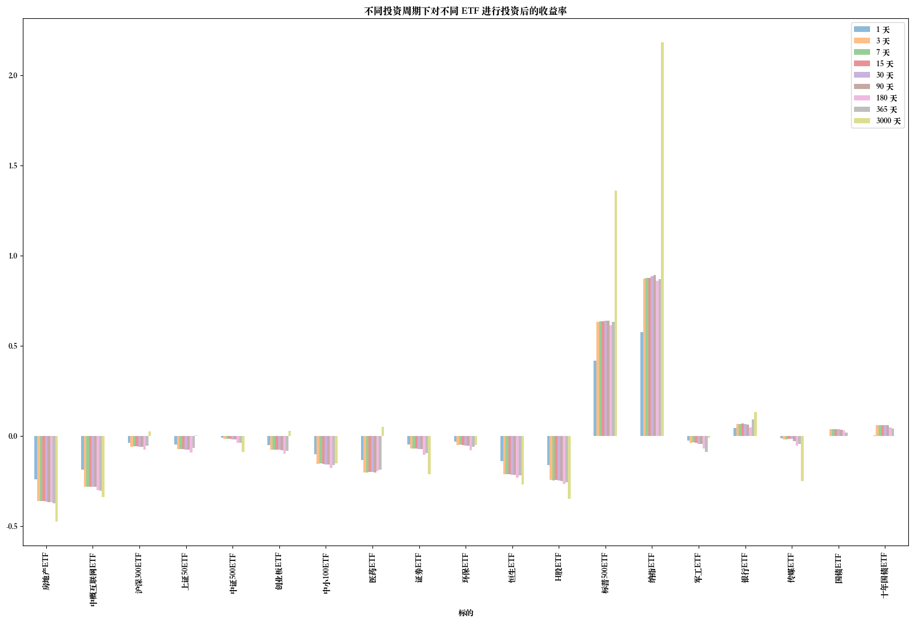
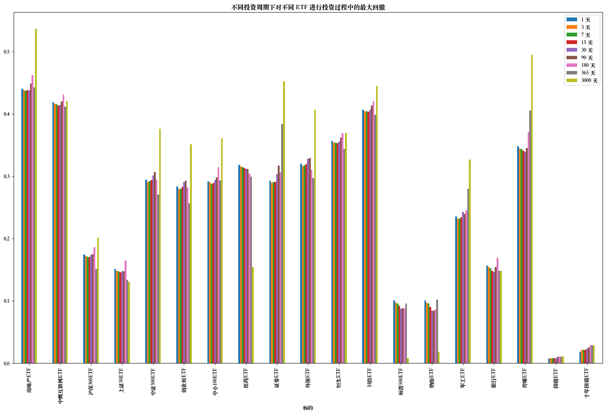
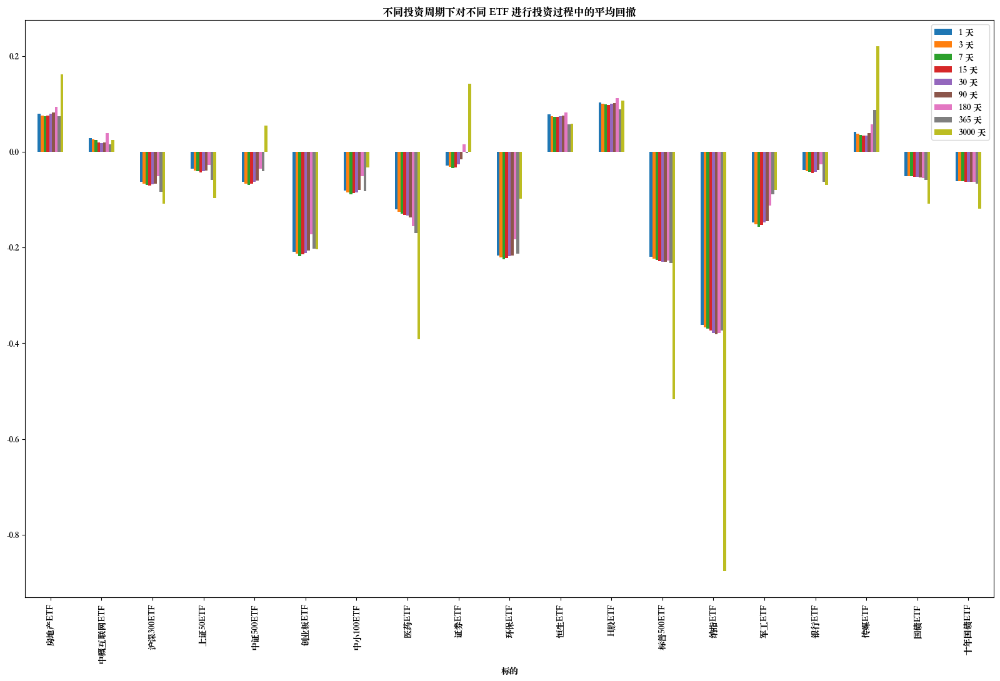

# 计算机网络体系结构第一次作业

作业要求：

> 请以一段时间内的真实指数基金行情数据，
>
> 1）验证定期等额平均成本投资法。例如：投资周期可以是日、周、月、季度、年，投资粒度 5000 元人民币，手续费参照代码 1“获取行情数据程序”中的 buy, sell 注释部分。
>
> 2）给出较优的投资周期、ETF 基金标的等参数，及理由。
>
> 3）验证附录 A 中的 14.1 资产配置原则之一：重新调整投资组合内资产类别的权重可以降低风险，在某些情况下，还可以提高投资收益。
>
> 注：行情数据可以通过 AKSahre 接口获得，https://akshare.akfamily.xyz

## 实验设置

买卖的最小单位是一手，即 100 份。

考虑印花税、过户费、佣金等交易费用。

进行投资的时间段为 2017 年 9 月 1 日到 2024 年 3 月 14 日。为了分析的需要，可能会使用在该时间段之前的部分数据。

### 选取的标的

在示例代码上加入了几个标的。

股票基金：

- 房地产 ETF
- 中概互联网 ETF
- 沪深 300 ETF
- 上证 50 ETF
- 中证 500 ETF
- 创业板 ETF
- 中小 100ETF
- 医药 ETF
- 证券 ETF
- 环保 ETF
- 恒生 ETF
- H 股 ETF
- 标普 500 ETF
- 纳指 ETF
- 军工 ETF
- 银行 ETF
- 传媒 ETF

债券基金：

- 国债 ETF
- 十年国债 ETF

|    日期    | 房地产 ETF | 中概互联网 ETF | 沪深 300ETF | 上证 50ETF | 中证 500ETF | 创业板 ETF | 中小 100ETF | 医药 ETF | 证券 ETF | 环保 ETF | 恒生 ETF | H 股 ETF | 标普 500ETF | 纳指 ETF | 军工 ETF | 银行 ETF | 传媒 ETF | 国债 ETF | 十年国债 ETF |
| :--------: | :--------: | :------------: | :---------: | :--------: | :---------: | :--------: | :---------: | :------: | :------: | :------: | :------: | :------: | :---------: | :------: | :------: | :------: | :------: | :------: | :----------: |
| 2017-09-01 |    NaN     |    1.440123    |  1.167898   |  1.212974  |  1.032103   |  0.852207  |  1.071719   | 1.136997 | 1.088123 | 1.006944 | 1.212072 | 1.180312 |  1.073519   | 1.220649 | 0.887463 | 1.005005 |   NaN    | 0.976216 |   1.003810   |
| 2024-03-14 |  0.521053  |    0.945752    |  1.199148   |  1.219617  |  0.940610   |  0.879079  |  0.903310   | 1.198142 | 0.853448 | 0.957341 | 0.881729 | 0.769006 |  2.546752   | 3.905605 | 0.881540 | 1.143143 | 0.746254 | 1.191415 |   1.270799   |

### 交易周期

选取的交易周期：

- 1 天，对应一日。
- 3 天，对应半周。
- 7 天，对应一周。
- 15 天，对应半月。
- 30 天，对应月。
- 90 天，对应季度。
- 180 天，对应半年。
- 365 天，对应年。
- 3000 天，对应一次性买入。

_注：由于 `datetime` 库的 `timedelta` 只支持日或者周等确定长度的时间段，此处全部以日数为单位。_

### 资金投入

按照每期 5000 元的粒度进行投入。

## 实验内容及结果

此处从以下三个指标出发进行了比较：

- 收益率：投资收益与投入资金的比值。
- 最大回撤：投资过程中的最大损失率。
- 平均回撤：投资过程中的平均损失率。

### 对定期等额平均成本投资法在单个 ETF 上的验证

该对照试验中，每次选择上述标的中的一个，进行定期等额平均成本投资法的投资测试。

以房地产 ETF 为例：

| 投资周期 |  1 天  |  3 天  |  7 天  | 15 天  | 30 天  | 90 天  | 180 天 | 365 天 | 3000 天 |
| :------: | :----: | :----: | :----: | :----: | :----: | :----: | :----: | :----: | :-----: |
|  收益率  | -0.240 | -0.362 | -0.362 | -0.362 | -0.364 | -0.366 | -0.368 | -0.374 | -0.476  |
| 最大回撤 | 0.285  | 0.430  | 0.430  | 0.430  | 0.432  | 0.431  | 0.428  | 0.442  |  0.532  |
| 平均回撤 | 0.037  | 0.055  | 0.055  | 0.056  | 0.057  | 0.060  | 0.066  | 0.058  |  0.162  |

可见定期等额平均成本投资法在房地产 ETF 上起到了降低风险的作用，减少了损失，降低了回撤。

下列各图中可以更清晰地看到定期等额平均成本投资法在不同的 ETF 上起到的降低收益率、降低回撤率的作用：

- 收益率：

  

  可以看到对于房地产 ETF、中概互联网、中证 500ETF、证券 ETF、恒生 ETF、H 股 ETF、传媒 ETF，定期等额平均成本投资法都起到了减少损失的作用。

  但同时需要注意的是，对于标普 500ETF、纳指 ETF，定期等额平均成本投资法降低了收益率，而对于沪深 300ETF、上证 50ETF、创业板 ETF、医药 ETF、军工 ETF，定期等额平均成本投资法甚至反而造成了少量损失。

    <!--中小 100ETF、环保 ETF、银行 ETF、国债 ETF、十年国债 ETF-->

- 

  定期等额平均成本投资法在大部分 ETF 上都起到了降低最大回撤率的效果，但在医药 ETF 上导致回撤率上升。

- 

  定期等额平均成本投资法在大部分 ETF 上都起到了使平均回撤率趋于 0；有趣的是，它在医药 ETF、证券 ETF 等基金上促使平均回撤率由正变为负，即平均意义上未发生回撤。

### 对定期等额平均成本投资法和静态投资组合在一对 ETF 上的验证

在这一对照试验中，每次选择上述股基中的一个和十年国债 ETF，进行定期等额平均成本投资法和静态投资组合的投资测试。

实验中投入资金的周期与调整投资比例的周期相同。_这个设定可能不太好_

在实验中，股基和债基的预期比例为 7:3，最高比例和最低比例分别为 8:2 和 6:4，当比例超出范围后将出售部分基金，使比例接近 7:3。
