## 重庆啤酒

2017-2023年年报披露的部分数据：

| 年份 | 净资产收益率 | 资产负债率 |
| :-: | :--------: | :-------: |
| 2016 | 15.370% | 63.090% |
| 2017 | 28.290% | 66.766% |
| 2018 | 28.580% | 64.766% |
| 2019 | 43.660% | 66.870% |
| 2020 | 45.550% | 83.650% |
| 2021 | 99.690% | 72.875% |
| 2022 | 69.250% | 71.010% |
| 2023 | 67.050% | 70.516% |

2016-2023年计算的净资产收益率：
                
| 年份 | 净资产收益率 | 资产负债率 |
| :-: | :--------: | :-------: |
| 2017 | 27.369% | 64.965% |
| 2018 | 34.719% | 65.797% |
| 2019 | 44.044% | 66.377% |
| 2020 | 41.879% | 74.769% |
| 2021 | 49.658% | 77.768% |
| 2022 | 37.433% | 71.905% |
| 2023 | 36.744% | 70.764% |

## 苏泊尔

2017-2023年年报披露的部分数据：

| 年份 | 净资产收益率 | 资产负债率 |
| :-: | :--------: | :-------: |
| 2016 | 23.410% | 41.949% |
| 2017 | 26.150% | 42.847% |
| 2018 | 28.840% | 44.447% |
| 2019 | 30.540% | 42.230% |
| 2020 | 26.970% | 41.128% |
| 2021 | 26.810% | 44.902% |
| 2022 | 27.890% | 45.396% |
| 2023 | 34.620% | 51.309% |

2016-2023年计算的净资产收益率：
                
| 年份 | 净资产收益率 | 资产负债率 |
| :-: | :--------: | :-------: |
| 2017 | 26.605% | 42.440% |
| 2018 | 29.516% | 43.694% |
| 2019 | 30.112% | 43.278% |
| 2020 | 26.222% | 41.669% |
| 2021 | 26.102% | 43.131% |
| 2022 | 28.072% | 45.140% |
| 2023 | 32.402% | 48.370% |

```mermaid
classDiagram
净资产收益率 -- 总资产收益率
    净资产收益率 : 236.74% = 129.54亿 / 54.72亿
    净资产收益率 : ROE(归母净利润 /  股东权益)
    总资产收益率 : 134.16% = （营业净利润率 X 总资产周转率）
    总资产收益率 : ProfitMagin(营业净利润 /  营业总收入)
净资产收益率 -- 归属母公司股东的净利润占比
	  归属母公司股东的净利润占比 : 92.11% = 129.54亿 / 140.63亿
	  归属母公司股东的净利润占比 : ratio(归母净利润/营业净利润)
归属母公司股东的净利润占比 -- 归母净利润
    归母净利润 : 129.54亿
归属母公司股东的净利润占比 -- 营业净利润
利润总额 : 156.60亿
利润总额 -- 营业净利润
净资产收益率 -- 权益乘数
    权益乘数 : 1.92 = 1 ➗ （1 - 资产负债率）
    权益乘数 : EquityMultiplier(总资产 /  股东权益)

总资产收益率 -- 营业净利润率
    营业净利润率 : 10.50% = （营业净利润 ➗ 营业总收入）
总资产收益率 -- 总资产周转率
    总资产周转率 : 12.774次 =（营业总收入 ➗ 资产总额）
权益乘数 -- 资产负债率
    资产负债率  : 47.80% =（负债总额 ➗ 资产总额）
    资产负债率  : ratio(负债总额 / 资产总额)

营业净利润率 -- 营业净利润
    营业净利润 : 140.63亿 = 营业总收入 - 营业总支出
营业净利润率 -- 营业总收入
总资产周转率 -- 营业总收入
总资产周转率 -- 资产总额
    资产总额 : 104.82亿 = 流动资产 + 非流动资产
资产负债率 -- 负债总额
    负债总额 : 50.11亿
资产负债率 -- 资产总额


营业净利润 -- 营业总收入
    营业总收入 : 1339.04亿
营业净利润 -- 营业总支出
    营业总支出 : 1198.41亿
资产总额 -- 流动资产
	  流动资产 : ? 亿
资产总额 -- 非流动资产
	  非流动资产 : ? 亿
负债总额 -- 流动负债
	  流动负债 : ? 亿
负债总额 -- 非流动负债
	  非流动负债 : ? 亿

营业总收入 -- 包括1
    包括1 : 营业收入
    包括1 : 0.00亿
    包括1 : 利息净收入
    包括1 : 0.00亿
    包括1 : 手续费及佣金净收入
    包括1 : 0.00亿
    包括1 : 已赚保费收入
    包括1 : 0.00亿
    包括1 : 投资收入
    包括1 : 0.00亿
    包括1 : ...
营业总支出 -- 包括2
    包括2 : 营业支出
    包括2 : 970.90亿
    包括2 : 销售支出
    包括2 : 167.27亿
    包括2 : 管理支出
    包括2 : 24.17亿
    包括2 : 财务支出
    包括2 : -2.31亿
    包括2 : 收入税支出
    包括2 : 27.19亿
    包括2 : 营业税金及附加费支出
    包括2 : 8.02亿
    包括2 : 退保金额支出
    包括2 : 0.00亿
    包括2 : 赔付支出
    包括2 : 0.00亿
    包括2 : ...
流动资产 -- 包括3
    包括3 : 货币资金
    包括3 : 21.51亿
    包括3 : 应收账款
    包括3 : 20.09亿
    包括3 : 存货
    包括3 : 19.80 亿
    包括3 : 结算备付金
    包括3 : nan 亿
    包括3 : 应收保费
    包括3 : nan 亿
    包括3 : ...
非流动资产 -- 包括4
    包括4 : 固定资产
    包括4 : 10.64亿
    包括4 : 可供出售金融资产
    包括4 : nan亿
    包括4 : ...
流动负债 -- 包括5
    包括5 : 应付账款
    包括5 : 26.34亿
    包括5 : 预收账款
    包括5 : nan亿
    包括5 : 向中央银行借款
    包括5 : nan亿
    包括5 : 代理买卖证券款
    包括5 : nan亿
    包括5 : 卖出回购金融资产款
    包括5 : nan亿
    包括5 : 拆入资金
    包括5 : nan亿
    包括5 : 短期借款
    包括5 : nan亿
    包括5 : 预收保费
    包括5 : nan亿
    包括5 : ...
非流动负债 -- 包括6
    包括6 : 吸收存款
    包括6 : nan亿
    包括6 : 发放贷款及垫款
    包括6 : nan亿
    包括6 : ...
所有者权益 -- 股东权益
    股东权益 : 54.72亿
```

## 贵州茅台

2017-2023年年报披露的部分数据：

| 年份 | 净资产收益率 | 资产负债率 |
| :-: | :--------: | :-------: |
| 2016 | 24.440% | 32.794% |
| 2017 | 32.950% | 28.668% |
| 2018 | 34.460% | 26.549% |
| 2019 | 33.090% | 22.490% |
| 2020 | 31.410% | 21.404% |
| 2021 | 29.890% | 22.813% |
| 2022 | 30.260% | 19.474% |
| 2023 | 34.190% | 17.984% |

2016-2023年计算的净资产收益率：
                
| 年份 | 净资产收益率 | 资产负债率 |
| :-: | :--------: | :-------: |
| 2017 | 31.503% | 30.551% |
| 2018 | 32.989% | 27.518% |
| 2019 | 31.785% | 24.382% |
| 2020 | 30.166% | 21.905% |
| 2021 | 28.771% | 22.171% |
| 2022 | 31.211% | 21.146% |
| 2023 | 34.874% | 18.704% |

## 方大特钢

2017-2023年年报披露的部分数据：

| 年份 | 净资产收益率 | 资产负债率 |
| :-: | :--------: | :-------: |
| 2016 | 28.510% | 65.459% |
| 2017 | 67.670% | 39.988% |
| 2018 | 58.170% | 29.960% |
| 2019 | 27.050% | 47.033% |
| 2020 | 28.790% | 31.149% |
| 2021 | 28.350% | 51.235% |
| 2022 | 12.010% | 53.012% |
| 2023 | 7.850% | 51.937% |

2016-2023年计算的净资产收益率：
                
| 年份 | 净资产收益率 | 资产负债率 |
| :-: | :--------: | :-------: |
| 2017 | 62.712% | 52.620% |
| 2018 | 49.164% | 34.699% |
| 2019 | 25.173% | 39.757% |
| 2020 | 26.257% | 38.863% |
| 2021 | 28.386% | 43.090% |
| 2022 | 11.229% | 52.108% |
| 2023 | 7.398% | 52.470% |

## 亿联网络

2017-2023年年报披露的部分数据：

| 年份 | 净资产收益率 | 资产负债率 |
| :-: | :--------: | :-------: |
| 2016 | 71.360% | 11.342% |
| 2017 | 26.670% | 4.924% |
| 2018 | 26.900% | 6.682% |
| 2019 | 31.470% | 8.937% |
| 2020 | 26.880% | 9.966% |
| 2021 | 28.260% | 10.889% |
| 2022 | 30.900% | 8.294% |
| 2023 | 25.640% | 8.548% |

2016-2023年计算的净资产收益率：
                
| 年份 | 净资产收益率 | 资产负债率 |
| :-: | :--------: | :-------: |
| 2017 | 32.121% | 6.406% |
| 2018 | 26.719% | 5.897% |
| 2019 | 31.292% | 7.951% |
| 2020 | 26.642% | 9.498% |
| 2021 | 28.020% | 10.475% |
| 2022 | 30.623% | 9.468% |
| 2023 | 25.102% | 8.423% |

## 京基智农

2017-2023年年报披露的部分数据：

| 年份 | 净资产收益率 | 资产负债率 |
| :-: | :--------: | :-------: |
| 2016 | 0.820% | 57.848% |
| 2017 | -23.790% | 81.849% |
| 2018 | 54.950% | 76.355% |
| 2019 | 70.350% | 63.261% |
| 2020 | 35.460% | 71.917% |
| 2021 | 15.000% | 82.746% |
| 2022 | 31.350% | 84.817% |
| 2023 | 55.470% | 67.785% |

2016-2023年计算的净资产收益率：
                
| 年份 | 净资产收益率 | 资产负债率 |
| :-: | :--------: | :-------: |
| 2017 | -20.268% | 73.829% |
| 2018 | 45.229% | 78.716% |
| 2019 | 61.104% | 69.084% |
| 2020 | 33.594% | 68.496% |
| 2021 | 14.581% | 78.411% |
| 2022 | 29.611% | 83.868% |
| 2023 | 53.164% | 77.854% |

## 浙江美大

2017-2023年年报披露的部分数据：

| 年份 | 净资产收益率 | 资产负债率 |
| :-: | :--------: | :-------: |
| 2016 | 18.500% | 17.642% |
| 2017 | 25.730% | 21.918% |
| 2018 | 29.280% | 23.335% |
| 2019 | 33.050% | 23.533% |
| 2020 | 34.350% | 21.795% |
| 2021 | 37.040% | 17.208% |
| 2022 | 23.510% | 13.803% |
| 2023 | 23.640% | 13.038% |

2016-2023年计算的净资产收益率：
                
| 年份 | 净资产收益率 | 资产负债率 |
| :-: | :--------: | :-------: |
| 2017 | 24.818% | 19.973% |
| 2018 | 28.242% | 22.648% |
| 2019 | 31.897% | 23.440% |
| 2020 | 33.731% | 22.624% |
| 2021 | 36.382% | 19.412% |
| 2022 | 23.088% | 15.533% |
| 2023 | 23.243% | 13.416% |

## 达安基因

2017-2023年年报披露的部分数据：

| 年份 | 净资产收益率 | 资产负债率 |
| :-: | :--------: | :-------: |
| 2016 | 7.710% | 38.324% |
| 2017 | 5.290% | 43.089% |
| 2018 | 5.770% | 39.930% |
| 2019 | 5.100% | 41.389% |
| 2020 | 80.210% | 32.617% |
| 2021 | 62.520% | 25.894% |
| 2022 | 58.960% | 21.286% |
| 2023 | 1.080% | 16.889% |

2016-2023年计算的净资产收益率：
                
| 年份 | 净资产收益率 | 资产负债率 |
| :-: | :--------: | :-------: |
| 2017 | 3.328% | 40.843% |
| 2018 | 4.196% | 41.696% |
| 2019 | 4.299% | 40.649% |
| 2020 | 74.191% | 35.662% |
| 2021 | 59.438% | 28.538% |
| 2022 | 56.157% | 23.184% |
| 2023 | 1.008% | 19.406% |

## 双汇发展

2017-2023年年报披露的部分数据：

| 年份 | 净资产收益率 | 资产负债率 |
| :-: | :--------: | :-------: |
| 2016 | 28.330% | 29.427% |
| 2017 | 35.620% | 33.010% |
| 2018 | 38.840% | 40.059% |
| 2019 | 37.370% | 40.226% |
| 2020 | 32.930% | 30.461% |
| 2021 | 21.800% | 31.867% |
| 2022 | 25.430% | 39.079% |
| 2023 | 23.830% | 42.342% |

2016-2023年计算的净资产收益率：
                
| 年份 | 净资产收益率 | 资产负债率 |
| :-: | :--------: | :-------: |
| 2017 | 28.290% | 31.288% |
| 2018 | 33.675% | 36.517% |
| 2019 | 35.286% | 40.152% |
| 2020 | 30.331% | 34.875% |
| 2021 | 20.582% | 31.157% |
| 2022 | 24.799% | 35.598% |
| 2023 | 23.323% | 40.716% |

## 吉比特

2017-2023年年报披露的部分数据：

| 年份 | 净资产收益率 | 资产负债率 |
| :-: | :--------: | :-------: |
| 2016 | 78.900% | 22.323% |
| 2017 | 29.580% | 21.865% |
| 2018 | 28.050% | 21.883% |
| 2019 | 28.140% | 21.372% |
| 2020 | 31.030% | 21.159% |
| 2021 | 35.970% | 28.771% |
| 2022 | 32.490% | 27.439% |
| 2023 | 26.040% | 20.931% |

2016-2023年计算的净资产收益率：
                
| 年份 | 净资产收益率 | 资产负债率 |
| :-: | :--------: | :-------: |
| 2017 | 27.043% | 22.074% |
| 2018 | 25.879% | 21.875% |
| 2019 | 24.647% | 21.616% |
| 2020 | 27.240% | 21.254% |
| 2021 | 31.556% | 25.487% |
| 2022 | 29.908% | 28.135% |
| 2023 | 22.599% | 24.149% |

