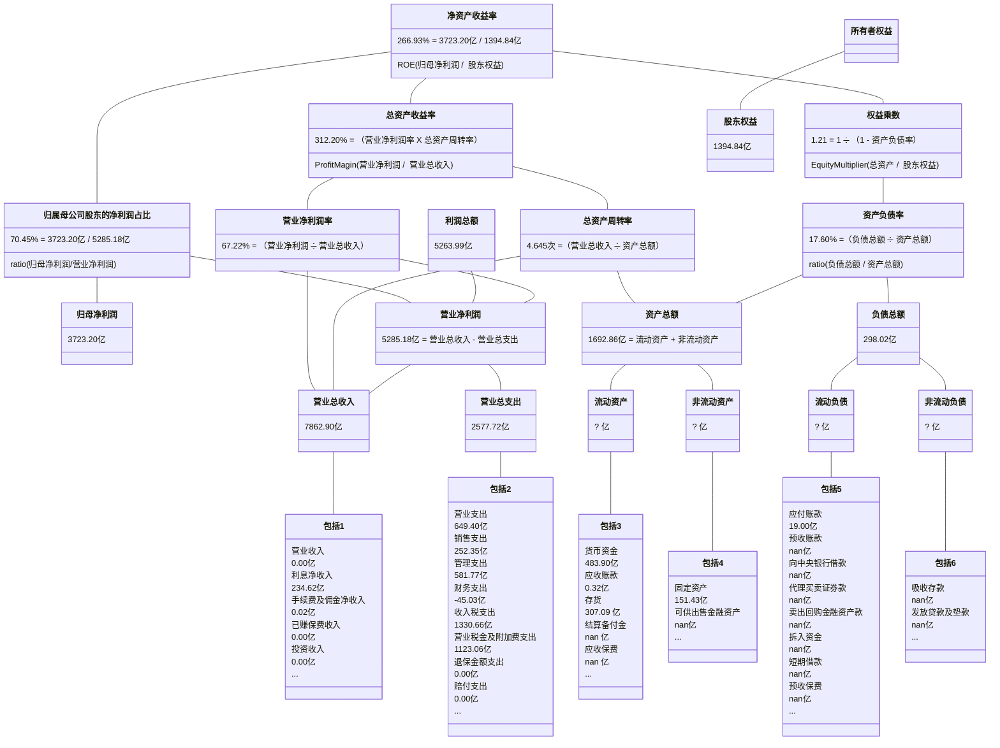
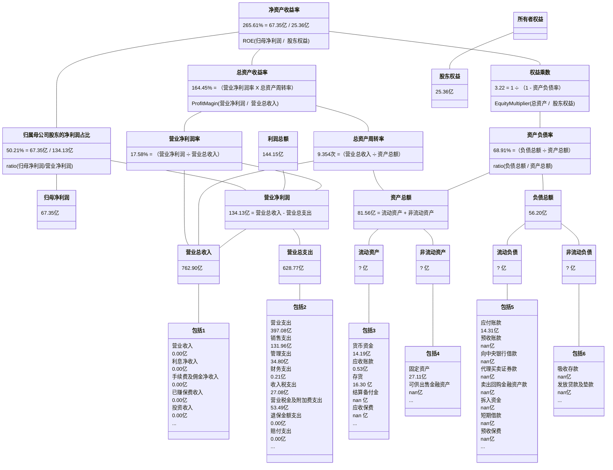

## 飞科电器

2015-2023年年报披露的部分数据：

| 年份 | 净资产收益率 | 资产负债率 |
| :-: | :--------: | :-------: |
| 2014 | 53.350% | 42.270% |
| 2015 | 55.230% | 34.660% |
| 2016 | 34.300% | 27.794% |
| 2017 | 38.420% | 25.970% |
| 2018 | 34.460% | 29.581% |
| 2019 | 27.380% | 28.808% |
| 2020 | 23.690% | 27.159% |
| 2021 | 22.090% | 27.026% |
| 2022 | 25.730% | 21.129% |
| 2023 | 29.730% | 19.799% |

2014-2023年计算的净资产收益率：
                
| 年份 | 净资产收益率 | 资产负债率 |
| :-: | :--------: | :-------: |
| 2015 | 52.083% | 38.140% |
| 2016 | 39.375% | 30.388% |
| 2017 | 37.793% | 26.811% |
| 2018 | 33.704% | 27.890% |
| 2019 | 26.210% | 29.195% |
| 2020 | 23.368% | 27.963% |
| 2021 | 21.815% | 27.090% |
| 2022 | 25.443% | 24.016% |
| 2023 | 29.114% | 20.455% |

## 吉比特

2015-2023年年报披露的部分数据：

| 年份 | 净资产收益率 | 资产负债率 |
| :-: | :--------: | :-------: |
| 2014 | 67.720% | 25.651% |
| 2015 | 43.740% | 20.751% |
| 2016 | 78.900% | 22.323% |
| 2017 | 29.580% | 21.865% |
| 2018 | 28.050% | 21.883% |
| 2019 | 28.140% | 21.372% |
| 2020 | 31.030% | 21.159% |
| 2021 | 35.970% | 28.771% |
| 2022 | 32.490% | 27.439% |
| 2023 | 26.040% | 20.931% |

2014-2023年计算的净资产收益率：
                
| 年份 | 净资产收益率 | 资产负债率 |
| :-: | :--------: | :-------: |
| 2015 | 42.232% | 22.822% |
| 2016 | 46.023% | 22.025% |
| 2017 | 27.043% | 22.074% |
| 2018 | 25.879% | 21.875% |
| 2019 | 24.647% | 21.616% |
| 2020 | 27.240% | 21.254% |
| 2021 | 31.556% | 25.487% |
| 2022 | 29.908% | 28.135% |
| 2023 | 22.599% | 24.149% |

## 苏泊尔

2015-2023年年报披露的部分数据：

| 年份 | 净资产收益率 | 资产负债率 |
| :-: | :--------: | :-------: |
| 2014 | 19.630% | 35.498% |
| 2015 | 21.900% | 32.265% |
| 2016 | 23.410% | 41.949% |
| 2017 | 26.150% | 42.847% |
| 2018 | 28.840% | 44.447% |
| 2019 | 30.540% | 42.230% |
| 2020 | 26.970% | 41.128% |
| 2021 | 26.810% | 44.902% |
| 2022 | 27.890% | 45.396% |
| 2023 | 34.620% | 51.309% |

2014-2023年计算的净资产收益率：
                
| 年份 | 净资产收益率 | 资产负债率 |
| :-: | :--------: | :-------: |
| 2015 | 19.142% | 33.794% |
| 2016 | 22.512% | 37.253% |
| 2017 | 26.605% | 42.440% |
| 2018 | 29.516% | 43.694% |
| 2019 | 30.112% | 43.278% |
| 2020 | 26.222% | 41.669% |
| 2021 | 26.102% | 43.131% |
| 2022 | 28.072% | 45.140% |
| 2023 | 32.402% | 48.370% |

## 百川能源

2015-2023年年报披露的部分数据：

| 年份 | 净资产收益率 | 资产负债率 |
| :-: | :--------: | :-------: |
| 2014 | 44.510% | 84.696% |
| 2015 | 53.580% | 52.537% |
| 2016 | 32.940% | 37.495% |
| 2017 | 32.130% | 44.479% |
| 2018 | 24.160% | 48.248% |
| 2019 | 16.490% | 48.995% |
| 2020 | 11.750% | 45.290% |
| 2021 | 13.380% | 50.133% |
| 2022 | 10.300% | 51.079% |
| 2023 | 9.990% | 51.718% |

2014-2023年计算的净资产收益率：
                
| 年份 | 净资产收益率 | 资产负债率 |
| :-: | :--------: | :-------: |
| 2015 | 91.353% | 55.481% |
| 2016 | 36.673% | 42.718% |
| 2017 | 28.333% | 42.196% |
| 2018 | 23.627% | 46.581% |
| 2019 | 15.714% | 48.627% |
| 2020 | 11.215% | 47.265% |
| 2021 | 12.720% | 47.732% |
| 2022 | 9.912% | 50.597% |
| 2023 | 9.659% | 51.400% |

## 养元饮品

2015-2023年年报披露的部分数据：

| 年份 | 净资产收益率 | 资产负债率 |
| :-: | :--------: | :-------: |
| 2014 | 62.510% | 51.594% |
| 2015 | 57.770% | 39.874% |
| 2016 | 46.730% | 38.798% |
| 2017 | 38.770% | 34.434% |
| 2018 | 27.000% | 21.724% |
| 2019 | 22.850% | 17.847% |
| 2020 | 13.130% | 21.427% |
| 2021 | 17.560% | 21.528% |
| 2022 | 12.510% | 23.542% |
| 2023 | 13.220% | 31.421% |

2014-2023年计算的净资产收益率：
                
| 年份 | 净资产收益率 | 资产负债率 |
| :-: | :--------: | :-------: |
| 2015 | 56.488% | 45.087% |
| 2016 | 47.203% | 39.325% |
| 2017 | 34.707% | 36.467% |
| 2018 | 29.388% | 27.094% |
| 2019 | 22.108% | 19.797% |
| 2020 | 13.012% | 19.635% |
| 2021 | 17.371% | 21.479% |
| 2022 | 12.294% | 22.509% |
| 2023 | 13.001% | 27.615% |

## 贵州茅台

2015-2023年年报披露的部分数据：

| 年份 | 净资产收益率 | 资产负债率 |
| :-: | :--------: | :-------: |
| 2014 | 31.960% | 16.033% |
| 2015 | 26.230% | 23.253% |
| 2016 | 24.440% | 32.794% |
| 2017 | 32.950% | 28.668% |
| 2018 | 34.460% | 26.549% |
| 2019 | 33.090% | 22.490% |
| 2020 | 31.410% | 21.404% |
| 2021 | 29.890% | 22.813% |
| 2022 | 30.260% | 19.474% |
| 2023 | 34.190% | 17.984% |

2014-2023年计算的净资产收益率：
                
| 年份 | 净资产收益率 | 资产负债率 |
| :-: | :--------: | :-------: |
| 2015 | 25.510% | 20.127% |
| 2016 | 23.525% | 28.661% |
| 2017 | 31.503% | 30.551% |
| 2018 | 32.989% | 27.518% |
| 2019 | 31.785% | 24.382% |
| 2020 | 30.166% | 21.905% |
| 2021 | 28.771% | 22.171% |
| 2022 | 31.211% | 21.146% |
| 2023 | 34.874% | 18.704% |

## 重庆啤酒

2015-2023年年报披露的部分数据：

| 年份 | 净资产收益率 | 资产负债率 |
| :-: | :--------: | :-------: |
| 2014 | 5.690% | 63.847% |
| 2015 | -5.470% | 67.238% |
| 2016 | 15.370% | 63.090% |
| 2017 | 28.290% | 66.766% |
| 2018 | 28.580% | 64.766% |
| 2019 | 43.660% | 66.870% |
| 2020 | 45.550% | 83.650% |
| 2021 | 99.690% | 72.875% |
| 2022 | 69.250% | 71.010% |
| 2023 | 67.050% | 70.516% |

2014-2023年计算的净资产收益率：
                
| 年份 | 净资产收益率 | 资产负债率 |
| :-: | :--------: | :-------: |
| 2015 | -4.979% | 65.497% |
| 2016 | 14.706% | 65.268% |
| 2017 | 27.369% | 64.965% |
| 2018 | 34.719% | 65.797% |
| 2019 | 44.044% | 66.377% |
| 2020 | 41.879% | 74.769% |
| 2021 | 49.658% | 77.768% |
| 2022 | 37.433% | 71.905% |
| 2023 | 36.744% | 70.764% |

## 同花顺

2015-2023年年报披露的部分数据：

| 年份 | 净资产收益率 | 资产负债率 |
| :-: | :--------: | :-------: |
| 2014 | 5.190% | 24.638% |
| 2015 | 57.810% | 40.217% |
| 2016 | 49.610% | 27.603% |
| 2017 | 24.680% | 24.744% |
| 2018 | 20.230% | 19.145% |
| 2019 | 24.930% | 23.795% |
| 2020 | 38.370% | 26.992% |
| 2021 | 33.590% | 23.814% |
| 2022 | 25.550% | 19.745% |
| 2023 | 20.190% | 25.653% |

2014-2023年计算的净资产收益率：
                
| 年份 | 净资产收益率 | 资产负债率 |
| :-: | :--------: | :-------: |
| 2015 | 57.687% | 35.425% |
| 2016 | 47.697% | 33.480% |
| 2017 | 23.705% | 26.151% |
| 2018 | 19.479% | 21.972% |
| 2019 | 24.493% | 21.745% |
| 2020 | 37.420% | 25.641% |
| 2021 | 32.668% | 25.267% |
| 2022 | 24.648% | 21.718% |
| 2023 | 19.259% | 22.827% |

## 亿联网络

2015-2023年年报披露的部分数据：

| 年份 | 净资产收益率 | 资产负债率 |
| :-: | :--------: | :-------: |
| 2014 | 59.410% | 29.442% |
| 2015 | 74.510% | 15.348% |
| 2016 | 71.360% | 11.342% |
| 2017 | 26.670% | 4.924% |
| 2018 | 26.900% | 6.682% |
| 2019 | 31.470% | 8.937% |
| 2020 | 26.880% | 9.966% |
| 2021 | 28.260% | 10.889% |
| 2022 | 30.900% | 8.294% |
| 2023 | 25.640% | 8.548% |

2014-2023年计算的净资产收益率：
                
| 年份 | 净资产收益率 | 资产负债率 |
| :-: | :--------: | :-------: |
| 2015 | 71.499% | 21.051% |
| 2016 | 69.357% | 12.805% |
| 2017 | 32.121% | 6.406% |
| 2018 | 26.719% | 5.897% |
| 2019 | 31.292% | 7.951% |
| 2020 | 26.642% | 9.498% |
| 2021 | 28.020% | 10.475% |
| 2022 | 30.623% | 9.468% |
| 2023 | 25.102% | 8.423% |

## 双汇发展

2015-2023年年报披露的部分数据：

| 年份 | 净资产收益率 | 资产负债率 |
| :-: | :--------: | :-------: |
| 2014 | 28.600% | 25.573% |
| 2015 | 27.240% | 22.714% |
| 2016 | 28.330% | 29.427% |
| 2017 | 35.620% | 33.010% |
| 2018 | 38.840% | 40.059% |
| 2019 | 37.370% | 40.226% |
| 2020 | 32.930% | 30.461% |
| 2021 | 21.800% | 31.867% |
| 2022 | 25.430% | 39.079% |
| 2023 | 23.830% | 42.342% |

2014-2023年计算的净资产收益率：
                
| 年份 | 净资产收益率 | 资产负债率 |
| :-: | :--------: | :-------: |
| 2015 | 24.998% | 24.115% |
| 2016 | 26.897% | 25.954% |
| 2017 | 28.290% | 31.288% |
| 2018 | 33.675% | 36.517% |
| 2019 | 35.286% | 40.152% |
| 2020 | 30.331% | 34.875% |
| 2021 | 20.582% | 31.157% |
| 2022 | 24.799% | 35.598% |
| 2023 | 23.323% | 40.716% |

