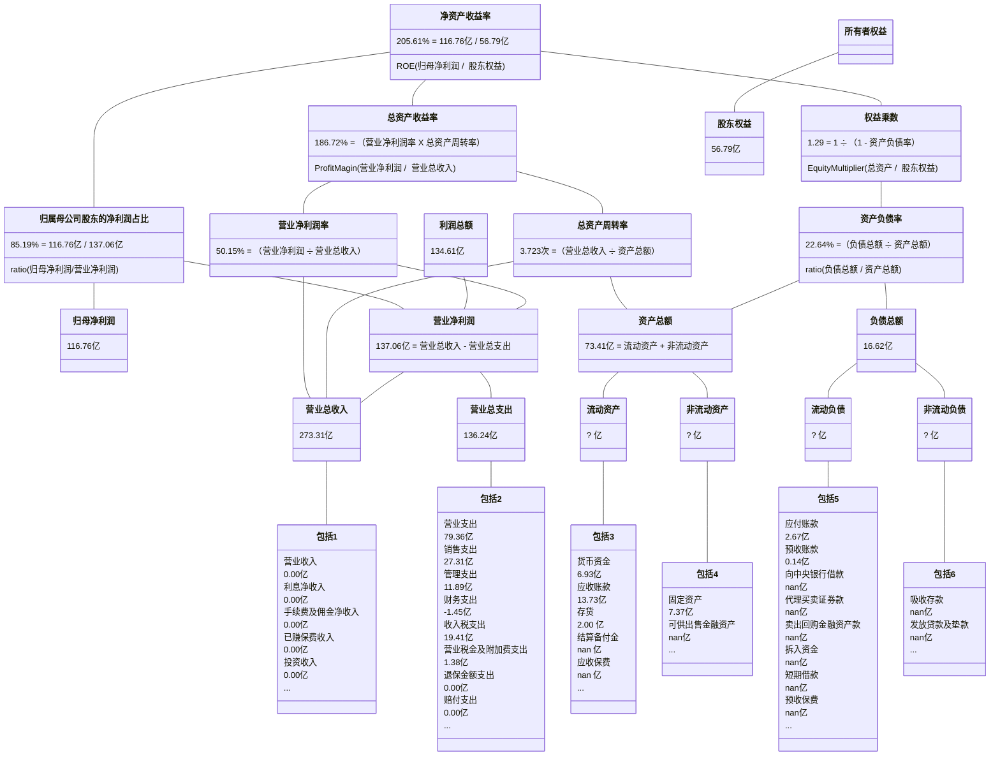
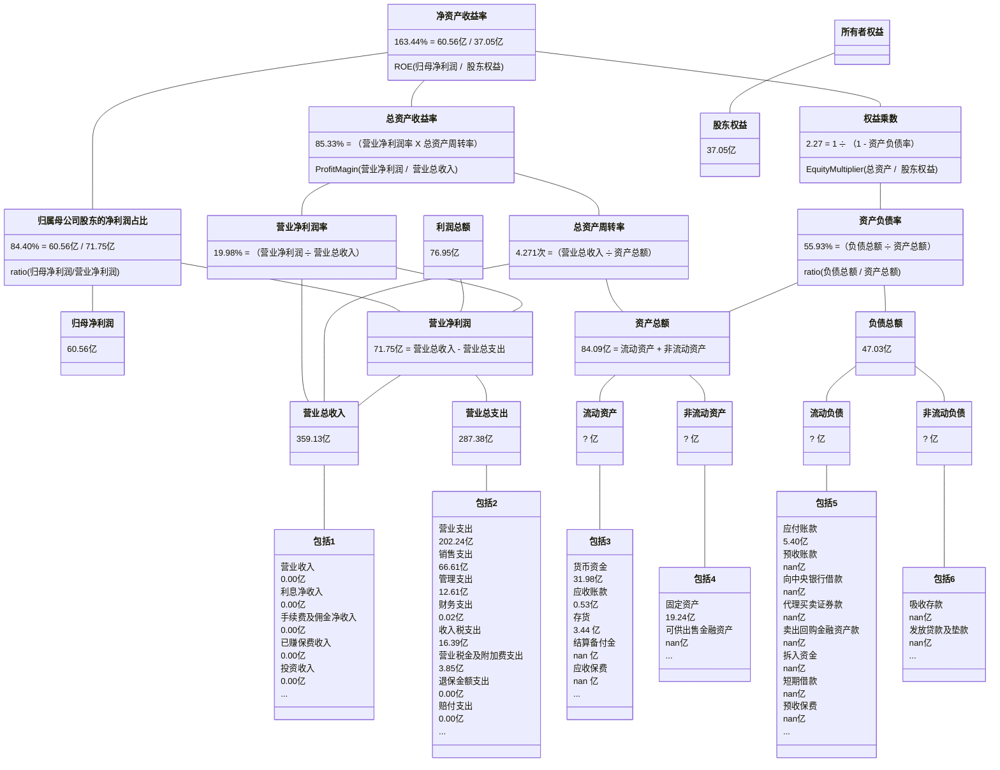

## 重庆啤酒

2019-2023年年报披露的部分数据：

| 年份 | 净资产收益率 | 资产负债率 |
| :-: | :--------: | :-------: |
| 2018 | 28.580% | 64.766% |
| 2019 | 43.660% | 66.870% |
| 2020 | 45.550% | 83.650% |
| 2021 | 99.690% | 72.875% |
| 2022 | 69.250% | 71.010% |
| 2023 | 67.050% | 70.516% |

2018-2023年计算的净资产收益率：
                
| 年份 | 净资产收益率 | 资产负债率 |
| :-: | :--------: | :-------: |
| 2019 | 44.044% | 66.377% |
| 2020 | 41.879% | 74.769% |
| 2021 | 49.658% | 77.768% |
| 2022 | 37.433% | 71.905% |
| 2023 | 36.744% | 70.764% |

## 达安基因

2019-2023年年报披露的部分数据：

| 年份 | 净资产收益率 | 资产负债率 |
| :-: | :--------: | :-------: |
| 2018 | 5.770% | 39.930% |
| 2019 | 5.100% | 41.389% |
| 2020 | 80.210% | 32.617% |
| 2021 | 62.520% | 25.894% |
| 2022 | 58.960% | 21.286% |
| 2023 | 1.080% | 16.889% |

2018-2023年计算的净资产收益率：
                
| 年份 | 净资产收益率 | 资产负债率 |
| :-: | :--------: | :-------: |
| 2019 | 4.299% | 40.649% |
| 2020 | 74.191% | 35.662% |
| 2021 | 59.438% | 28.538% |
| 2022 | 56.157% | 23.184% |
| 2023 | 1.008% | 19.406% |

## 京基智农

2019-2023年年报披露的部分数据：

| 年份 | 净资产收益率 | 资产负债率 |
| :-: | :--------: | :-------: |
| 2018 | 54.950% | 76.355% |
| 2019 | 70.350% | 63.261% |
| 2020 | 35.460% | 71.917% |
| 2021 | 15.000% | 82.746% |
| 2022 | 31.350% | 84.817% |
| 2023 | 55.470% | 67.785% |

2018-2023年计算的净资产收益率：
                
| 年份 | 净资产收益率 | 资产负债率 |
| :-: | :--------: | :-------: |
| 2019 | 61.104% | 69.084% |
| 2020 | 33.594% | 68.496% |
| 2021 | 14.581% | 78.411% |
| 2022 | 29.611% | 83.868% |
| 2023 | 53.164% | 77.854% |

## 英科医疗

2019-2023年年报披露的部分数据：

| 年份 | 净资产收益率 | 资产负债率 |
| :-: | :--------: | :-------: |
| 2018 | 15.300% | 47.493% |
| 2019 | 13.080% | 49.807% |
| 2020 | 132.220% | 26.997% |
| 2021 | 59.610% | 21.824% |
| 2022 | 3.940% | 25.278% |
| 2023 | 2.400% | 39.827% |

2018-2023年计算的净资产收益率：
                
| 年份 | 净资产收益率 | 资产负债率 |
| :-: | :--------: | :-------: |
| 2019 | 12.852% | 48.771% |
| 2020 | 128.047% | 31.282% |
| 2021 | 58.124% | 23.818% |
| 2022 | 3.911% | 23.586% |
| 2023 | 2.368% | 33.392% |

## 智飞生物

2019-2023年年报披露的部分数据：

| 年份 | 净资产收益率 | 资产负债率 |
| :-: | :--------: | :-------: |
| 2018 | 40.780% | 38.608% |
| 2019 | 47.670% | 47.477% |
| 2020 | 46.290% | 45.787% |
| 2021 | 78.010% | 41.235% |
| 2022 | 36.130% | 36.227% |
| 2023 | 29.090% | 37.279% |

2018-2023年计算的净资产收益率：
                
| 年份 | 净资产收益率 | 资产负债率 |
| :-: | :--------: | :-------: |
| 2019 | 47.671% | 44.074% |
| 2020 | 47.175% | 46.494% |
| 2021 | 78.813% | 42.765% |
| 2022 | 35.991% | 38.438% |
| 2023 | 28.954% | 36.826% |

## 东鹏饮料

2019-2023年年报披露的部分数据：

| 年份 | 净资产收益率 | 资产负债率 |
| :-: | :--------: | :-------: |
| 2018 | 22.050% | 48.426% |
| 2019 | 43.140% | 51.053% |
| 2020 | 45.820% | 56.131% |
| 2021 | 36.480% | 45.599% |
| 2022 | 31.650% | 57.333% |
| 2023 | 35.820% | 57.011% |

2018-2023年计算的净资产收益率：
                
| 年份 | 净资产收益率 | 资产负债率 |
| :-: | :--------: | :-------: |
| 2019 | 41.921% | 50.036% |
| 2020 | 45.770% | 53.928% |
| 2021 | 38.787% | 49.379% |
| 2022 | 30.970% | 52.683% |
| 2023 | 35.822% | 57.154% |

## 贵州茅台

2019-2023年年报披露的部分数据：

| 年份 | 净资产收益率 | 资产负债率 |
| :-: | :--------: | :-------: |
| 2018 | 34.460% | 26.549% |
| 2019 | 33.090% | 22.490% |
| 2020 | 31.410% | 21.404% |
| 2021 | 29.890% | 22.813% |
| 2022 | 30.260% | 19.474% |
| 2023 | 34.190% | 17.984% |

2018-2023年计算的净资产收益率：
                
| 年份 | 净资产收益率 | 资产负债率 |
| :-: | :--------: | :-------: |
| 2019 | 31.785% | 24.382% |
| 2020 | 30.166% | 21.905% |
| 2021 | 28.771% | 22.171% |
| 2022 | 31.211% | 21.146% |
| 2023 | 34.874% | 18.704% |

## 苏泊尔

2019-2023年年报披露的部分数据：

| 年份 | 净资产收益率 | 资产负债率 |
| :-: | :--------: | :-------: |
| 2018 | 28.840% | 44.447% |
| 2019 | 30.540% | 42.230% |
| 2020 | 26.970% | 41.128% |
| 2021 | 26.810% | 44.902% |
| 2022 | 27.890% | 45.396% |
| 2023 | 34.620% | 51.309% |

2018-2023年计算的净资产收益率：
                
| 年份 | 净资产收益率 | 资产负债率 |
| :-: | :--------: | :-------: |
| 2019 | 30.112% | 43.278% |
| 2020 | 26.222% | 41.669% |
| 2021 | 26.102% | 43.131% |
| 2022 | 28.072% | 45.140% |
| 2023 | 32.402% | 48.370% |

## 中远海控

2019-2023年年报披露的部分数据：

| 年份 | 净资产收益率 | 资产负债率 |
| :-: | :--------: | :-------: |
| 2018 | 5.520% | 75.299% |
| 2019 | 21.570% | 73.639% |
| 2020 | 25.160% | 71.059% |
| 2021 | 100.570% | 56.681% |
| 2022 | 59.840% | 50.424% |
| 2023 | 11.800% | 47.404% |

2018-2023年计算的净资产收益率：
                
| 年份 | 净资产收益率 | 资产负债率 |
| :-: | :--------: | :-------: |
| 2019 | 10.781% | 74.411% |
| 2020 | 13.431% | 72.326% |
| 2021 | 69.221% | 62.379% |
| 2022 | 50.642% | 53.223% |
| 2023 | 9.601% | 48.991% |

## 双汇发展

2019-2023年年报披露的部分数据：

| 年份 | 净资产收益率 | 资产负债率 |
| :-: | :--------: | :-------: |
| 2018 | 38.840% | 40.059% |
| 2019 | 37.370% | 40.226% |
| 2020 | 32.930% | 30.461% |
| 2021 | 21.800% | 31.867% |
| 2022 | 25.430% | 39.079% |
| 2023 | 23.830% | 42.342% |

2018-2023年计算的净资产收益率：
                
| 年份 | 净资产收益率 | 资产负债率 |
| :-: | :--------: | :-------: |
| 2019 | 35.286% | 40.152% |
| 2020 | 30.331% | 34.875% |
| 2021 | 20.582% | 31.157% |
| 2022 | 24.799% | 35.598% |
| 2023 | 23.323% | 40.716% |

