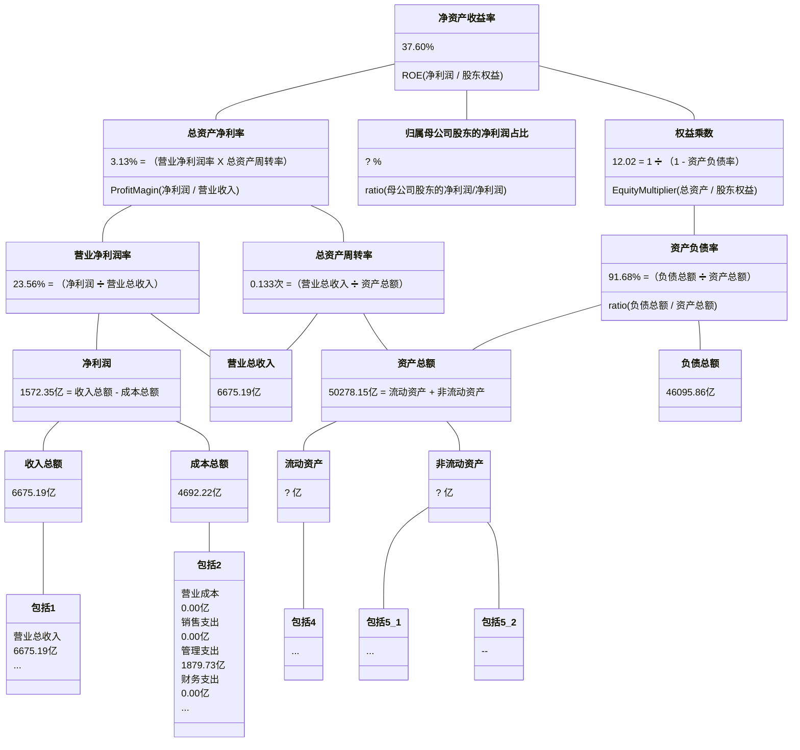

```mermaid
classDiagram
净资产收益率 -- 总资产净利率
	净资产收益率 : 37.60%
	净资产收益率 : ROE(净利润 /  股东权益)
	总资产净利率 : 3.13% = （营业净利润率 X 总资产周转率）
	总资产净利率 : ProfitMagin(净利润 /  营业收入)
净资产收益率 -- 归属母公司股东的净利润占比
	归属母公司股东的净利润占比 : ? %
	归属母公司股东的净利润占比 : ratio(母公司股东的净利润/净利润)
净资产收益率 -- 权益乘数
	权益乘数 : 12.02 = 1 ➗ （1 - 资产负债率）
	权益乘数 : EquityMultiplier(总资产 /  股东权益)
	
总资产净利率 -- 营业净利润率
	营业净利润率 : 23.56% = （净利润 ➗ 营业总收入）
总资产净利率 -- 总资产周转率
	总资产周转率 : 0.133次 =（营业总收入 ➗ 资产总额）
权益乘数 -- 资产负债率
	资产负债率  : 91.68% =（负债总额 ➗ 资产总额）
	资产负债率  : ratio(负债总额 / 资产总额)

营业净利润率 -- 净利润
	净利润 : 1572.35亿 = 收入总额 - 成本总额
营业净利润率 -- 营业总收入
	营业总收入 : 6675.19亿
总资产周转率 -- 营业总收入
总资产周转率 -- 资产总额
	资产总额 : 50278.15亿 = 流动资产 + 非流动资产
资产负债率 -- 　负债总额
	负债总额 : 46095.86亿
资产负债率 -- 　资产总额


净利润 -- 收入总额
	收入总额 : 6675.19亿
净利润 -- 成本总额
	成本总额 : 4692.22亿
资产总额 -- 流动资产
	流动资产 : ? 亿
资产总额 -- 非流动资产
	非流动资产 : ? 亿

收入总额 -- 包括1
	包括1 : 营业总收入
	包括1 : 6675.19亿
	包括1 : ...
成本总额 -- 包括2
	包括2 : 营业成本
	包括2 : 0.00亿
	包括2 : 销售支出
	包括2 : 0.00亿
	包括2 : 管理支出
	包括2 : 1879.73亿
	包括2 : 财务支出
	包括2 : 0.00亿
	包括2 : ...
流动资产 -- 包括4
	包括4 : ...
非流动资产 -- 包括5_1
	包括5_1 : ...
非流动资产 -- 包括5_2
	包括5_2 : --
```
