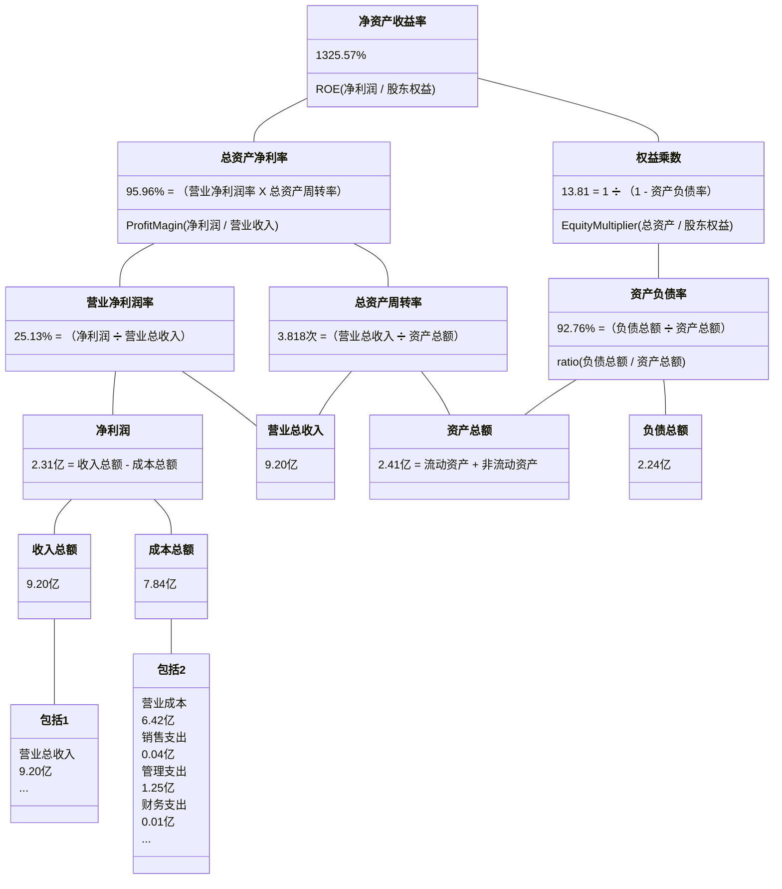
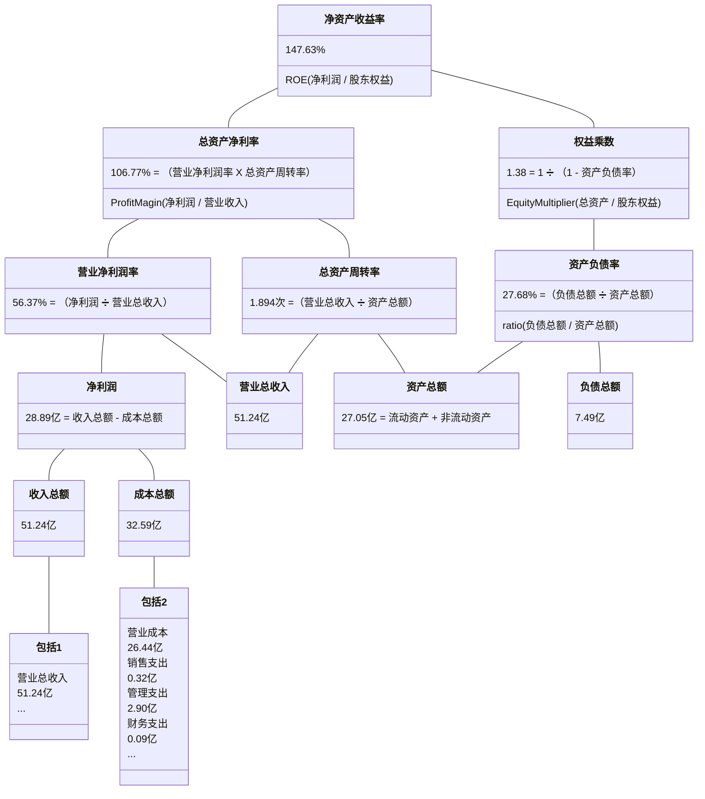
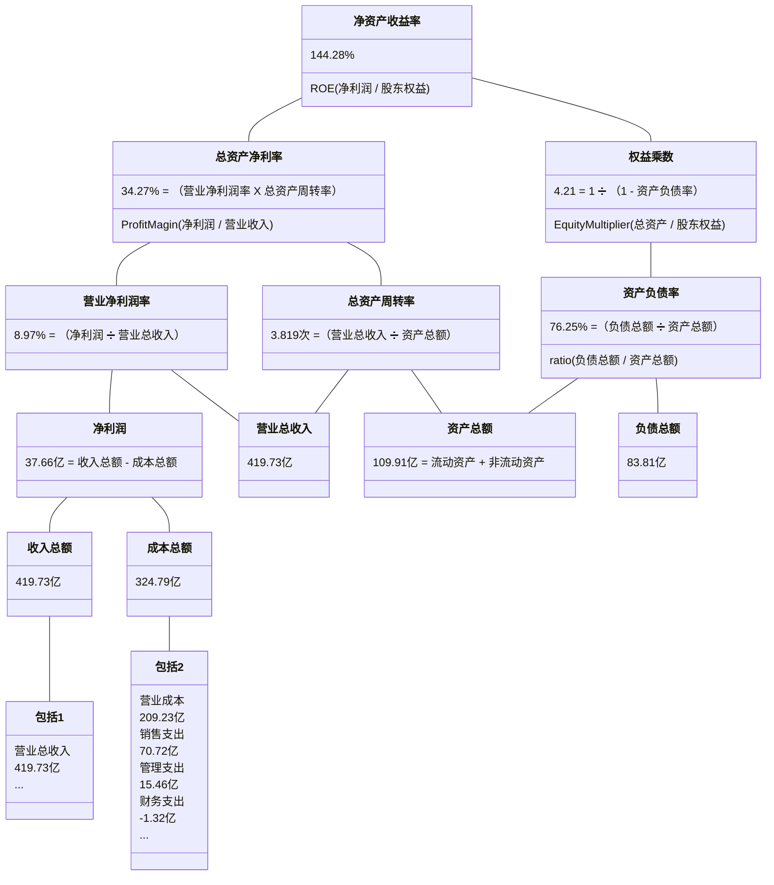
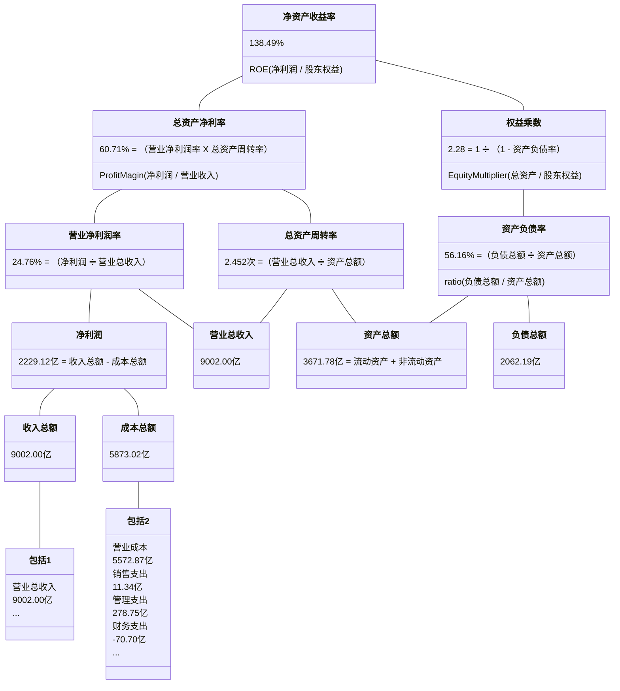
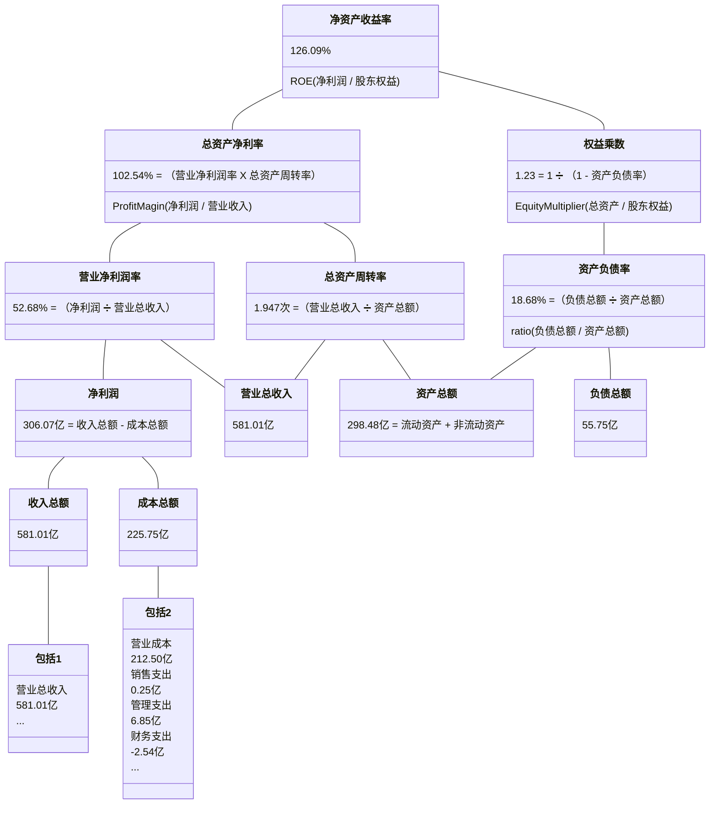
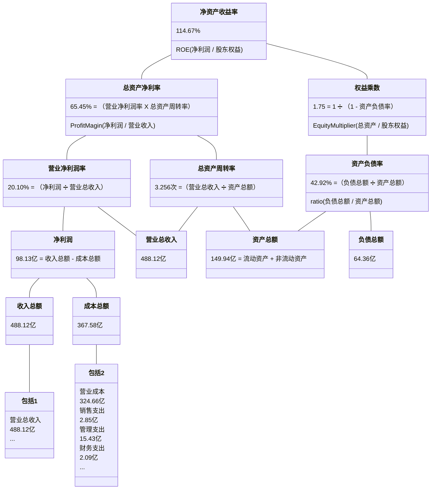

## 中天服务

```mermaid
classDiagram
净资产收益率 -- 总资产净利率
	净资产收益率 : 1325.57%
	净资产收益率 : ROE(净利润 /  股东权益)
	总资产净利率 : 95.96% = （营业净利润率 X 总资产周转率）
	总资产净利率 : ProfitMagin(净利润 /  营业收入)
净资产收益率 -- 权益乘数
	权益乘数 : 13.81 = 1 ➗ （1 - 资产负债率）
	权益乘数 : EquityMultiplier(总资产 /  股东权益)
	
总资产净利率 -- 营业净利润率
	营业净利润率 : 25.13% = （净利润 ➗ 营业总收入）
总资产净利率 -- 总资产周转率
	总资产周转率 : 3.818次 =（营业总收入 ➗ 资产总额）
权益乘数 -- 资产负债率
	资产负债率  : 92.76% =（负债总额 ➗ 资产总额）
	资产负债率  : ratio(负债总额 / 资产总额)

营业净利润率 -- 净利润
	净利润 : 2.31亿 = 收入总额 - 成本总额
营业净利润率 -- 营业总收入
	营业总收入 : 9.20亿
总资产周转率 -- 营业总收入
总资产周转率 -- 资产总额
	资产总额 : 2.41亿 = 流动资产 + 非流动资产
资产负债率 -- 　负债总额
	负债总额 : 2.24亿
资产负债率 -- 　资产总额


净利润 -- 收入总额
	收入总额 : 9.20亿
净利润 -- 成本总额
	成本总额 : 7.84亿

收入总额 -- 包括1
	包括1 : 营业总收入
	包括1 : 9.20亿
	包括1 : ...
成本总额 -- 包括2
	包括2 : 营业成本
	包括2 : 6.42亿
	包括2 : 销售支出
	包括2 : 0.04亿
	包括2 : 管理支出
	包括2 : 1.25亿
	包括2 : 财务支出
	包括2 : 0.01亿
	包括2 : ...
```

## ST澄星

```mermaid
classDiagram
净资产收益率 -- 总资产净利率
	净资产收益率 : 229.57%
	净资产收益率 : ROE(净利润 /  股东权益)
	总资产净利率 : 45.11% = （营业净利润率 X 总资产周转率）
	总资产净利率 : ProfitMagin(净利润 /  营业收入)
净资产收益率 -- 权益乘数
	权益乘数 : 5.09 = 1 ➗ （1 - 资产负债率）
	权益乘数 : EquityMultiplier(总资产 /  股东权益)
	
总资产净利率 -- 营业净利润率
	营业净利润率 : 22.57% = （净利润 ➗ 营业总收入）
总资产净利率 -- 总资产周转率
	总资产周转率 : 1.999次 =（营业总收入 ➗ 资产总额）
权益乘数 -- 资产负债率
	资产负债率  : 80.35% =（负债总额 ➗ 资产总额）
	资产负债率  : ratio(负债总额 / 资产总额)

营业净利润率 -- 净利润
	净利润 : 24.76亿 = 收入总额 - 成本总额
营业净利润率 -- 营业总收入
	营业总收入 : 109.72亿
总资产周转率 -- 营业总收入
总资产周转率 -- 资产总额
	资产总额 : 54.90亿 = 流动资产 + 非流动资产
资产负债率 -- 　负债总额
	负债总额 : 44.11亿
资产负债率 -- 　资产总额


净利润 -- 收入总额
	收入总额 : 109.72亿
净利润 -- 成本总额
	成本总额 : 100.27亿

收入总额 -- 包括1
	包括1 : 营业总收入
	包括1 : 109.72亿
	包括1 : ...
成本总额 -- 包括2
	包括2 : 营业成本
	包括2 : 90.10亿
	包括2 : 销售支出
	包括2 : 0.73亿
	包括2 : 管理支出
	包括2 : 4.61亿
	包括2 : 财务支出
	包括2 : 3.42亿
	包括2 : ...
```

## 融捷股份

```mermaid
classDiagram
净资产收益率 -- 总资产净利率
	净资产收益率 : 147.63%
	净资产收益率 : ROE(净利润 /  股东权益)
	总资产净利率 : 106.77% = （营业净利润率 X 总资产周转率）
	总资产净利率 : ProfitMagin(净利润 /  营业收入)
净资产收益率 -- 权益乘数
	权益乘数 : 1.38 = 1 ➗ （1 - 资产负债率）
	权益乘数 : EquityMultiplier(总资产 /  股东权益)
	
总资产净利率 -- 营业净利润率
	营业净利润率 : 56.37% = （净利润 ➗ 营业总收入）
总资产净利率 -- 总资产周转率
	总资产周转率 : 1.894次 =（营业总收入 ➗ 资产总额）
权益乘数 -- 资产负债率
	资产负债率  : 27.68% =（负债总额 ➗ 资产总额）
	资产负债率  : ratio(负债总额 / 资产总额)

营业净利润率 -- 净利润
	净利润 : 28.89亿 = 收入总额 - 成本总额
营业净利润率 -- 营业总收入
	营业总收入 : 51.24亿
总资产周转率 -- 营业总收入
总资产周转率 -- 资产总额
	资产总额 : 27.05亿 = 流动资产 + 非流动资产
资产负债率 -- 　负债总额
	负债总额 : 7.49亿
资产负债率 -- 　资产总额


净利润 -- 收入总额
	收入总额 : 51.24亿
净利润 -- 成本总额
	成本总额 : 32.59亿

收入总额 -- 包括1
	包括1 : 营业总收入
	包括1 : 51.24亿
	包括1 : ...
成本总额 -- 包括2
	包括2 : 营业成本
	包括2 : 26.44亿
	包括2 : 销售支出
	包括2 : 0.32亿
	包括2 : 管理支出
	包括2 : 2.90亿
	包括2 : 财务支出
	包括2 : 0.09亿
	包括2 : ...
```

## 重庆啤酒

```mermaid
classDiagram
净资产收益率 -- 总资产净利率
	净资产收益率 : 144.28%
	净资产收益率 : ROE(净利润 /  股东权益)
	总资产净利率 : 34.27% = （营业净利润率 X 总资产周转率）
	总资产净利率 : ProfitMagin(净利润 /  营业收入)
净资产收益率 -- 权益乘数
	权益乘数 : 4.21 = 1 ➗ （1 - 资产负债率）
	权益乘数 : EquityMultiplier(总资产 /  股东权益)
	
总资产净利率 -- 营业净利润率
	营业净利润率 : 8.97% = （净利润 ➗ 营业总收入）
总资产净利率 -- 总资产周转率
	总资产周转率 : 3.819次 =（营业总收入 ➗ 资产总额）
权益乘数 -- 资产负债率
	资产负债率  : 76.25% =（负债总额 ➗ 资产总额）
	资产负债率  : ratio(负债总额 / 资产总额)

营业净利润率 -- 净利润
	净利润 : 37.66亿 = 收入总额 - 成本总额
营业净利润率 -- 营业总收入
	营业总收入 : 419.73亿
总资产周转率 -- 营业总收入
总资产周转率 -- 资产总额
	资产总额 : 109.91亿 = 流动资产 + 非流动资产
资产负债率 -- 　负债总额
	负债总额 : 83.81亿
资产负债率 -- 　资产总额


净利润 -- 收入总额
	收入总额 : 419.73亿
净利润 -- 成本总额
	成本总额 : 324.79亿

收入总额 -- 包括1
	包括1 : 营业总收入
	包括1 : 419.73亿
	包括1 : ...
成本总额 -- 包括2
	包括2 : 营业成本
	包括2 : 209.23亿
	包括2 : 销售支出
	包括2 : 70.72亿
	包括2 : 管理支出
	包括2 : 15.46亿
	包括2 : 财务支出
	包括2 : -1.32亿
	包括2 : ...
```

## 盐湖股份

```mermaid
classDiagram
净资产收益率 -- 总资产净利率
	净资产收益率 : 139.95%
	净资产收益率 : ROE(净利润 /  股东权益)
	总资产净利率 : 84.07% = （营业净利润率 X 总资产周转率）
	总资产净利率 : ProfitMagin(净利润 /  营业收入)
净资产收益率 -- 权益乘数
	权益乘数 : 1.66 = 1 ➗ （1 - 资产负债率）
	权益乘数 : EquityMultiplier(总资产 /  股东权益)
	
总资产净利率 -- 营业净利润率
	营业净利润率 : 41.67% = （净利润 ➗ 营业总收入）
总资产净利率 -- 总资产周转率
	总资产周转率 : 2.017次 =（营业总收入 ➗ 资产总额）
权益乘数 -- 资产负债率
	资产负债率  : 39.93% =（负债总额 ➗ 资产总额）
	资产负债率  : ratio(负债总额 / 资产总额)

营业净利润率 -- 净利润
	净利润 : 279.60亿 = 收入总额 - 成本总额
营业净利润率 -- 营业总收入
	营业总收入 : 670.96亿
总资产周转率 -- 营业总收入
总资产周转率 -- 资产总额
	资产总额 : 332.59亿 = 流动资产 + 非流动资产
资产负债率 -- 　负债总额
	负债总额 : 132.80亿
资产负债率 -- 　资产总额


净利润 -- 收入总额
	收入总额 : 670.96亿
净利润 -- 成本总额
	成本总额 : 293.92亿

收入总额 -- 包括1
	包括1 : 营业总收入
	包括1 : 670.96亿
	包括1 : ...
成本总额 -- 包括2
	包括2 : 营业成本
	包括2 : 218.78亿
	包括2 : 销售支出
	包括2 : 6.29亿
	包括2 : 管理支出
	包括2 : 24.30亿
	包括2 : 财务支出
	包括2 : 1.75亿
	包括2 : ...
```

## 中远海控

```mermaid
classDiagram
净资产收益率 -- 总资产净利率
	净资产收益率 : 138.49%
	净资产收益率 : ROE(净利润 /  股东权益)
	总资产净利率 : 60.71% = （营业净利润率 X 总资产周转率）
	总资产净利率 : ProfitMagin(净利润 /  营业收入)
净资产收益率 -- 权益乘数
	权益乘数 : 2.28 = 1 ➗ （1 - 资产负债率）
	权益乘数 : EquityMultiplier(总资产 /  股东权益)
	
总资产净利率 -- 营业净利润率
	营业净利润率 : 24.76% = （净利润 ➗ 营业总收入）
总资产净利率 -- 总资产周转率
	总资产周转率 : 2.452次 =（营业总收入 ➗ 资产总额）
权益乘数 -- 资产负债率
	资产负债率  : 56.16% =（负债总额 ➗ 资产总额）
	资产负债率  : ratio(负债总额 / 资产总额)

营业净利润率 -- 净利润
	净利润 : 2229.12亿 = 收入总额 - 成本总额
营业净利润率 -- 营业总收入
	营业总收入 : 9002.00亿
总资产周转率 -- 营业总收入
总资产周转率 -- 资产总额
	资产总额 : 3671.78亿 = 流动资产 + 非流动资产
资产负债率 -- 　负债总额
	负债总额 : 2062.19亿
资产负债率 -- 　资产总额


净利润 -- 收入总额
	收入总额 : 9002.00亿
净利润 -- 成本总额
	成本总额 : 5873.02亿

收入总额 -- 包括1
	包括1 : 营业总收入
	包括1 : 9002.00亿
	包括1 : ...
成本总额 -- 包括2
	包括2 : 营业成本
	包括2 : 5572.87亿
	包括2 : 销售支出
	包括2 : 11.34亿
	包括2 : 管理支出
	包括2 : 278.75亿
	包括2 : 财务支出
	包括2 : -70.70亿
	包括2 : ...
```

## 石英股份

```mermaid
classDiagram
净资产收益率 -- 总资产净利率
	净资产收益率 : 133.98%
	净资产收益率 : ROE(净利润 /  股东权益)
	总资产净利率 : 120.61% = （营业净利润率 X 总资产周转率）
	总资产净利率 : ProfitMagin(净利润 /  营业收入)
净资产收益率 -- 权益乘数
	权益乘数 : 1.11 = 1 ➗ （1 - 资产负债率）
	权益乘数 : EquityMultiplier(总资产 /  股东权益)
	
总资产净利率 -- 营业净利润率
	营业净利润率 : 62.79% = （净利润 ➗ 营业总收入）
总资产净利率 -- 总资产周转率
	总资产周转率 : 1.921次 =（营业总收入 ➗ 资产总额）
权益乘数 -- 资产负债率
	资产负债率  : 9.98% =（负债总额 ➗ 资产总额）
	资产负债率  : ratio(负债总额 / 资产总额)

营业净利润率 -- 净利润
	净利润 : 63.72亿 = 收入总额 - 成本总额
营业净利润率 -- 营业总收入
	营业总收入 : 101.49亿
总资产周转率 -- 营业总收入
总资产周转率 -- 资产总额
	资产总额 : 52.83亿 = 流动资产 + 非流动资产
资产负债率 -- 　负债总额
	负债总额 : 5.27亿
资产负债率 -- 　资产总额


净利润 -- 收入总额
	收入总额 : 101.49亿
净利润 -- 成本总额
	成本总额 : 27.52亿

收入总额 -- 包括1
	包括1 : 营业总收入
	包括1 : 101.49亿
	包括1 : ...
成本总额 -- 包括2
	包括2 : 营业成本
	包括2 : 20.54亿
	包括2 : 销售支出
	包括2 : 0.47亿
	包括2 : 管理支出
	包括2 : 2.70亿
	包括2 : 财务支出
	包括2 : -0.29亿
	包括2 : ...
```

## 达安基因

```mermaid
classDiagram
净资产收益率 -- 总资产净利率
	净资产收益率 : 133.64%
	净资产收益率 : ROE(净利润 /  股东权益)
	总资产净利率 : 103.12% = （营业净利润率 X 总资产周转率）
	总资产净利率 : ProfitMagin(净利润 /  营业收入)
净资产收益率 -- 权益乘数
	权益乘数 : 1.30 = 1 ➗ （1 - 资产负债率）
	权益乘数 : EquityMultiplier(总资产 /  股东权益)
	
总资产净利率 -- 营业净利润率
	营业净利润率 : 43.73% = （净利润 ➗ 营业总收入）
总资产净利率 -- 总资产周转率
	总资产周转率 : 2.358次 =（营业总收入 ➗ 资产总额）
权益乘数 -- 资产负债率
	资产负债率  : 22.84% =（负债总额 ➗ 资产总额）
	资产负债率  : ratio(负债总额 / 资产总额)

营业净利润率 -- 净利润
	净利润 : 91.35亿 = 收入总额 - 成本总额
营业净利润率 -- 营业总收入
	营业总收入 : 208.91亿
总资产周转率 -- 营业总收入
总资产周转率 -- 资产总额
	资产总额 : 88.59亿 = 流动资产 + 非流动资产
资产负债率 -- 　负债总额
	负债总额 : 20.23亿
资产负债率 -- 　资产总额


净利润 -- 收入总额
	收入总额 : 208.91亿
净利润 -- 成本总额
	成本总额 : 99.25亿

收入总额 -- 包括1
	包括1 : 营业总收入
	包括1 : 208.91亿
	包括1 : ...
成本总额 -- 包括2
	包括2 : 营业成本
	包括2 : 57.91亿
	包括2 : 销售支出
	包括2 : 19.03亿
	包括2 : 管理支出
	包括2 : 8.31亿
	包括2 : 财务支出
	包括2 : -2.17亿
	包括2 : ...
```

## 大全能源

```mermaid
classDiagram
净资产收益率 -- 总资产净利率
	净资产收益率 : 126.09%
	净资产收益率 : ROE(净利润 /  股东权益)
	总资产净利率 : 102.54% = （营业净利润率 X 总资产周转率）
	总资产净利率 : ProfitMagin(净利润 /  营业收入)
净资产收益率 -- 权益乘数
	权益乘数 : 1.23 = 1 ➗ （1 - 资产负债率）
	权益乘数 : EquityMultiplier(总资产 /  股东权益)
	
总资产净利率 -- 营业净利润率
	营业净利润率 : 52.68% = （净利润 ➗ 营业总收入）
总资产净利率 -- 总资产周转率
	总资产周转率 : 1.947次 =（营业总收入 ➗ 资产总额）
权益乘数 -- 资产负债率
	资产负债率  : 18.68% =（负债总额 ➗ 资产总额）
	资产负债率  : ratio(负债总额 / 资产总额)

营业净利润率 -- 净利润
	净利润 : 306.07亿 = 收入总额 - 成本总额
营业净利润率 -- 营业总收入
	营业总收入 : 581.01亿
总资产周转率 -- 营业总收入
总资产周转率 -- 资产总额
	资产总额 : 298.48亿 = 流动资产 + 非流动资产
资产负债率 -- 　负债总额
	负债总额 : 55.75亿
资产负债率 -- 　资产总额


净利润 -- 收入总额
	收入总额 : 581.01亿
净利润 -- 成本总额
	成本总额 : 225.75亿

收入总额 -- 包括1
	包括1 : 营业总收入
	包括1 : 581.01亿
	包括1 : ...
成本总额 -- 包括2
	包括2 : 营业成本
	包括2 : 212.50亿
	包括2 : 销售支出
	包括2 : 0.25亿
	包括2 : 管理支出
	包括2 : 6.85亿
	包括2 : 财务支出
	包括2 : -2.54亿
	包括2 : ...
```

## 天赐材料

```mermaid
classDiagram
净资产收益率 -- 总资产净利率
	净资产收益率 : 114.67%
	净资产收益率 : ROE(净利润 /  股东权益)
	总资产净利率 : 65.45% = （营业净利润率 X 总资产周转率）
	总资产净利率 : ProfitMagin(净利润 /  营业收入)
净资产收益率 -- 权益乘数
	权益乘数 : 1.75 = 1 ➗ （1 - 资产负债率）
	权益乘数 : EquityMultiplier(总资产 /  股东权益)
	
总资产净利率 -- 营业净利润率
	营业净利润率 : 20.10% = （净利润 ➗ 营业总收入）
总资产净利率 -- 总资产周转率
	总资产周转率 : 3.256次 =（营业总收入 ➗ 资产总额）
权益乘数 -- 资产负债率
	资产负债率  : 42.92% =（负债总额 ➗ 资产总额）
	资产负债率  : ratio(负债总额 / 资产总额)

营业净利润率 -- 净利润
	净利润 : 98.13亿 = 收入总额 - 成本总额
营业净利润率 -- 营业总收入
	营业总收入 : 488.12亿
总资产周转率 -- 营业总收入
总资产周转率 -- 资产总额
	资产总额 : 149.94亿 = 流动资产 + 非流动资产
资产负债率 -- 　负债总额
	负债总额 : 64.36亿
资产负债率 -- 　资产总额


净利润 -- 收入总额
	收入总额 : 488.12亿
净利润 -- 成本总额
	成本总额 : 367.58亿

收入总额 -- 包括1
	包括1 : 营业总收入
	包括1 : 488.12亿
	包括1 : ...
成本总额 -- 包括2
	包括2 : 营业成本
	包括2 : 324.66亿
	包括2 : 销售支出
	包括2 : 2.85亿
	包括2 : 管理支出
	包括2 : 15.43亿
	包括2 : 财务支出
	包括2 : 2.09亿
	包括2 : ...
```
