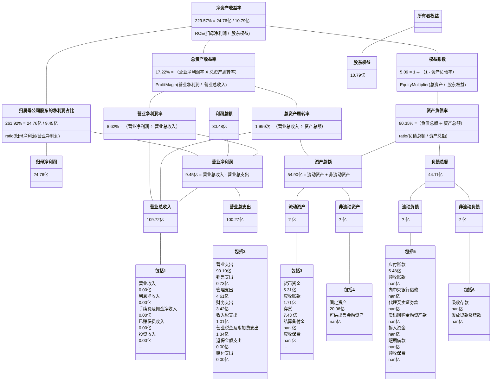
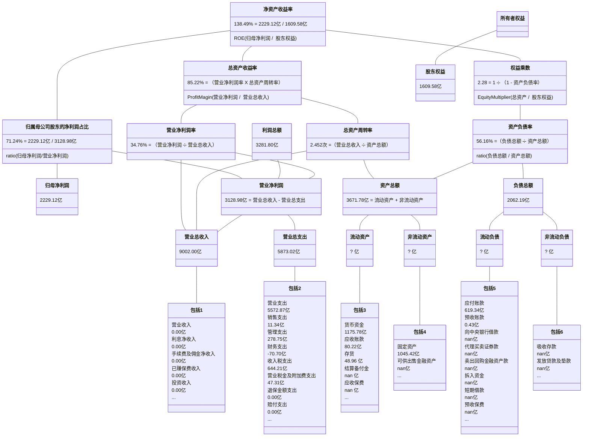
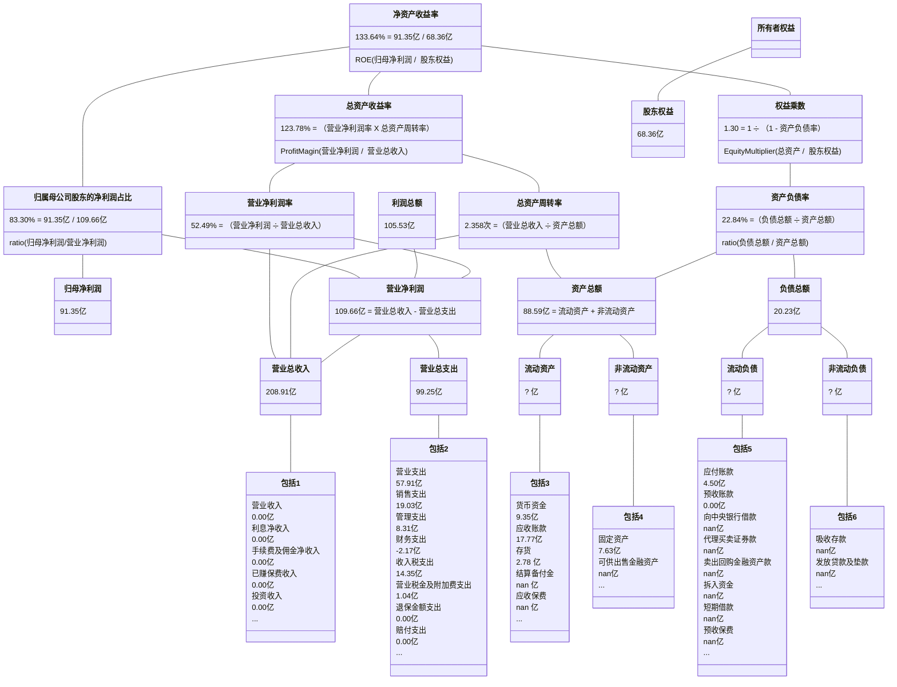
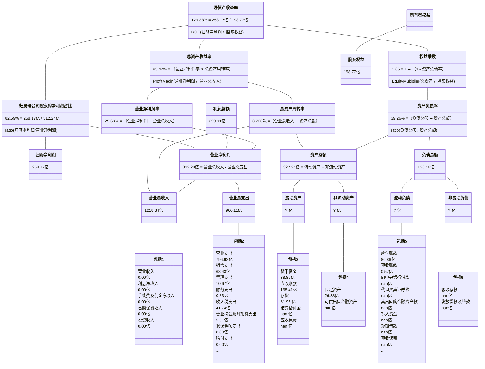

## ST澄星

2020-2023年年报披露的部分数据：

| 年份 | 净资产收益率 | 资产负债率 |
| :-: | :--------: | :-------: |
| 2020 | nan% | 102.445% |
| 2021 | 451.050% | 75.016% |
| 2022 | 30.400% | 55.172% |
| 2023 | -3.180% | 58.589% |

三年计算的净资产收益率：
                
| 年份 | 净资产收益率 | 资产负债率 |
| :-: | :--------: | :-------: |
| 20211231 | 234.565% | 86.638% |
| 20221231 | 23.821% | 66.438% |
| 20231231 | -2.524% | 56.863% |

## 融捷股份

2020-2023年年报披露的部分数据：

| 年份 | 净资产收益率 | 资产负债率 |
| :-: | :--------: | :-------: |
| 2020 | 3.780% | 39.626% |
| 2021 | 11.310% | 46.925% |
| 2022 | 130.740% | 16.813% |
| 2023 | 11.590% | 24.910% |

三年计算的净资产收益率：
                
| 年份 | 净资产收益率 | 资产负债率 |
| :-: | :--------: | :-------: |
| 20211231 | 10.231% | 43.800% |
| 20221231 | 124.095% | 24.650% |
| 20231231 | 11.683% | 21.123% |

## 重庆啤酒

2020-2023年年报披露的部分数据：

| 年份 | 净资产收益率 | 资产负债率 |
| :-: | :--------: | :-------: |
| 2020 | 45.550% | 83.650% |
| 2021 | 99.690% | 72.875% |
| 2022 | 69.250% | 71.010% |
| 2023 | 67.050% | 70.516% |

三年计算的净资产收益率：
                
| 年份 | 净资产收益率 | 资产负债率 |
| :-: | :--------: | :-------: |
| 20211231 | 49.658% | 77.768% |
| 20221231 | 37.433% | 71.905% |
| 20231231 | 36.744% | 70.764% |

## 盐湖股份

2020-2023年年报披露的部分数据：

| 年份 | 净资产收益率 | 资产负债率 |
| :-: | :--------: | :-------: |
| 2020 | 0.000% | 73.815% |
| 2021 | 66.850% | 53.892% |
| 2022 | 89.470% | 32.313% |
| 2023 | 27.910% | 25.247% |

三年计算的净资产收益率：
                
| 年份 | 净资产收益率 | 资产负债率 |
| :-: | :--------: | :-------: |
| 20211231 | 52.949% | 62.721% |
| 20221231 | 77.518% | 40.403% |
| 20231231 | 25.040% | 28.610% |

## 中远海控

2020-2023年年报披露的部分数据：

| 年份 | 净资产收益率 | 资产负债率 |
| :-: | :--------: | :-------: |
| 2020 | 25.160% | 71.059% |
| 2021 | 100.570% | 56.681% |
| 2022 | 59.840% | 50.424% |
| 2023 | 11.800% | 47.404% |

三年计算的净资产收益率：
                
| 年份 | 净资产收益率 | 资产负债率 |
| :-: | :--------: | :-------: |
| 20211231 | 69.221% | 62.379% |
| 20221231 | 50.642% | 53.223% |
| 20231231 | 9.601% | 48.991% |

## 石英股份

2020-2023年年报披露的部分数据：

| 年份 | 净资产收益率 | 资产负债率 |
| :-: | :--------: | :-------: |
| 2020 | 10.860% | 10.441% |
| 2021 | 13.140% | 10.892% |
| 2022 | 39.430% | 10.883% |
| 2023 | 90.630% | 9.859% |

三年计算的净资产收益率：
                
| 年份 | 净资产收益率 | 资产负债率 |
| :-: | :--------: | :-------: |
| 20211231 | 13.617% | 10.680% |
| 20221231 | 38.507% | 10.886% |
| 20231231 | 92.888% | 10.171% |

## 达安基因

2020-2023年年报披露的部分数据：

| 年份 | 净资产收益率 | 资产负债率 |
| :-: | :--------: | :-------: |
| 2020 | 80.210% | 32.617% |
| 2021 | 62.520% | 25.894% |
| 2022 | 58.960% | 21.286% |
| 2023 | 1.080% | 16.889% |

三年计算的净资产收益率：
                
| 年份 | 净资产收益率 | 资产负债率 |
| :-: | :--------: | :-------: |
| 20211231 | 59.438% | 28.538% |
| 20221231 | 56.157% | 23.184% |
| 20231231 | 1.008% | 19.406% |

## 智飞生物

2020-2023年年报披露的部分数据：

| 年份 | 净资产收益率 | 资产负债率 |
| :-: | :--------: | :-------: |
| 2020 | 46.290% | 45.787% |
| 2021 | 78.010% | 41.235% |
| 2022 | 36.130% | 36.227% |
| 2023 | 29.090% | 37.279% |

三年计算的净资产收益率：
                
| 年份 | 净资产收益率 | 资产负债率 |
| :-: | :--------: | :-------: |
| 20211231 | 78.813% | 42.765% |
| 20221231 | 35.991% | 38.438% |
| 20231231 | 28.954% | 36.826% |

## 大全能源

2020-2023年年报披露的部分数据：

| 年份 | 净资产收益率 | 资产负债率 |
| :-: | :--------: | :-------: |
| 2020 | 26.070% | 48.146% |
| 2021 | 55.940% | 26.716% |
| 2022 | 61.680% | 12.864% |
| 2023 | 13.300% | 13.445% |

三年计算的净资产收益率：
                
| 年份 | 净资产收益率 | 资产负债率 |
| :-: | :--------: | :-------: |
| 20211231 | 54.161% | 32.845% |
| 20221231 | 61.670% | 17.029% |
| 20231231 | 12.889% | 13.150% |

## 天赐材料

2020-2023年年报披露的部分数据：

| 年份 | 净资产收益率 | 资产负债率 |
| :-: | :--------: | :-------: |
| 2020 | 17.490% | 41.173% |
| 2021 | 40.920% | 46.976% |
| 2022 | 59.420% | 49.717% |
| 2023 | 14.780% | 43.364% |

三年计算的净资产收益率：
                
| 年份 | 净资产收益率 | 资产负债率 |
| :-: | :--------: | :-------: |
| 20211231 | 40.499% | 45.224% |
| 20221231 | 56.557% | 48.751% |
| 20231231 | 14.313% | 46.640% |

