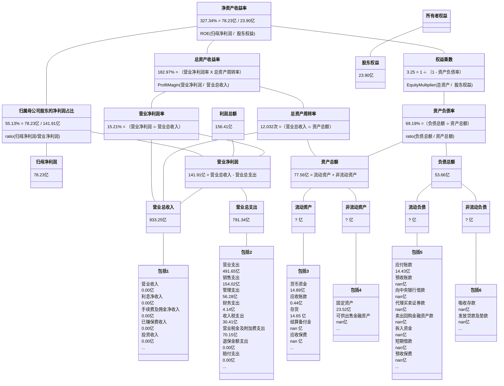
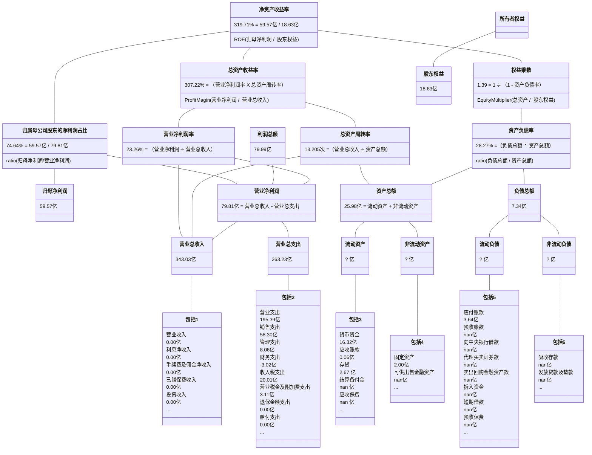

## 双汇发展

2009-2023年年报披露的部分数据：

| 年份 | 净资产收益率 | 资产负债率 | 归母净利润 | 股东权益合计 |
| :-: | :--------: | :-------: | :------: | :--------: |
| 2008 | 31.710% | 32.062% | 6.989亿 | 30.274亿 |
| 2009 | 34.130% | 35.392% | 9.107亿 | 37.170亿 |
| 2010 | 35.430% | 35.548% | 11.592亿 | 46.086亿 |
| 2011 | 14.760% | 38.913% | 13.342亿 | 101.316亿 |
| 2012 | 27.930% | 24.804% | 28.852亿 | 125.541亿 |
| 2013 | 30.440% | 24.019% | 38.582亿 | 150.034亿 |
| 2014 | 28.600% | 25.573% | 40.399亿 | 163.608亿 |
| 2015 | 27.240% | 22.714% | 42.555亿 | 176.866亿 |
| 2016 | 28.330% | 29.427% | 44.051亿 | 150.687亿 |
| 2017 | 35.620% | 33.010% | 43.193亿 | 154.673亿 |
| 2018 | 38.840% | 40.059% | 49.119亿 | 137.052亿 |
| 2019 | 37.370% | 40.226% | 54.376亿 | 171.154亿 |
| 2020 | 32.930% | 30.461% | 62.555亿 | 241.327亿 |
| 2021 | 21.800% | 31.867% | 48.659亿 | 231.497亿 |
| 2022 | 25.430% | 39.079% | 56.209亿 | 221.825亿 |
| 2023 | 23.830% | 42.342% | 50.527亿 | 211.463亿 |

2008-2023年计算的部分数据：
                
| 年份 | 净资产收益率 | 资产负债率 | 归母净利润 | 股东权益合计 |
| :-: | :--------: | :-------: | :------: | :--------: |
| 2009 | 27.004% | 33.939% | 9.107亿 | 33.722亿 |
| 2010 | 27.847% | 35.479% | 11.592亿 | 41.628亿 |
| 2011 | 18.103% | 37.899% | 13.342亿 | 73.701亿 |
| 2012 | 25.437% | 31.835% | 28.852亿 | 113.429亿 |
| 2013 | 28.001% | 24.378% | 38.582亿 | 137.787亿 |
| 2014 | 25.761% | 24.838% | 40.399亿 | 156.821亿 |
| 2015 | 24.998% | 24.115% | 42.555亿 | 170.237亿 |
| 2016 | 26.897% | 25.954% | 44.051亿 | 163.777亿 |
| 2017 | 28.290% | 31.288% | 43.193亿 | 152.680亿 |
| 2018 | 33.675% | 36.517% | 49.119亿 | 145.863亿 |
| 2019 | 35.286% | 40.152% | 54.376亿 | 154.103亿 |
| 2020 | 30.331% | 34.875% | 62.555亿 | 206.241亿 |
| 2021 | 20.582% | 31.157% | 48.659亿 | 236.412亿 |
| 2022 | 24.799% | 35.598% | 56.209亿 | 226.661亿 |
| 2023 | 23.323% | 40.716% | 50.527亿 | 216.644亿 |

## 苏泊尔

2009-2023年年报披露的部分数据：

| 年份 | 净资产收益率 | 资产负债率 | 归母净利润 | 股东权益合计 |
| :-: | :--------: | :-------: | :------: | :--------: |
| 2008 | 13.190% | 18.423% | 2.365亿 | 21.626亿 |
| 2009 | 15.330% | 26.909% | 3.104亿 | 23.870亿 |
| 2010 | 17.580% | 30.370% | 4.039亿 | 27.367亿 |
| 2011 | 18.380% | 29.552% | 4.756亿 | 30.943亿 |
| 2012 | 16.240% | 31.564% | 4.691亿 | 33.946亿 |
| 2013 | 18.540% | 34.938% | 5.885亿 | 37.329亿 |
| 2014 | 19.630% | 35.498% | 6.899亿 | 42.788亿 |
| 2015 | 21.900% | 32.265% | 8.890亿 | 50.097亿 |
| 2016 | 23.410% | 41.949% | 10.773亿 | 45.616亿 |
| 2017 | 26.150% | 42.847% | 13.262亿 | 54.079亿 |
| 2018 | 28.840% | 44.447% | 16.699亿 | 59.071亿 |
| 2019 | 30.540% | 42.230% | 19.199亿 | 68.446亿 |
| 2020 | 26.970% | 41.128% | 18.462亿 | 72.367亿 |
| 2021 | 26.810% | 44.902% | 19.439亿 | 76.583亿 |
| 2022 | 27.890% | 45.396% | 20.677亿 | 70.727亿 |
| 2023 | 34.620% | 51.309% | 21.798亿 | 63.818亿 |

2008-2023年计算的部分数据：
                
| 年份 | 净资产收益率 | 资产负债率 | 归母净利润 | 股东权益合计 |
| :-: | :--------: | :-------: | :------: | :--------: |
| 2009 | 13.646% | 23.107% | 3.104亿 | 22.748亿 |
| 2010 | 15.767% | 28.799% | 4.039亿 | 25.619亿 |
| 2011 | 16.314% | 29.938% | 4.756亿 | 29.155亿 |
| 2012 | 14.460% | 30.619% | 4.691亿 | 32.444亿 |
| 2013 | 16.514% | 33.374% | 5.885亿 | 35.637亿 |
| 2014 | 17.222% | 35.238% | 6.899亿 | 40.059亿 |
| 2015 | 19.142% | 33.794% | 8.890亿 | 46.443亿 |
| 2016 | 22.512% | 37.253% | 10.773亿 | 47.856亿 |
| 2017 | 26.605% | 42.440% | 13.262亿 | 49.847亿 |
| 2018 | 29.516% | 43.694% | 16.699亿 | 56.575亿 |
| 2019 | 30.112% | 43.278% | 19.199亿 | 63.758亿 |
| 2020 | 26.222% | 41.669% | 18.462亿 | 70.407亿 |
| 2021 | 26.102% | 43.131% | 19.439亿 | 74.475亿 |
| 2022 | 28.072% | 45.140% | 20.677亿 | 73.655亿 |
| 2023 | 32.402% | 48.370% | 21.798亿 | 67.273亿 |

## 浙江美大

2009-2023年年报披露的部分数据：

| 年份 | 净资产收益率 | 资产负债率 | 归母净利润 | 股东权益合计 |
| :-: | :--------: | :-------: | :------: | :--------: |
| 2008 | 35.320% | 33.462% | 0.629亿 | 2.106亿 |
| 2009 | 34.190% | 34.616% | 0.861亿 | 2.947亿 |
| 2010 | 21.240% | 37.903% | 0.626亿 | 2.652亿 |
| 2011 | 27.950% | 28.671% | 0.808亿 | 3.281亿 |
| 2012 | 13.920% | 13.953% | 0.880亿 | 8.624亿 |
| 2013 | 12.200% | 14.255% | 1.077亿 | 9.201亿 |
| 2014 | 14.620% | 12.672% | 1.377亿 | 9.878亿 |
| 2015 | 15.320% | 13.897% | 1.556亿 | 10.435亿 |
| 2016 | 18.500% | 17.642% | 2.027亿 | 11.511亿 |
| 2017 | 25.730% | 21.918% | 3.052亿 | 13.084亿 |
| 2018 | 29.280% | 23.335% | 3.775亿 | 13.651亿 |
| 2019 | 33.050% | 23.533% | 4.600亿 | 15.192亿 |
| 2020 | 34.350% | 21.795% | 5.436亿 | 17.037亿 |
| 2021 | 37.040% | 17.208% | 6.647亿 | 19.502亿 |
| 2022 | 23.510% | 13.803% | 4.522亿 | 19.665亿 |
| 2023 | 23.640% | 13.038% | 4.643亿 | 20.286亿 |

2008-2023年计算的部分数据：
                
| 年份 | 净资产收益率 | 资产负债率 | 归母净利润 | 股东权益合计 |
| :-: | :--------: | :-------: | :------: | :--------: |
| 2009 | 34.081% | 34.140% | 0.861亿 | 2.527亿 |
| 2010 | 22.361% | 36.215% | 0.626亿 | 2.800亿 |
| 2011 | 27.247% | 33.117% | 0.808亿 | 2.966亿 |
| 2012 | 14.792% | 18.583% | 0.880亿 | 5.952亿 |
| 2013 | 12.081% | 14.109% | 1.077亿 | 8.913亿 |
| 2014 | 14.438% | 13.442% | 1.377亿 | 9.540亿 |
| 2015 | 15.324% | 13.306% | 1.556亿 | 10.157亿 |
| 2016 | 18.469% | 15.903% | 2.027亿 | 10.973亿 |
| 2017 | 24.818% | 19.973% | 3.052亿 | 12.297亿 |
| 2018 | 28.242% | 22.648% | 3.775亿 | 13.367亿 |
| 2019 | 31.897% | 23.440% | 4.600亿 | 14.422亿 |
| 2020 | 33.731% | 22.624% | 5.436亿 | 16.115亿 |
| 2021 | 36.382% | 19.412% | 6.647亿 | 18.270亿 |
| 2022 | 23.088% | 15.533% | 4.522亿 | 19.584亿 |
| 2023 | 23.243% | 13.416% | 4.643亿 | 19.975亿 |

## 贵州茅台

2009-2023年年报披露的部分数据：

| 年份 | 净资产收益率 | 资产负债率 | 归母净利润 | 股东权益合计 |
| :-: | :--------: | :-------: | :------: | :--------: |
| 2008 | 39.010% | 26.982% | 37.995亿 | 115.034亿 |
| 2009 | 33.550% | 25.888% | 43.124亿 | 146.516亿 |
| 2010 | 30.910% | 27.506% | 50.512亿 | 185.494亿 |
| 2011 | 40.390% | 27.213% | 87.631亿 | 254.034亿 |
| 2012 | 45.000% | 21.210% | 133.081亿 | 354.540亿 |
| 2013 | 39.430% | 20.422% | 151.366亿 | 441.291亿 |
| 2014 | 31.960% | 16.033% | 153.498亿 | 553.116亿 |
| 2015 | 26.230% | 23.253% | 155.031亿 | 662.342亿 |
| 2016 | 24.440% | 32.794% | 167.184亿 | 758.985亿 |
| 2017 | 32.950% | 28.668% | 270.794亿 | 960.196亿 |
| 2018 | 34.460% | 26.549% | 352.036亿 | 1174.085亿 |
| 2019 | 33.090% | 22.490% | 412.065亿 | 1418.764亿 |
| 2020 | 31.410% | 21.404% | 466.973亿 | 1677.207亿 |
| 2021 | 29.890% | 22.813% | 524.601亿 | 1969.575亿 |
| 2022 | 30.260% | 19.474% | 627.175亿 | 2049.381亿 |
| 2023 | 34.190% | 17.984% | 747.341亿 | 2236.565亿 |

2008-2023年计算的部分数据：
                
| 年份 | 净资产收益率 | 资产负债率 | 归母净利润 | 股东权益合计 |
| :-: | :--------: | :-------: | :------: | :--------: |
| 2009 | 32.976% | 26.373% | 43.124亿 | 130.775亿 |
| 2010 | 30.428% | 26.801% | 50.512亿 | 166.005亿 |
| 2011 | 39.875% | 27.337% | 87.631亿 | 219.764亿 |
| 2012 | 43.735% | 23.832% | 133.081亿 | 304.287亿 |
| 2013 | 38.040% | 20.775% | 151.366亿 | 397.916亿 |
| 2014 | 30.872% | 18.039% | 153.498亿 | 497.203亿 |
| 2015 | 25.510% | 20.127% | 155.031亿 | 607.729亿 |
| 2016 | 23.525% | 28.661% | 167.184亿 | 710.664亿 |
| 2017 | 31.503% | 30.551% | 270.794亿 | 859.591亿 |
| 2018 | 32.989% | 27.518% | 352.036亿 | 1067.141亿 |
| 2019 | 31.785% | 24.382% | 412.065亿 | 1296.424亿 |
| 2020 | 30.166% | 21.905% | 466.973亿 | 1547.985亿 |
| 2021 | 28.771% | 22.171% | 524.601亿 | 1823.391亿 |
| 2022 | 31.211% | 21.146% | 627.175亿 | 2009.478亿 |
| 2023 | 34.874% | 18.704% | 747.341亿 | 2142.973亿 |

## 宇通客车

2009-2023年年报披露的部分数据：

| 年份 | 净资产收益率 | 资产负债率 | 归母净利润 | 股东权益合计 |
| :-: | :--------: | :-------: | :------: | :--------: |
| 2008 | 27.720% | 63.690% | 5.310亿 | 17.010亿 |
| 2009 | 29.200% | 60.528% | 5.635亿 | 21.739亿 |
| 2010 | 37.740% | 65.075% | 8.687亿 | 25.005亿 |
| 2011 | 40.580% | 57.535% | 11.814亿 | 33.378亿 |
| 2012 | 30.500% | 50.459% | 15.497亿 | 79.967亿 |
| 2013 | 26.380% | 48.906% | 22.630亿 | 95.114亿 |
| 2014 | 25.540% | 54.412% | 26.126亿 | 108.606亿 |
| 2015 | 30.190% | 57.068% | 35.352亿 | 129.394亿 |
| 2016 | 31.240% | 61.088% | 40.437亿 | 136.791亿 |
| 2017 | 22.150% | 56.849% | 31.292亿 | 156.059亿 |
| 2018 | 14.300% | 54.466% | 23.015亿 | 167.562亿 |
| 2019 | 11.350% | 51.792% | 19.423亿 | 176.954亿 |
| 2020 | 3.110% | 53.642% | 5.160亿 | 154.426亿 |
| 2021 | 4.060% | 52.300% | 6.138亿 | 153.431亿 |
| 2022 | 5.150% | 51.344% | 7.591亿 | 145.960亿 |
| 2023 | 12.970% | 54.446% | 18.171亿 | 140.566亿 |

2008-2023年计算的部分数据：
                
| 年份 | 净资产收益率 | 资产负债率 | 归母净利润 | 股东权益合计 |
| :-: | :--------: | :-------: | :------: | :--------: |
| 2009 | 29.084% | 61.981% | 5.635亿 | 19.374亿 |
| 2010 | 37.169% | 63.098% | 8.687亿 | 23.372亿 |
| 2011 | 40.471% | 61.129% | 11.814亿 | 29.191亿 |
| 2012 | 27.345% | 52.776% | 15.497亿 | 56.672亿 |
| 2013 | 25.850% | 49.627% | 22.630亿 | 87.541亿 |
| 2014 | 25.649% | 51.997% | 26.126亿 | 101.860亿 |
| 2015 | 29.708% | 55.895% | 35.352亿 | 119.000亿 |
| 2016 | 30.383% | 59.232% | 40.437亿 | 133.092亿 |
| 2017 | 21.371% | 58.938% | 31.292亿 | 146.425亿 |
| 2018 | 14.223% | 55.647% | 23.015亿 | 161.810亿 |
| 2019 | 11.275% | 53.131% | 19.423亿 | 172.258亿 |
| 2020 | 3.114% | 52.672% | 5.160亿 | 165.690亿 |
| 2021 | 3.987% | 52.983% | 6.138亿 | 153.929亿 |
| 2022 | 5.071% | 51.839% | 7.591亿 | 149.696亿 |
| 2023 | 12.684% | 52.917% | 18.171亿 | 143.263亿 |

## 伟星新材

2009-2023年年报披露的部分数据：

| 年份 | 净资产收益率 | 资产负债率 | 归母净利润 | 股东权益合计 |
| :-: | :--------: | :-------: | :------: | :--------: |
| 2008 | 34.500% | 50.155% | 0.951亿 | 3.233亿 |
| 2009 | 41.450% | 53.484% | 1.326亿 | 3.039亿 |
| 2010 | 14.020% | 16.594% | 1.701亿 | 15.728亿 |
| 2011 | 13.390% | 19.441% | 2.193亿 | 17.178亿 |
| 2012 | 13.870% | 15.292% | 2.359亿 | 17.723亿 |
| 2013 | 17.090% | 15.470% | 3.157亿 | 19.453亿 |
| 2014 | 19.120% | 17.284% | 3.878亿 | 21.170亿 |
| 2015 | 21.460% | 17.499% | 4.844亿 | 23.933亿 |
| 2016 | 26.150% | 25.172% | 6.707亿 | 27.471亿 |
| 2017 | 28.190% | 23.521% | 8.213亿 | 32.105亿 |
| 2018 | 29.450% | 20.738% | 9.783亿 | 36.572亿 |
| 2019 | 27.050% | 19.047% | 9.832亿 | 39.057亿 |
| 2020 | 29.950% | 23.197% | 11.926亿 | 43.468亿 |
| 2021 | 27.000% | 23.320% | 12.234亿 | 49.353亿 |
| 2022 | 25.840% | 21.450% | 12.975亿 | 54.504亿 |
| 2023 | 26.150% | 21.153% | 14.324亿 | 57.492亿 |

2008-2023年计算的部分数据：
                
| 年份 | 净资产收益率 | 资产负债率 | 归母净利润 | 股东权益合计 |
| :-: | :--------: | :-------: | :------: | :--------: |
| 2009 | 42.287% | 51.825% | 1.326亿 | 3.136亿 |
| 2010 | 18.129% | 26.087% | 1.701亿 | 9.383亿 |
| 2011 | 13.326% | 18.105% | 2.193亿 | 16.453亿 |
| 2012 | 13.520% | 17.386% | 2.359亿 | 17.451亿 |
| 2013 | 16.982% | 15.385% | 3.157亿 | 18.588亿 |
| 2014 | 19.090% | 16.426% | 3.878亿 | 20.311亿 |
| 2015 | 21.480% | 17.398% | 4.844亿 | 22.551亿 |
| 2016 | 26.096% | 21.785% | 6.707亿 | 25.702亿 |
| 2017 | 27.571% | 24.291% | 8.213亿 | 29.788亿 |
| 2018 | 28.491% | 22.064% | 9.783亿 | 34.339亿 |
| 2019 | 26.002% | 19.874% | 9.832亿 | 37.815亿 |
| 2020 | 28.903% | 21.287% | 11.926亿 | 41.262亿 |
| 2021 | 26.359% | 23.262% | 12.234亿 | 46.410亿 |
| 2022 | 24.986% | 22.350% | 12.975亿 | 51.928亿 |
| 2023 | 25.580% | 21.298% | 14.324亿 | 55.998亿 |

## 天虹股份

2009-2023年年报披露的部分数据：

| 年份 | 净资产收益率 | 资产负债率 | 归母净利润 | 股东权益合计 |
| :-: | :--------: | :-------: | :------: | :--------: |
| 2008 | 50.370% | 77.421% | 3.136亿 | 6.872亿 |
| 2009 | 40.420% | 77.038% | 3.560亿 | 9.032亿 |
| 2010 | 21.400% | 53.704% | 4.850亿 | 33.100亿 |
| 2011 | 16.700% | 58.600% | 5.739亿 | 36.454亿 |
| 2012 | 15.530% | 58.071% | 5.877亿 | 39.688亿 |
| 2013 | 14.930% | 58.843% | 6.154亿 | 43.189亿 |
| 2014 | 12.180% | 60.275% | 5.384亿 | 45.680亿 |
| 2015 | 24.080% | 60.289% | 12.084亿 | 55.137亿 |
| 2016 | 9.500% | 62.066% | 5.241亿 | 55.983亿 |
| 2017 | 12.470% | 60.882% | 7.182亿 | 60.269亿 |
| 2018 | 14.500% | 59.574% | 9.044亿 | 65.710亿 |
| 2019 | 12.870% | 58.185% | 8.593亿 | 69.552亿 |
| 2020 | 3.740% | 62.361% | 2.534亿 | 67.020亿 |
| 2021 | 5.500% | 87.177% | 2.321亿 | 41.170亿 |
| 2022 | 2.970% | 86.697% | 1.201亿 | 40.498亿 |
| 2023 | 5.510% | 85.198% | 2.267亿 | 42.181亿 |

2008-2023年计算的部分数据：
                
| 年份 | 净资产收益率 | 资产负债率 | 归母净利润 | 股东权益合计 |
| :-: | :--------: | :-------: | :------: | :--------: |
| 2009 | 44.763% | 77.205% | 3.560亿 | 7.952亿 |
| 2010 | 23.023% | 61.985% | 4.850亿 | 21.066亿 |
| 2011 | 16.502% | 56.406% | 5.739亿 | 34.777亿 |
| 2012 | 15.436% | 58.326% | 5.877亿 | 38.071亿 |
| 2013 | 14.852% | 58.477% | 6.154亿 | 41.438亿 |
| 2014 | 12.117% | 59.591% | 5.384亿 | 44.435亿 |
| 2015 | 23.972% | 60.282% | 12.084亿 | 50.409亿 |
| 2016 | 9.433% | 61.204% | 5.241亿 | 55.560亿 |
| 2017 | 12.356% | 61.461% | 7.182亿 | 58.126亿 |
| 2018 | 14.358% | 60.211% | 9.044亿 | 62.990亿 |
| 2019 | 12.706% | 58.872% | 8.593亿 | 67.631亿 |
| 2020 | 3.711% | 60.344% | 2.534亿 | 68.286亿 |
| 2021 | 4.291% | 78.324% | 2.321亿 | 54.095亿 |
| 2022 | 2.941% | 86.944% | 1.201亿 | 40.834亿 |
| 2023 | 5.483% | 85.972% | 2.267亿 | 41.340亿 |

## 美亚光电

2009-2023年年报披露的部分数据：

| 年份 | 净资产收益率 | 资产负债率 | 归母净利润 | 股东权益合计 |
| :-: | :--------: | :-------: | :------: | :--------: |
| 2008 | 15.540% | 9.867% | 0.714亿 | 4.876亿 |
| 2009 | 18.640% | 12.757% | 0.957亿 | 5.513亿 |
| 2010 | 46.070% | 50.977% | 1.504亿 | 3.009亿 |
| 2011 | 40.030% | 23.047% | 1.325亿 | 3.988亿 |
| 2012 | 20.570% | 9.360% | 1.686亿 | 13.747亿 |
| 2013 | 14.350% | 9.157% | 2.080亿 | 15.245亿 |
| 2014 | 15.630% | 9.493% | 2.510亿 | 17.035亿 |
| 2015 | 17.560% | 11.375% | 2.894亿 | 19.259亿 |
| 2016 | 15.780% | 12.830% | 3.093亿 | 20.347亿 |
| 2017 | 17.380% | 19.915% | 3.647亿 | 21.965亿 |
| 2018 | 20.140% | 14.838% | 4.479亿 | 23.093亿 |
| 2019 | 23.610% | 13.920% | 5.446亿 | 23.835亿 |
| 2020 | 19.100% | 19.700% | 4.382亿 | 22.959亿 |
| 2021 | 21.700% | 22.978% | 5.111亿 | 25.053亿 |
| 2022 | 29.370% | 20.082% | 7.301亿 | 26.492亿 |
| 2023 | 28.770% | 19.437% | 7.448亿 | 27.591亿 |

2008-2023年计算的部分数据：
                
| 年份 | 净资产收益率 | 资产负债率 | 归母净利润 | 股东权益合计 |
| :-: | :--------: | :-------: | :------: | :--------: |
| 2009 | 18.432% | 11.424% | 0.957亿 | 5.195亿 |
| 2010 | 35.299% | 31.588% | 1.504亿 | 4.261亿 |
| 2011 | 37.890% | 38.190% | 1.325亿 | 3.498亿 |
| 2012 | 19.011% | 12.846% | 1.686亿 | 8.867亿 |
| 2013 | 14.349% | 9.253% | 2.080亿 | 14.496亿 |
| 2014 | 15.550% | 9.334% | 2.510亿 | 16.140亿 |
| 2015 | 15.949% | 10.501% | 2.894亿 | 18.147亿 |
| 2016 | 15.621% | 12.128% | 3.093亿 | 19.803亿 |
| 2017 | 17.237% | 16.657% | 3.647亿 | 21.156亿 |
| 2018 | 19.880% | 17.391% | 4.479亿 | 22.529亿 |
| 2019 | 23.208% | 14.375% | 5.446亿 | 23.464亿 |
| 2020 | 18.728% | 16.856% | 4.382亿 | 23.397亿 |
| 2021 | 21.290% | 21.444% | 5.111亿 | 24.006亿 |
| 2022 | 28.329% | 21.516% | 7.301亿 | 25.772亿 |
| 2023 | 27.544% | 19.754% | 7.448亿 | 27.041亿 |

## 重庆啤酒

2009-2023年年报披露的部分数据：

| 年份 | 净资产收益率 | 资产负债率 | 归母净利润 | 股东权益合计 |
| :-: | :--------: | :-------: | :------: | :--------: |
| 2008 | 16.500% | 63.920% | 1.636亿 | 11.276亿 |
| 2009 | 16.080% | 60.758% | 1.815亿 | 12.926亿 |
| 2010 | 28.100% | 57.882% | 3.619亿 | 14.964亿 |
| 2011 | 10.980% | 58.702% | 1.536亿 | 14.803亿 |
| 2012 | 11.060% | 60.196% | 1.590亿 | 18.540亿 |
| 2013 | 10.640% | 58.512% | 1.587亿 | 17.999亿 |
| 2014 | 5.690% | 63.847% | 0.734亿 | 14.191亿 |
| 2015 | -5.470% | 67.238% | -0.657亿 | 12.191亿 |
| 2016 | 15.370% | 63.090% | 1.810亿 | 12.423亿 |
| 2017 | 28.290% | 66.766% | 3.295亿 | 11.653亿 |
| 2018 | 28.580% | 64.766% | 4.040亿 | 11.619亿 |
| 2019 | 43.660% | 66.870% | 10.429亿 | 35.738亿 |
| 2020 | 45.550% | 83.650% | 10.768亿 | 15.688亿 |
| 2021 | 99.690% | 72.875% | 11.662亿 | 31.283亿 |
| 2022 | 69.250% | 71.010% | 12.636亿 | 36.231亿 |
| 2023 | 67.050% | 70.516% | 13.366亿 | 36.521亿 |

2008-2023年计算的部分数据：
                
| 年份 | 净资产收益率 | 资产负债率 | 归母净利润 | 股东权益合计 |
| :-: | :--------: | :-------: | :------: | :--------: |
| 2009 | 14.997% | 62.297% | 1.815亿 | 12.101亿 |
| 2010 | 25.953% | 59.266% | 3.619亿 | 13.945亿 |
| 2011 | 10.321% | 58.294% | 1.536亿 | 14.884亿 |
| 2012 | 9.539% | 59.546% | 1.590亿 | 16.672亿 |
| 2013 | 8.689% | 59.384% | 1.587亿 | 18.270亿 |
| 2014 | 4.563% | 61.046% | 0.734亿 | 16.095亿 |
| 2015 | -4.979% | 65.497% | -0.657亿 | 13.191亿 |
| 2016 | 14.706% | 65.268% | 1.810亿 | 12.307亿 |
| 2017 | 27.369% | 64.965% | 3.295亿 | 12.038亿 |
| 2018 | 34.719% | 65.797% | 4.040亿 | 11.636亿 |
| 2019 | 44.044% | 66.377% | 10.429亿 | 23.678亿 |
| 2020 | 41.879% | 74.769% | 10.768亿 | 25.713亿 |
| 2021 | 49.658% | 77.768% | 11.662亿 | 23.486亿 |
| 2022 | 37.433% | 71.905% | 12.636亿 | 33.757亿 |
| 2023 | 36.744% | 70.764% | 13.366亿 | 36.376亿 |

## 承德露露

2009-2023年年报披露的部分数据：

| 年份 | 净资产收益率 | 资产负债率 | 归母净利润 | 股东权益合计 |
| :-: | :--------: | :-------: | :------: | :--------: |
| 2008 | 19.680% | 40.584% | 1.098亿 | 6.025亿 |
| 2009 | 22.640% | 40.537% | 1.387亿 | 6.643亿 |
| 2010 | 23.900% | 44.214% | 1.785亿 | 7.642亿 |
| 2011 | 26.250% | 48.162% | 1.934亿 | 7.763亿 |
| 2012 | 28.060% | 46.912% | 2.224亿 | 8.215亿 |
| 2013 | 36.530% | 44.611% | 3.339亿 | 10.387亿 |
| 2014 | 38.130% | 27.618% | 4.432亿 | 13.396亿 |
| 2015 | 31.160% | 31.713% | 4.632亿 | 17.013亿 |
| 2016 | 24.830% | 35.198% | 4.504亿 | 20.065亿 |
| 2017 | 21.520% | 27.686% | 4.136亿 | 20.332亿 |
| 2018 | 21.990% | 31.176% | 4.131亿 | 19.566亿 |
| 2019 | 24.550% | 34.600% | 4.649亿 | 20.310亿 |
| 2020 | 20.900% | 27.638% | 4.322亿 | 22.381亿 |
| 2021 | 25.840% | 31.818% | 5.695亿 | 23.921亿 |
| 2022 | 23.700% | 26.747% | 6.019亿 | 27.937亿 |
| 2023 | 22.020% | 25.287% | 6.381亿 | 31.239亿 |

2008-2023年计算的部分数据：
                
| 年份 | 净资产收益率 | 资产负债率 | 归母净利润 | 股东权益合计 |
| :-: | :--------: | :-------: | :------: | :--------: |
| 2009 | 21.895% | 40.559% | 1.387亿 | 6.334亿 |
| 2010 | 24.985% | 42.562% | 1.785亿 | 7.143亿 |
| 2011 | 25.110% | 46.276% | 1.934亿 | 7.703亿 |
| 2012 | 27.842% | 47.527% | 2.224亿 | 7.989亿 |
| 2013 | 35.903% | 45.651% | 3.339亿 | 9.301亿 |
| 2014 | 37.268% | 36.171% | 4.432亿 | 11.892亿 |
| 2015 | 30.466% | 29.968% | 4.632亿 | 15.205亿 |
| 2016 | 24.293% | 33.644% | 4.504亿 | 18.539亿 |
| 2017 | 20.477% | 31.623% | 4.136亿 | 20.199亿 |
| 2018 | 20.706% | 29.441% | 4.131亿 | 19.949亿 |
| 2019 | 23.316% | 32.963% | 4.649亿 | 19.938亿 |
| 2020 | 20.247% | 31.126% | 4.322亿 | 21.345亿 |
| 2021 | 24.600% | 29.860% | 5.695亿 | 23.151亿 |
| 2022 | 23.212% | 29.177% | 6.019亿 | 25.929亿 |
| 2023 | 21.567% | 25.984% | 6.381亿 | 29.588亿 |

