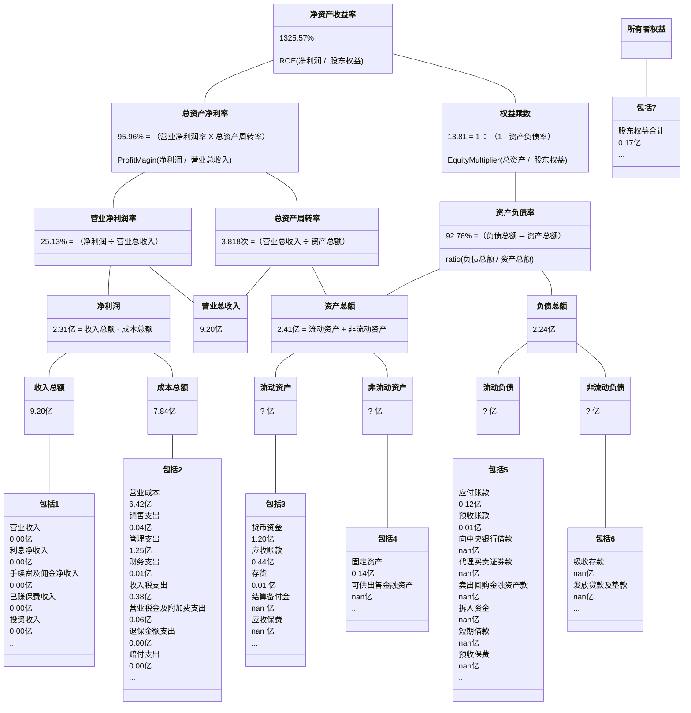
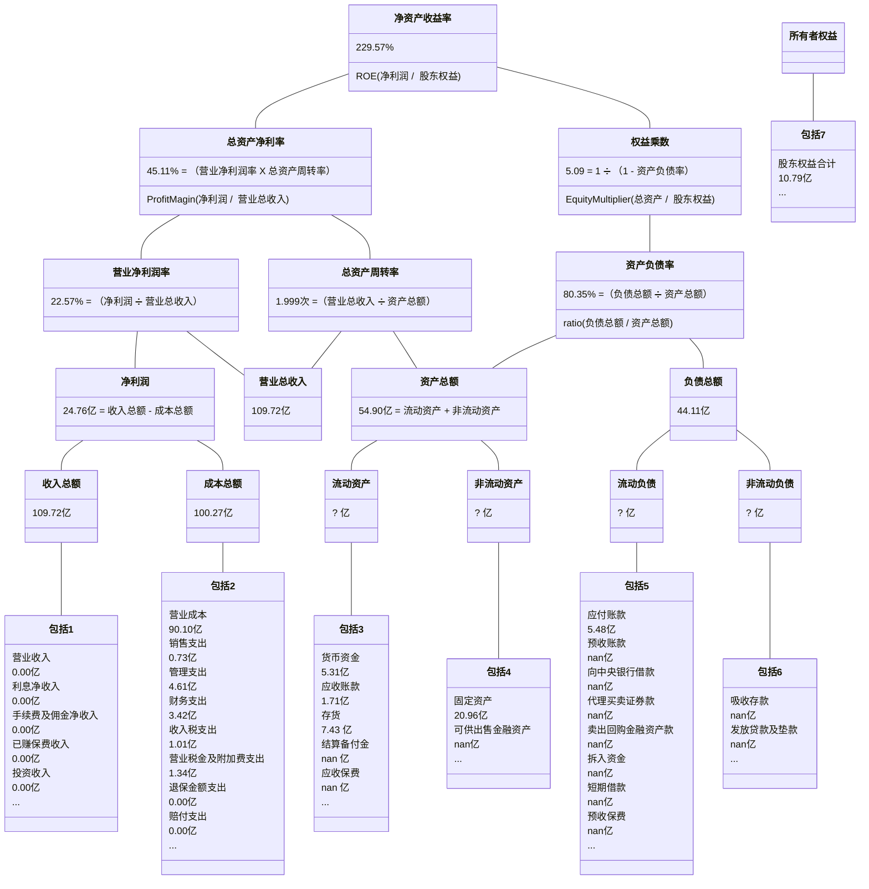
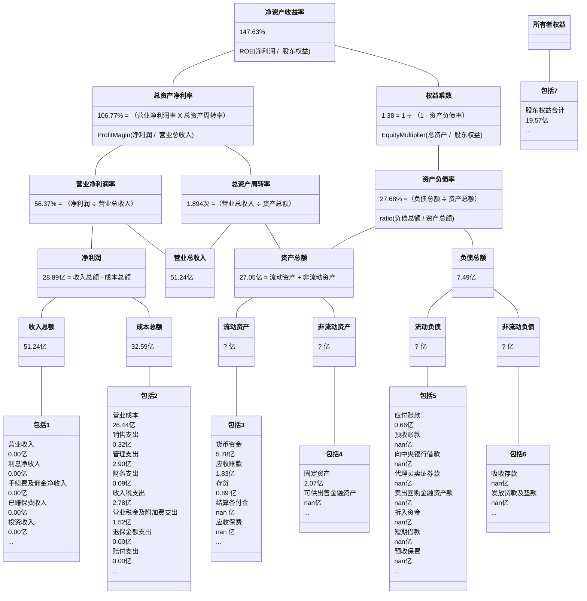
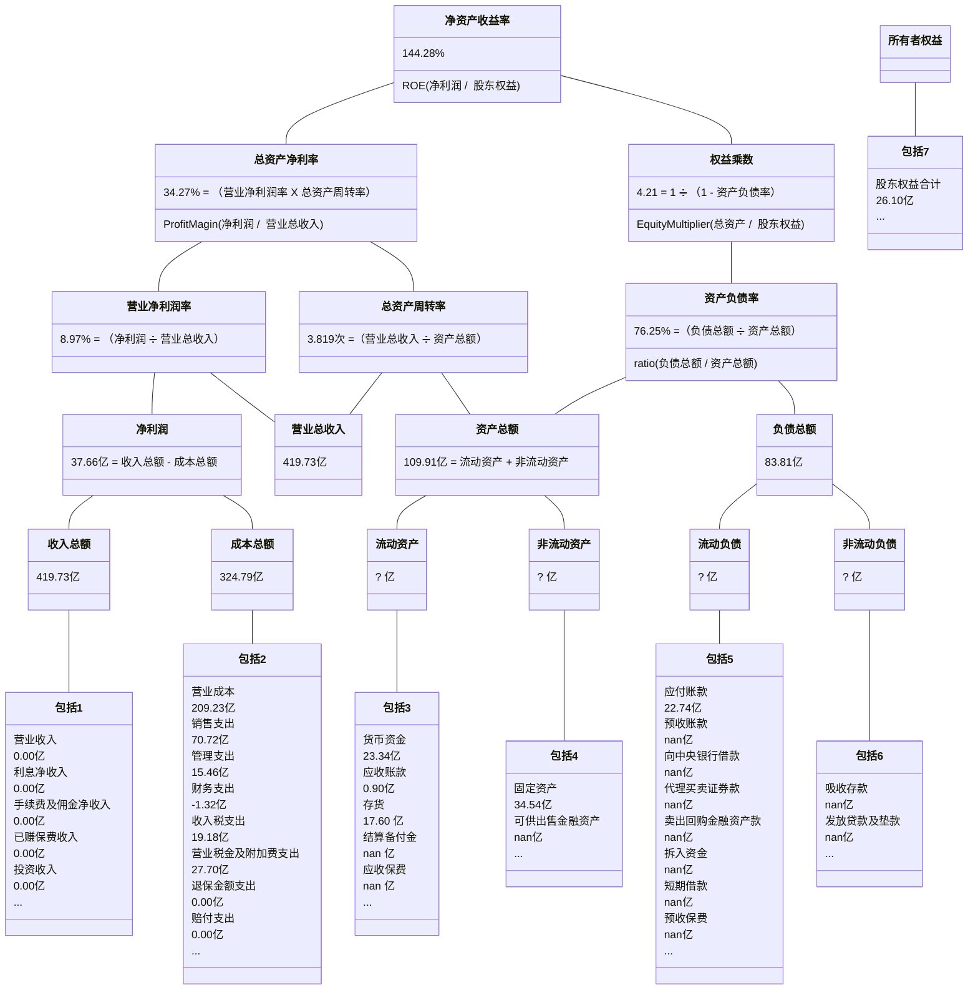
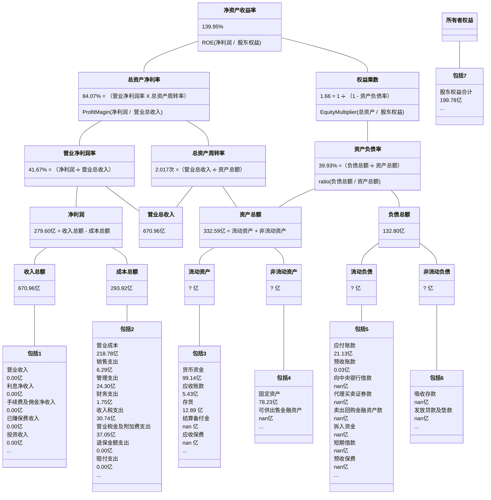
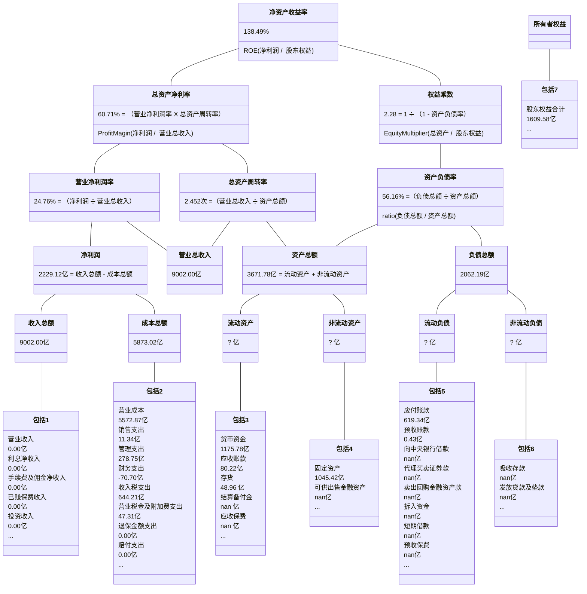
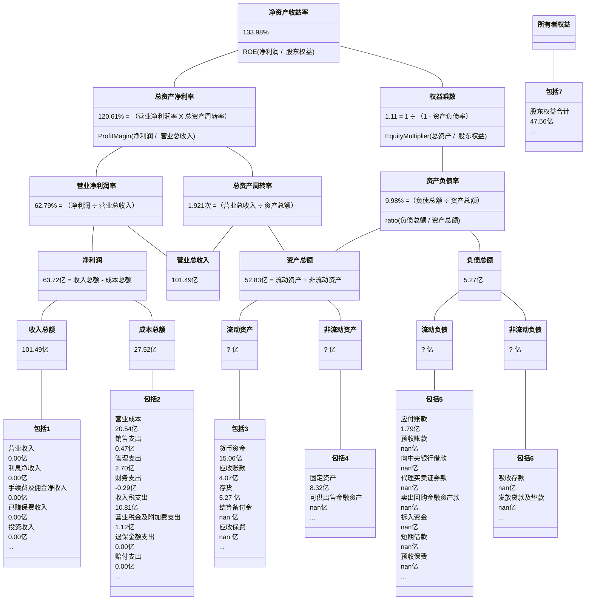
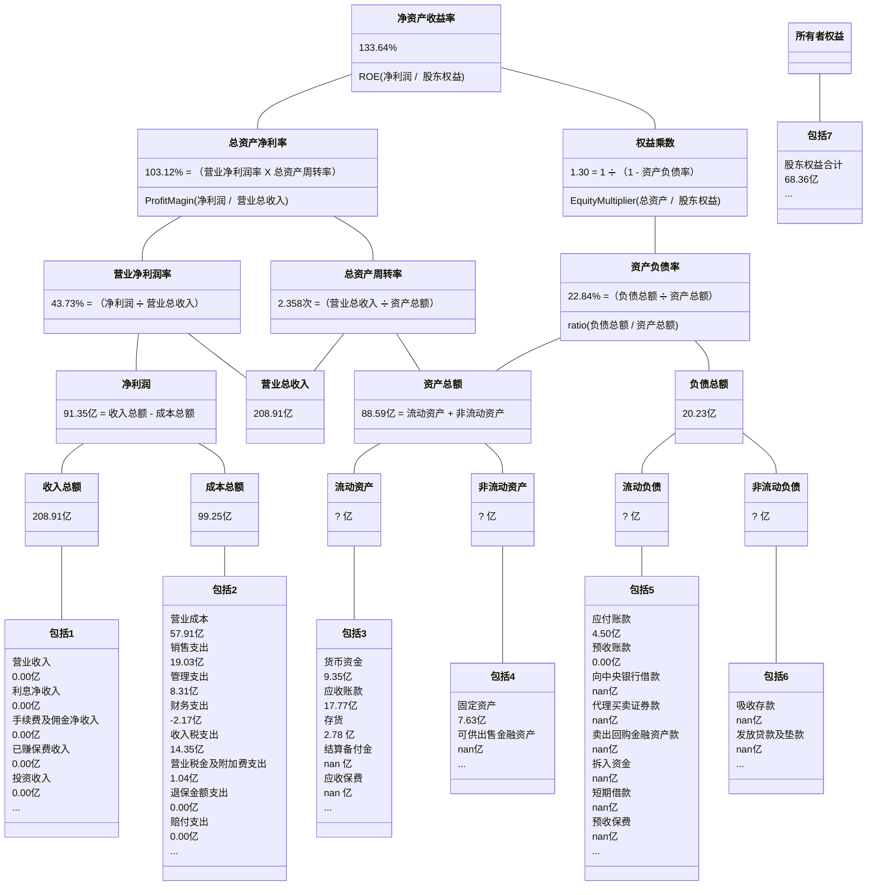
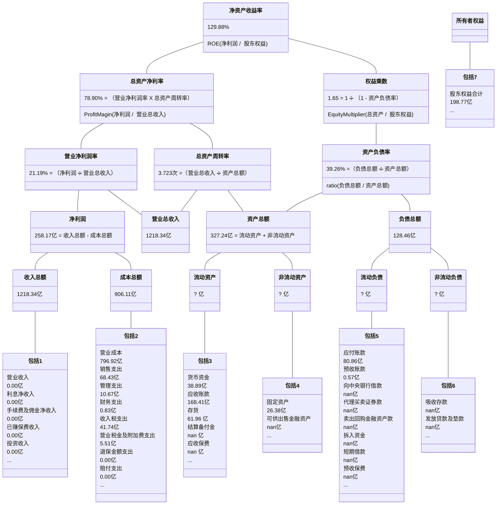
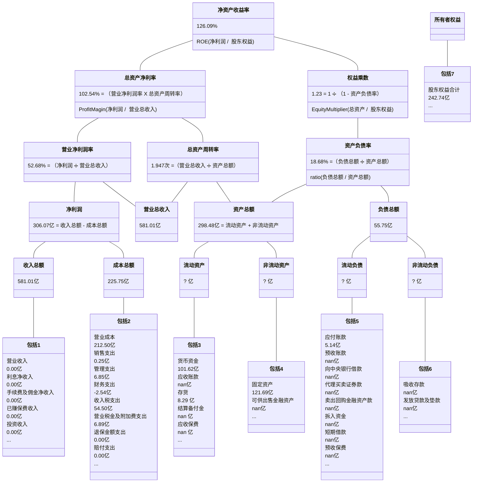

## 中天服务

```mermaid
classDiagram
净资产收益率 -- 总资产净利率
    净资产收益率 : 1325.57%
    净资产收益率 : ROE(净利润 /  股东权益)
    总资产净利率 : 95.96% = （营业净利润率 X 总资产周转率）
    总资产净利率 : ProfitMagin(净利润 /  营业总收入)
净资产收益率 -- 权益乘数
    权益乘数 : 13.81 = 1 ➗ （1 - 资产负债率）
    权益乘数 : EquityMultiplier(总资产 /  股东权益)
    
总资产净利率 -- 营业净利润率
    营业净利润率 : 25.13% = （净利润 ➗ 营业总收入）
总资产净利率 -- 总资产周转率
    总资产周转率 : 3.818次 =（营业总收入 ➗ 资产总额）
权益乘数 -- 资产负债率
    资产负债率  : 92.76% =（负债总额 ➗ 资产总额）
    资产负债率  : ratio(负债总额 / 资产总额)

营业净利润率 -- 净利润
    净利润 : 2.31亿 = 收入总额 - 成本总额
营业净利润率 -- 营业总收入
    营业总收入 : 9.20亿
总资产周转率 -- 营业总收入
总资产周转率 -- 资产总额
    资产总额 : 2.41亿 = 流动资产 + 非流动资产
资产负债率 -- 　负债总额
    负债总额 : 2.24亿
资产负债率 -- 　资产总额


净利润 -- 收入总额
    收入总额 : 9.20亿
净利润 -- 成本总额
    成本总额 : 7.84亿
资产总额 -- 流动资产
	流动资产 : ? 亿
资产总额 -- 非流动资产
	非流动资产 : ? 亿
负债总额 -- 流动负债
	流动负债 : ? 亿
负债总额 -- 非流动负债
	非流动负债 : ? 亿

收入总额 -- 包括1
    包括1 : 营业收入
    包括1 : 0.00亿
    包括1 : 利息净收入
    包括1 : 0.00亿
    包括1 : 手续费及佣金净收入
    包括1 : 0.00亿
    包括1 : 已赚保费收入
    包括1 : 0.00亿
    包括1 : 投资收入
    包括1 : 0.00亿
    包括1 : ...
成本总额 -- 包括2
    包括2 : 营业成本
    包括2 : 6.42亿
    包括2 : 销售支出
    包括2 : 0.04亿
    包括2 : 管理支出
    包括2 : 1.25亿
    包括2 : 财务支出
    包括2 : 0.01亿
    包括2 : 收入税支出
    包括2 : 0.38亿
    包括2 : 营业税金及附加费支出
    包括2 : 0.06亿
    包括2 : 退保金额支出
    包括2 : 0.00亿
    包括2 : 赔付支出
    包括2 : 0.00亿
    包括2 : ...
流动资产 -- 包括3
    包括3 : 货币资金
    包括3 : 1.20亿
    包括3 : 应收账款
    包括3 : 0.44亿
    包括3 : 存货
    包括3 : 0.01 亿
    包括3 : 结算备付金
    包括3 : nan 亿
    包括3 : 应收保费
    包括3 : nan 亿
    包括3 : ...
非流动资产 -- 包括4
    包括4 : 固定资产
    包括4 : 0.14亿
    包括4 : 可供出售金融资产
    包括4 : nan亿
    包括4 : ...
流动负债 -- 包括5
    包括5 : 应付账款
    包括5 : 0.12亿
    包括5 : 预收账款
    包括5 : 0.01亿
    包括5 : 向中央银行借款
    包括5 : nan亿
    包括5 : 代理买卖证券款
    包括5 : nan亿
    包括5 : 卖出回购金融资产款
    包括5 : nan亿
    包括5 : 拆入资金
    包括5 : nan亿
    包括5 : 短期借款
    包括5 : nan亿
    包括5 : 预收保费
    包括5 : nan亿
    包括5 : ...
非流动负债 -- 包括6
    包括6 : 吸收存款
    包括6 : nan亿
    包括6 : 发放贷款及垫款
    包括6 : nan亿
    包括6 : ...
所有者权益 -- 包括7
    包括7 : 股东权益合计
    包括7 : 0.17亿
    包括7 : ...
```

## ST澄星

```mermaid
classDiagram
净资产收益率 -- 总资产净利率
    净资产收益率 : 229.57%
    净资产收益率 : ROE(净利润 /  股东权益)
    总资产净利率 : 45.11% = （营业净利润率 X 总资产周转率）
    总资产净利率 : ProfitMagin(净利润 /  营业总收入)
净资产收益率 -- 权益乘数
    权益乘数 : 5.09 = 1 ➗ （1 - 资产负债率）
    权益乘数 : EquityMultiplier(总资产 /  股东权益)
    
总资产净利率 -- 营业净利润率
    营业净利润率 : 22.57% = （净利润 ➗ 营业总收入）
总资产净利率 -- 总资产周转率
    总资产周转率 : 1.999次 =（营业总收入 ➗ 资产总额）
权益乘数 -- 资产负债率
    资产负债率  : 80.35% =（负债总额 ➗ 资产总额）
    资产负债率  : ratio(负债总额 / 资产总额)

营业净利润率 -- 净利润
    净利润 : 24.76亿 = 收入总额 - 成本总额
营业净利润率 -- 营业总收入
    营业总收入 : 109.72亿
总资产周转率 -- 营业总收入
总资产周转率 -- 资产总额
    资产总额 : 54.90亿 = 流动资产 + 非流动资产
资产负债率 -- 　负债总额
    负债总额 : 44.11亿
资产负债率 -- 　资产总额


净利润 -- 收入总额
    收入总额 : 109.72亿
净利润 -- 成本总额
    成本总额 : 100.27亿
资产总额 -- 流动资产
	流动资产 : ? 亿
资产总额 -- 非流动资产
	非流动资产 : ? 亿
负债总额 -- 流动负债
	流动负债 : ? 亿
负债总额 -- 非流动负债
	非流动负债 : ? 亿

收入总额 -- 包括1
    包括1 : 营业收入
    包括1 : 0.00亿
    包括1 : 利息净收入
    包括1 : 0.00亿
    包括1 : 手续费及佣金净收入
    包括1 : 0.00亿
    包括1 : 已赚保费收入
    包括1 : 0.00亿
    包括1 : 投资收入
    包括1 : 0.00亿
    包括1 : ...
成本总额 -- 包括2
    包括2 : 营业成本
    包括2 : 90.10亿
    包括2 : 销售支出
    包括2 : 0.73亿
    包括2 : 管理支出
    包括2 : 4.61亿
    包括2 : 财务支出
    包括2 : 3.42亿
    包括2 : 收入税支出
    包括2 : 1.01亿
    包括2 : 营业税金及附加费支出
    包括2 : 1.34亿
    包括2 : 退保金额支出
    包括2 : 0.00亿
    包括2 : 赔付支出
    包括2 : 0.00亿
    包括2 : ...
流动资产 -- 包括3
    包括3 : 货币资金
    包括3 : 5.31亿
    包括3 : 应收账款
    包括3 : 1.71亿
    包括3 : 存货
    包括3 : 7.43 亿
    包括3 : 结算备付金
    包括3 : nan 亿
    包括3 : 应收保费
    包括3 : nan 亿
    包括3 : ...
非流动资产 -- 包括4
    包括4 : 固定资产
    包括4 : 20.96亿
    包括4 : 可供出售金融资产
    包括4 : nan亿
    包括4 : ...
流动负债 -- 包括5
    包括5 : 应付账款
    包括5 : 5.48亿
    包括5 : 预收账款
    包括5 : nan亿
    包括5 : 向中央银行借款
    包括5 : nan亿
    包括5 : 代理买卖证券款
    包括5 : nan亿
    包括5 : 卖出回购金融资产款
    包括5 : nan亿
    包括5 : 拆入资金
    包括5 : nan亿
    包括5 : 短期借款
    包括5 : nan亿
    包括5 : 预收保费
    包括5 : nan亿
    包括5 : ...
非流动负债 -- 包括6
    包括6 : 吸收存款
    包括6 : nan亿
    包括6 : 发放贷款及垫款
    包括6 : nan亿
    包括6 : ...
所有者权益 -- 包括7
    包括7 : 股东权益合计
    包括7 : 10.79亿
    包括7 : ...
```

## 融捷股份

```mermaid
classDiagram
净资产收益率 -- 总资产净利率
    净资产收益率 : 147.63%
    净资产收益率 : ROE(净利润 /  股东权益)
    总资产净利率 : 106.77% = （营业净利润率 X 总资产周转率）
    总资产净利率 : ProfitMagin(净利润 /  营业总收入)
净资产收益率 -- 权益乘数
    权益乘数 : 1.38 = 1 ➗ （1 - 资产负债率）
    权益乘数 : EquityMultiplier(总资产 /  股东权益)
    
总资产净利率 -- 营业净利润率
    营业净利润率 : 56.37% = （净利润 ➗ 营业总收入）
总资产净利率 -- 总资产周转率
    总资产周转率 : 1.894次 =（营业总收入 ➗ 资产总额）
权益乘数 -- 资产负债率
    资产负债率  : 27.68% =（负债总额 ➗ 资产总额）
    资产负债率  : ratio(负债总额 / 资产总额)

营业净利润率 -- 净利润
    净利润 : 28.89亿 = 收入总额 - 成本总额
营业净利润率 -- 营业总收入
    营业总收入 : 51.24亿
总资产周转率 -- 营业总收入
总资产周转率 -- 资产总额
    资产总额 : 27.05亿 = 流动资产 + 非流动资产
资产负债率 -- 　负债总额
    负债总额 : 7.49亿
资产负债率 -- 　资产总额


净利润 -- 收入总额
    收入总额 : 51.24亿
净利润 -- 成本总额
    成本总额 : 32.59亿
资产总额 -- 流动资产
	流动资产 : ? 亿
资产总额 -- 非流动资产
	非流动资产 : ? 亿
负债总额 -- 流动负债
	流动负债 : ? 亿
负债总额 -- 非流动负债
	非流动负债 : ? 亿

收入总额 -- 包括1
    包括1 : 营业收入
    包括1 : 0.00亿
    包括1 : 利息净收入
    包括1 : 0.00亿
    包括1 : 手续费及佣金净收入
    包括1 : 0.00亿
    包括1 : 已赚保费收入
    包括1 : 0.00亿
    包括1 : 投资收入
    包括1 : 0.00亿
    包括1 : ...
成本总额 -- 包括2
    包括2 : 营业成本
    包括2 : 26.44亿
    包括2 : 销售支出
    包括2 : 0.32亿
    包括2 : 管理支出
    包括2 : 2.90亿
    包括2 : 财务支出
    包括2 : 0.09亿
    包括2 : 收入税支出
    包括2 : 2.78亿
    包括2 : 营业税金及附加费支出
    包括2 : 1.52亿
    包括2 : 退保金额支出
    包括2 : 0.00亿
    包括2 : 赔付支出
    包括2 : 0.00亿
    包括2 : ...
流动资产 -- 包括3
    包括3 : 货币资金
    包括3 : 5.78亿
    包括3 : 应收账款
    包括3 : 1.83亿
    包括3 : 存货
    包括3 : 0.89 亿
    包括3 : 结算备付金
    包括3 : nan 亿
    包括3 : 应收保费
    包括3 : nan 亿
    包括3 : ...
非流动资产 -- 包括4
    包括4 : 固定资产
    包括4 : 2.07亿
    包括4 : 可供出售金融资产
    包括4 : nan亿
    包括4 : ...
流动负债 -- 包括5
    包括5 : 应付账款
    包括5 : 0.66亿
    包括5 : 预收账款
    包括5 : nan亿
    包括5 : 向中央银行借款
    包括5 : nan亿
    包括5 : 代理买卖证券款
    包括5 : nan亿
    包括5 : 卖出回购金融资产款
    包括5 : nan亿
    包括5 : 拆入资金
    包括5 : nan亿
    包括5 : 短期借款
    包括5 : nan亿
    包括5 : 预收保费
    包括5 : nan亿
    包括5 : ...
非流动负债 -- 包括6
    包括6 : 吸收存款
    包括6 : nan亿
    包括6 : 发放贷款及垫款
    包括6 : nan亿
    包括6 : ...
所有者权益 -- 包括7
    包括7 : 股东权益合计
    包括7 : 19.57亿
    包括7 : ...
```

## 重庆啤酒

```mermaid
classDiagram
净资产收益率 -- 总资产净利率
    净资产收益率 : 144.28%
    净资产收益率 : ROE(净利润 /  股东权益)
    总资产净利率 : 34.27% = （营业净利润率 X 总资产周转率）
    总资产净利率 : ProfitMagin(净利润 /  营业总收入)
净资产收益率 -- 权益乘数
    权益乘数 : 4.21 = 1 ➗ （1 - 资产负债率）
    权益乘数 : EquityMultiplier(总资产 /  股东权益)
    
总资产净利率 -- 营业净利润率
    营业净利润率 : 8.97% = （净利润 ➗ 营业总收入）
总资产净利率 -- 总资产周转率
    总资产周转率 : 3.819次 =（营业总收入 ➗ 资产总额）
权益乘数 -- 资产负债率
    资产负债率  : 76.25% =（负债总额 ➗ 资产总额）
    资产负债率  : ratio(负债总额 / 资产总额)

营业净利润率 -- 净利润
    净利润 : 37.66亿 = 收入总额 - 成本总额
营业净利润率 -- 营业总收入
    营业总收入 : 419.73亿
总资产周转率 -- 营业总收入
总资产周转率 -- 资产总额
    资产总额 : 109.91亿 = 流动资产 + 非流动资产
资产负债率 -- 　负债总额
    负债总额 : 83.81亿
资产负债率 -- 　资产总额


净利润 -- 收入总额
    收入总额 : 419.73亿
净利润 -- 成本总额
    成本总额 : 324.79亿
资产总额 -- 流动资产
	流动资产 : ? 亿
资产总额 -- 非流动资产
	非流动资产 : ? 亿
负债总额 -- 流动负债
	流动负债 : ? 亿
负债总额 -- 非流动负债
	非流动负债 : ? 亿

收入总额 -- 包括1
    包括1 : 营业收入
    包括1 : 0.00亿
    包括1 : 利息净收入
    包括1 : 0.00亿
    包括1 : 手续费及佣金净收入
    包括1 : 0.00亿
    包括1 : 已赚保费收入
    包括1 : 0.00亿
    包括1 : 投资收入
    包括1 : 0.00亿
    包括1 : ...
成本总额 -- 包括2
    包括2 : 营业成本
    包括2 : 209.23亿
    包括2 : 销售支出
    包括2 : 70.72亿
    包括2 : 管理支出
    包括2 : 15.46亿
    包括2 : 财务支出
    包括2 : -1.32亿
    包括2 : 收入税支出
    包括2 : 19.18亿
    包括2 : 营业税金及附加费支出
    包括2 : 27.70亿
    包括2 : 退保金额支出
    包括2 : 0.00亿
    包括2 : 赔付支出
    包括2 : 0.00亿
    包括2 : ...
流动资产 -- 包括3
    包括3 : 货币资金
    包括3 : 23.34亿
    包括3 : 应收账款
    包括3 : 0.90亿
    包括3 : 存货
    包括3 : 17.60 亿
    包括3 : 结算备付金
    包括3 : nan 亿
    包括3 : 应收保费
    包括3 : nan 亿
    包括3 : ...
非流动资产 -- 包括4
    包括4 : 固定资产
    包括4 : 34.54亿
    包括4 : 可供出售金融资产
    包括4 : nan亿
    包括4 : ...
流动负债 -- 包括5
    包括5 : 应付账款
    包括5 : 22.74亿
    包括5 : 预收账款
    包括5 : nan亿
    包括5 : 向中央银行借款
    包括5 : nan亿
    包括5 : 代理买卖证券款
    包括5 : nan亿
    包括5 : 卖出回购金融资产款
    包括5 : nan亿
    包括5 : 拆入资金
    包括5 : nan亿
    包括5 : 短期借款
    包括5 : nan亿
    包括5 : 预收保费
    包括5 : nan亿
    包括5 : ...
非流动负债 -- 包括6
    包括6 : 吸收存款
    包括6 : nan亿
    包括6 : 发放贷款及垫款
    包括6 : nan亿
    包括6 : ...
所有者权益 -- 包括7
    包括7 : 股东权益合计
    包括7 : 26.10亿
    包括7 : ...
```

## 盐湖股份

```mermaid
classDiagram
净资产收益率 -- 总资产净利率
    净资产收益率 : 139.95%
    净资产收益率 : ROE(净利润 /  股东权益)
    总资产净利率 : 84.07% = （营业净利润率 X 总资产周转率）
    总资产净利率 : ProfitMagin(净利润 /  营业总收入)
净资产收益率 -- 权益乘数
    权益乘数 : 1.66 = 1 ➗ （1 - 资产负债率）
    权益乘数 : EquityMultiplier(总资产 /  股东权益)
    
总资产净利率 -- 营业净利润率
    营业净利润率 : 41.67% = （净利润 ➗ 营业总收入）
总资产净利率 -- 总资产周转率
    总资产周转率 : 2.017次 =（营业总收入 ➗ 资产总额）
权益乘数 -- 资产负债率
    资产负债率  : 39.93% =（负债总额 ➗ 资产总额）
    资产负债率  : ratio(负债总额 / 资产总额)

营业净利润率 -- 净利润
    净利润 : 279.60亿 = 收入总额 - 成本总额
营业净利润率 -- 营业总收入
    营业总收入 : 670.96亿
总资产周转率 -- 营业总收入
总资产周转率 -- 资产总额
    资产总额 : 332.59亿 = 流动资产 + 非流动资产
资产负债率 -- 　负债总额
    负债总额 : 132.80亿
资产负债率 -- 　资产总额


净利润 -- 收入总额
    收入总额 : 670.96亿
净利润 -- 成本总额
    成本总额 : 293.92亿
资产总额 -- 流动资产
	流动资产 : ? 亿
资产总额 -- 非流动资产
	非流动资产 : ? 亿
负债总额 -- 流动负债
	流动负债 : ? 亿
负债总额 -- 非流动负债
	非流动负债 : ? 亿

收入总额 -- 包括1
    包括1 : 营业收入
    包括1 : 0.00亿
    包括1 : 利息净收入
    包括1 : 0.00亿
    包括1 : 手续费及佣金净收入
    包括1 : 0.00亿
    包括1 : 已赚保费收入
    包括1 : 0.00亿
    包括1 : 投资收入
    包括1 : 0.00亿
    包括1 : ...
成本总额 -- 包括2
    包括2 : 营业成本
    包括2 : 218.78亿
    包括2 : 销售支出
    包括2 : 6.29亿
    包括2 : 管理支出
    包括2 : 24.30亿
    包括2 : 财务支出
    包括2 : 1.75亿
    包括2 : 收入税支出
    包括2 : 30.74亿
    包括2 : 营业税金及附加费支出
    包括2 : 37.05亿
    包括2 : 退保金额支出
    包括2 : 0.00亿
    包括2 : 赔付支出
    包括2 : 0.00亿
    包括2 : ...
流动资产 -- 包括3
    包括3 : 货币资金
    包括3 : 99.14亿
    包括3 : 应收账款
    包括3 : 5.43亿
    包括3 : 存货
    包括3 : 12.89 亿
    包括3 : 结算备付金
    包括3 : nan 亿
    包括3 : 应收保费
    包括3 : nan 亿
    包括3 : ...
非流动资产 -- 包括4
    包括4 : 固定资产
    包括4 : 78.23亿
    包括4 : 可供出售金融资产
    包括4 : nan亿
    包括4 : ...
流动负债 -- 包括5
    包括5 : 应付账款
    包括5 : 21.13亿
    包括5 : 预收账款
    包括5 : 0.03亿
    包括5 : 向中央银行借款
    包括5 : nan亿
    包括5 : 代理买卖证券款
    包括5 : nan亿
    包括5 : 卖出回购金融资产款
    包括5 : nan亿
    包括5 : 拆入资金
    包括5 : nan亿
    包括5 : 短期借款
    包括5 : nan亿
    包括5 : 预收保费
    包括5 : nan亿
    包括5 : ...
非流动负债 -- 包括6
    包括6 : 吸收存款
    包括6 : nan亿
    包括6 : 发放贷款及垫款
    包括6 : nan亿
    包括6 : ...
所有者权益 -- 包括7
    包括7 : 股东权益合计
    包括7 : 199.78亿
    包括7 : ...
```

## 中远海控

```mermaid
classDiagram
净资产收益率 -- 总资产净利率
    净资产收益率 : 138.49%
    净资产收益率 : ROE(净利润 /  股东权益)
    总资产净利率 : 60.71% = （营业净利润率 X 总资产周转率）
    总资产净利率 : ProfitMagin(净利润 /  营业总收入)
净资产收益率 -- 权益乘数
    权益乘数 : 2.28 = 1 ➗ （1 - 资产负债率）
    权益乘数 : EquityMultiplier(总资产 /  股东权益)
    
总资产净利率 -- 营业净利润率
    营业净利润率 : 24.76% = （净利润 ➗ 营业总收入）
总资产净利率 -- 总资产周转率
    总资产周转率 : 2.452次 =（营业总收入 ➗ 资产总额）
权益乘数 -- 资产负债率
    资产负债率  : 56.16% =（负债总额 ➗ 资产总额）
    资产负债率  : ratio(负债总额 / 资产总额)

营业净利润率 -- 净利润
    净利润 : 2229.12亿 = 收入总额 - 成本总额
营业净利润率 -- 营业总收入
    营业总收入 : 9002.00亿
总资产周转率 -- 营业总收入
总资产周转率 -- 资产总额
    资产总额 : 3671.78亿 = 流动资产 + 非流动资产
资产负债率 -- 　负债总额
    负债总额 : 2062.19亿
资产负债率 -- 　资产总额


净利润 -- 收入总额
    收入总额 : 9002.00亿
净利润 -- 成本总额
    成本总额 : 5873.02亿
资产总额 -- 流动资产
	流动资产 : ? 亿
资产总额 -- 非流动资产
	非流动资产 : ? 亿
负债总额 -- 流动负债
	流动负债 : ? 亿
负债总额 -- 非流动负债
	非流动负债 : ? 亿

收入总额 -- 包括1
    包括1 : 营业收入
    包括1 : 0.00亿
    包括1 : 利息净收入
    包括1 : 0.00亿
    包括1 : 手续费及佣金净收入
    包括1 : 0.00亿
    包括1 : 已赚保费收入
    包括1 : 0.00亿
    包括1 : 投资收入
    包括1 : 0.00亿
    包括1 : ...
成本总额 -- 包括2
    包括2 : 营业成本
    包括2 : 5572.87亿
    包括2 : 销售支出
    包括2 : 11.34亿
    包括2 : 管理支出
    包括2 : 278.75亿
    包括2 : 财务支出
    包括2 : -70.70亿
    包括2 : 收入税支出
    包括2 : 644.21亿
    包括2 : 营业税金及附加费支出
    包括2 : 47.31亿
    包括2 : 退保金额支出
    包括2 : 0.00亿
    包括2 : 赔付支出
    包括2 : 0.00亿
    包括2 : ...
流动资产 -- 包括3
    包括3 : 货币资金
    包括3 : 1175.78亿
    包括3 : 应收账款
    包括3 : 80.22亿
    包括3 : 存货
    包括3 : 48.96 亿
    包括3 : 结算备付金
    包括3 : nan 亿
    包括3 : 应收保费
    包括3 : nan 亿
    包括3 : ...
非流动资产 -- 包括4
    包括4 : 固定资产
    包括4 : 1045.42亿
    包括4 : 可供出售金融资产
    包括4 : nan亿
    包括4 : ...
流动负债 -- 包括5
    包括5 : 应付账款
    包括5 : 619.34亿
    包括5 : 预收账款
    包括5 : 0.43亿
    包括5 : 向中央银行借款
    包括5 : nan亿
    包括5 : 代理买卖证券款
    包括5 : nan亿
    包括5 : 卖出回购金融资产款
    包括5 : nan亿
    包括5 : 拆入资金
    包括5 : nan亿
    包括5 : 短期借款
    包括5 : nan亿
    包括5 : 预收保费
    包括5 : nan亿
    包括5 : ...
非流动负债 -- 包括6
    包括6 : 吸收存款
    包括6 : nan亿
    包括6 : 发放贷款及垫款
    包括6 : nan亿
    包括6 : ...
所有者权益 -- 包括7
    包括7 : 股东权益合计
    包括7 : 1609.58亿
    包括7 : ...
```

## 石英股份

```mermaid
classDiagram
净资产收益率 -- 总资产净利率
    净资产收益率 : 133.98%
    净资产收益率 : ROE(净利润 /  股东权益)
    总资产净利率 : 120.61% = （营业净利润率 X 总资产周转率）
    总资产净利率 : ProfitMagin(净利润 /  营业总收入)
净资产收益率 -- 权益乘数
    权益乘数 : 1.11 = 1 ➗ （1 - 资产负债率）
    权益乘数 : EquityMultiplier(总资产 /  股东权益)
    
总资产净利率 -- 营业净利润率
    营业净利润率 : 62.79% = （净利润 ➗ 营业总收入）
总资产净利率 -- 总资产周转率
    总资产周转率 : 1.921次 =（营业总收入 ➗ 资产总额）
权益乘数 -- 资产负债率
    资产负债率  : 9.98% =（负债总额 ➗ 资产总额）
    资产负债率  : ratio(负债总额 / 资产总额)

营业净利润率 -- 净利润
    净利润 : 63.72亿 = 收入总额 - 成本总额
营业净利润率 -- 营业总收入
    营业总收入 : 101.49亿
总资产周转率 -- 营业总收入
总资产周转率 -- 资产总额
    资产总额 : 52.83亿 = 流动资产 + 非流动资产
资产负债率 -- 　负债总额
    负债总额 : 5.27亿
资产负债率 -- 　资产总额


净利润 -- 收入总额
    收入总额 : 101.49亿
净利润 -- 成本总额
    成本总额 : 27.52亿
资产总额 -- 流动资产
	流动资产 : ? 亿
资产总额 -- 非流动资产
	非流动资产 : ? 亿
负债总额 -- 流动负债
	流动负债 : ? 亿
负债总额 -- 非流动负债
	非流动负债 : ? 亿

收入总额 -- 包括1
    包括1 : 营业收入
    包括1 : 0.00亿
    包括1 : 利息净收入
    包括1 : 0.00亿
    包括1 : 手续费及佣金净收入
    包括1 : 0.00亿
    包括1 : 已赚保费收入
    包括1 : 0.00亿
    包括1 : 投资收入
    包括1 : 0.00亿
    包括1 : ...
成本总额 -- 包括2
    包括2 : 营业成本
    包括2 : 20.54亿
    包括2 : 销售支出
    包括2 : 0.47亿
    包括2 : 管理支出
    包括2 : 2.70亿
    包括2 : 财务支出
    包括2 : -0.29亿
    包括2 : 收入税支出
    包括2 : 10.81亿
    包括2 : 营业税金及附加费支出
    包括2 : 1.12亿
    包括2 : 退保金额支出
    包括2 : 0.00亿
    包括2 : 赔付支出
    包括2 : 0.00亿
    包括2 : ...
流动资产 -- 包括3
    包括3 : 货币资金
    包括3 : 15.06亿
    包括3 : 应收账款
    包括3 : 4.07亿
    包括3 : 存货
    包括3 : 5.27 亿
    包括3 : 结算备付金
    包括3 : nan 亿
    包括3 : 应收保费
    包括3 : nan 亿
    包括3 : ...
非流动资产 -- 包括4
    包括4 : 固定资产
    包括4 : 8.32亿
    包括4 : 可供出售金融资产
    包括4 : nan亿
    包括4 : ...
流动负债 -- 包括5
    包括5 : 应付账款
    包括5 : 1.79亿
    包括5 : 预收账款
    包括5 : nan亿
    包括5 : 向中央银行借款
    包括5 : nan亿
    包括5 : 代理买卖证券款
    包括5 : nan亿
    包括5 : 卖出回购金融资产款
    包括5 : nan亿
    包括5 : 拆入资金
    包括5 : nan亿
    包括5 : 短期借款
    包括5 : nan亿
    包括5 : 预收保费
    包括5 : nan亿
    包括5 : ...
非流动负债 -- 包括6
    包括6 : 吸收存款
    包括6 : nan亿
    包括6 : 发放贷款及垫款
    包括6 : nan亿
    包括6 : ...
所有者权益 -- 包括7
    包括7 : 股东权益合计
    包括7 : 47.56亿
    包括7 : ...
```

## 达安基因

```mermaid
classDiagram
净资产收益率 -- 总资产净利率
    净资产收益率 : 133.64%
    净资产收益率 : ROE(净利润 /  股东权益)
    总资产净利率 : 103.12% = （营业净利润率 X 总资产周转率）
    总资产净利率 : ProfitMagin(净利润 /  营业总收入)
净资产收益率 -- 权益乘数
    权益乘数 : 1.30 = 1 ➗ （1 - 资产负债率）
    权益乘数 : EquityMultiplier(总资产 /  股东权益)
    
总资产净利率 -- 营业净利润率
    营业净利润率 : 43.73% = （净利润 ➗ 营业总收入）
总资产净利率 -- 总资产周转率
    总资产周转率 : 2.358次 =（营业总收入 ➗ 资产总额）
权益乘数 -- 资产负债率
    资产负债率  : 22.84% =（负债总额 ➗ 资产总额）
    资产负债率  : ratio(负债总额 / 资产总额)

营业净利润率 -- 净利润
    净利润 : 91.35亿 = 收入总额 - 成本总额
营业净利润率 -- 营业总收入
    营业总收入 : 208.91亿
总资产周转率 -- 营业总收入
总资产周转率 -- 资产总额
    资产总额 : 88.59亿 = 流动资产 + 非流动资产
资产负债率 -- 　负债总额
    负债总额 : 20.23亿
资产负债率 -- 　资产总额


净利润 -- 收入总额
    收入总额 : 208.91亿
净利润 -- 成本总额
    成本总额 : 99.25亿
资产总额 -- 流动资产
	流动资产 : ? 亿
资产总额 -- 非流动资产
	非流动资产 : ? 亿
负债总额 -- 流动负债
	流动负债 : ? 亿
负债总额 -- 非流动负债
	非流动负债 : ? 亿

收入总额 -- 包括1
    包括1 : 营业收入
    包括1 : 0.00亿
    包括1 : 利息净收入
    包括1 : 0.00亿
    包括1 : 手续费及佣金净收入
    包括1 : 0.00亿
    包括1 : 已赚保费收入
    包括1 : 0.00亿
    包括1 : 投资收入
    包括1 : 0.00亿
    包括1 : ...
成本总额 -- 包括2
    包括2 : 营业成本
    包括2 : 57.91亿
    包括2 : 销售支出
    包括2 : 19.03亿
    包括2 : 管理支出
    包括2 : 8.31亿
    包括2 : 财务支出
    包括2 : -2.17亿
    包括2 : 收入税支出
    包括2 : 14.35亿
    包括2 : 营业税金及附加费支出
    包括2 : 1.04亿
    包括2 : 退保金额支出
    包括2 : 0.00亿
    包括2 : 赔付支出
    包括2 : 0.00亿
    包括2 : ...
流动资产 -- 包括3
    包括3 : 货币资金
    包括3 : 9.35亿
    包括3 : 应收账款
    包括3 : 17.77亿
    包括3 : 存货
    包括3 : 2.78 亿
    包括3 : 结算备付金
    包括3 : nan 亿
    包括3 : 应收保费
    包括3 : nan 亿
    包括3 : ...
非流动资产 -- 包括4
    包括4 : 固定资产
    包括4 : 7.63亿
    包括4 : 可供出售金融资产
    包括4 : nan亿
    包括4 : ...
流动负债 -- 包括5
    包括5 : 应付账款
    包括5 : 4.50亿
    包括5 : 预收账款
    包括5 : 0.00亿
    包括5 : 向中央银行借款
    包括5 : nan亿
    包括5 : 代理买卖证券款
    包括5 : nan亿
    包括5 : 卖出回购金融资产款
    包括5 : nan亿
    包括5 : 拆入资金
    包括5 : nan亿
    包括5 : 短期借款
    包括5 : nan亿
    包括5 : 预收保费
    包括5 : nan亿
    包括5 : ...
非流动负债 -- 包括6
    包括6 : 吸收存款
    包括6 : nan亿
    包括6 : 发放贷款及垫款
    包括6 : nan亿
    包括6 : ...
所有者权益 -- 包括7
    包括7 : 股东权益合计
    包括7 : 68.36亿
    包括7 : ...
```

## 智飞生物

```mermaid
classDiagram
净资产收益率 -- 总资产净利率
    净资产收益率 : 129.88%
    净资产收益率 : ROE(净利润 /  股东权益)
    总资产净利率 : 78.90% = （营业净利润率 X 总资产周转率）
    总资产净利率 : ProfitMagin(净利润 /  营业总收入)
净资产收益率 -- 权益乘数
    权益乘数 : 1.65 = 1 ➗ （1 - 资产负债率）
    权益乘数 : EquityMultiplier(总资产 /  股东权益)
    
总资产净利率 -- 营业净利润率
    营业净利润率 : 21.19% = （净利润 ➗ 营业总收入）
总资产净利率 -- 总资产周转率
    总资产周转率 : 3.723次 =（营业总收入 ➗ 资产总额）
权益乘数 -- 资产负债率
    资产负债率  : 39.26% =（负债总额 ➗ 资产总额）
    资产负债率  : ratio(负债总额 / 资产总额)

营业净利润率 -- 净利润
    净利润 : 258.17亿 = 收入总额 - 成本总额
营业净利润率 -- 营业总收入
    营业总收入 : 1218.34亿
总资产周转率 -- 营业总收入
总资产周转率 -- 资产总额
    资产总额 : 327.24亿 = 流动资产 + 非流动资产
资产负债率 -- 　负债总额
    负债总额 : 128.46亿
资产负债率 -- 　资产总额


净利润 -- 收入总额
    收入总额 : 1218.34亿
净利润 -- 成本总额
    成本总额 : 906.11亿
资产总额 -- 流动资产
	流动资产 : ? 亿
资产总额 -- 非流动资产
	非流动资产 : ? 亿
负债总额 -- 流动负债
	流动负债 : ? 亿
负债总额 -- 非流动负债
	非流动负债 : ? 亿

收入总额 -- 包括1
    包括1 : 营业收入
    包括1 : 0.00亿
    包括1 : 利息净收入
    包括1 : 0.00亿
    包括1 : 手续费及佣金净收入
    包括1 : 0.00亿
    包括1 : 已赚保费收入
    包括1 : 0.00亿
    包括1 : 投资收入
    包括1 : 0.00亿
    包括1 : ...
成本总额 -- 包括2
    包括2 : 营业成本
    包括2 : 796.92亿
    包括2 : 销售支出
    包括2 : 68.43亿
    包括2 : 管理支出
    包括2 : 10.67亿
    包括2 : 财务支出
    包括2 : 0.83亿
    包括2 : 收入税支出
    包括2 : 41.74亿
    包括2 : 营业税金及附加费支出
    包括2 : 5.51亿
    包括2 : 退保金额支出
    包括2 : 0.00亿
    包括2 : 赔付支出
    包括2 : 0.00亿
    包括2 : ...
流动资产 -- 包括3
    包括3 : 货币资金
    包括3 : 38.89亿
    包括3 : 应收账款
    包括3 : 168.41亿
    包括3 : 存货
    包括3 : 61.96 亿
    包括3 : 结算备付金
    包括3 : nan 亿
    包括3 : 应收保费
    包括3 : nan 亿
    包括3 : ...
非流动资产 -- 包括4
    包括4 : 固定资产
    包括4 : 26.38亿
    包括4 : 可供出售金融资产
    包括4 : nan亿
    包括4 : ...
流动负债 -- 包括5
    包括5 : 应付账款
    包括5 : 80.86亿
    包括5 : 预收账款
    包括5 : 0.57亿
    包括5 : 向中央银行借款
    包括5 : nan亿
    包括5 : 代理买卖证券款
    包括5 : nan亿
    包括5 : 卖出回购金融资产款
    包括5 : nan亿
    包括5 : 拆入资金
    包括5 : nan亿
    包括5 : 短期借款
    包括5 : nan亿
    包括5 : 预收保费
    包括5 : nan亿
    包括5 : ...
非流动负债 -- 包括6
    包括6 : 吸收存款
    包括6 : nan亿
    包括6 : 发放贷款及垫款
    包括6 : nan亿
    包括6 : ...
所有者权益 -- 包括7
    包括7 : 股东权益合计
    包括7 : 198.77亿
    包括7 : ...
```

## 大全能源

```mermaid
classDiagram
净资产收益率 -- 总资产净利率
    净资产收益率 : 126.09%
    净资产收益率 : ROE(净利润 /  股东权益)
    总资产净利率 : 102.54% = （营业净利润率 X 总资产周转率）
    总资产净利率 : ProfitMagin(净利润 /  营业总收入)
净资产收益率 -- 权益乘数
    权益乘数 : 1.23 = 1 ➗ （1 - 资产负债率）
    权益乘数 : EquityMultiplier(总资产 /  股东权益)
    
总资产净利率 -- 营业净利润率
    营业净利润率 : 52.68% = （净利润 ➗ 营业总收入）
总资产净利率 -- 总资产周转率
    总资产周转率 : 1.947次 =（营业总收入 ➗ 资产总额）
权益乘数 -- 资产负债率
    资产负债率  : 18.68% =（负债总额 ➗ 资产总额）
    资产负债率  : ratio(负债总额 / 资产总额)

营业净利润率 -- 净利润
    净利润 : 306.07亿 = 收入总额 - 成本总额
营业净利润率 -- 营业总收入
    营业总收入 : 581.01亿
总资产周转率 -- 营业总收入
总资产周转率 -- 资产总额
    资产总额 : 298.48亿 = 流动资产 + 非流动资产
资产负债率 -- 　负债总额
    负债总额 : 55.75亿
资产负债率 -- 　资产总额


净利润 -- 收入总额
    收入总额 : 581.01亿
净利润 -- 成本总额
    成本总额 : 225.75亿
资产总额 -- 流动资产
	流动资产 : ? 亿
资产总额 -- 非流动资产
	非流动资产 : ? 亿
负债总额 -- 流动负债
	流动负债 : ? 亿
负债总额 -- 非流动负债
	非流动负债 : ? 亿

收入总额 -- 包括1
    包括1 : 营业收入
    包括1 : 0.00亿
    包括1 : 利息净收入
    包括1 : 0.00亿
    包括1 : 手续费及佣金净收入
    包括1 : 0.00亿
    包括1 : 已赚保费收入
    包括1 : 0.00亿
    包括1 : 投资收入
    包括1 : 0.00亿
    包括1 : ...
成本总额 -- 包括2
    包括2 : 营业成本
    包括2 : 212.50亿
    包括2 : 销售支出
    包括2 : 0.25亿
    包括2 : 管理支出
    包括2 : 6.85亿
    包括2 : 财务支出
    包括2 : -2.54亿
    包括2 : 收入税支出
    包括2 : 54.50亿
    包括2 : 营业税金及附加费支出
    包括2 : 6.89亿
    包括2 : 退保金额支出
    包括2 : 0.00亿
    包括2 : 赔付支出
    包括2 : 0.00亿
    包括2 : ...
流动资产 -- 包括3
    包括3 : 货币资金
    包括3 : 101.62亿
    包括3 : 应收账款
    包括3 : nan亿
    包括3 : 存货
    包括3 : 8.29 亿
    包括3 : 结算备付金
    包括3 : nan 亿
    包括3 : 应收保费
    包括3 : nan 亿
    包括3 : ...
非流动资产 -- 包括4
    包括4 : 固定资产
    包括4 : 121.69亿
    包括4 : 可供出售金融资产
    包括4 : nan亿
    包括4 : ...
流动负债 -- 包括5
    包括5 : 应付账款
    包括5 : 5.14亿
    包括5 : 预收账款
    包括5 : nan亿
    包括5 : 向中央银行借款
    包括5 : nan亿
    包括5 : 代理买卖证券款
    包括5 : nan亿
    包括5 : 卖出回购金融资产款
    包括5 : nan亿
    包括5 : 拆入资金
    包括5 : nan亿
    包括5 : 短期借款
    包括5 : nan亿
    包括5 : 预收保费
    包括5 : nan亿
    包括5 : ...
非流动负债 -- 包括6
    包括6 : 吸收存款
    包括6 : nan亿
    包括6 : 发放贷款及垫款
    包括6 : nan亿
    包括6 : ...
所有者权益 -- 包括7
    包括7 : 股东权益合计
    包括7 : 242.74亿
    包括7 : ...
```
