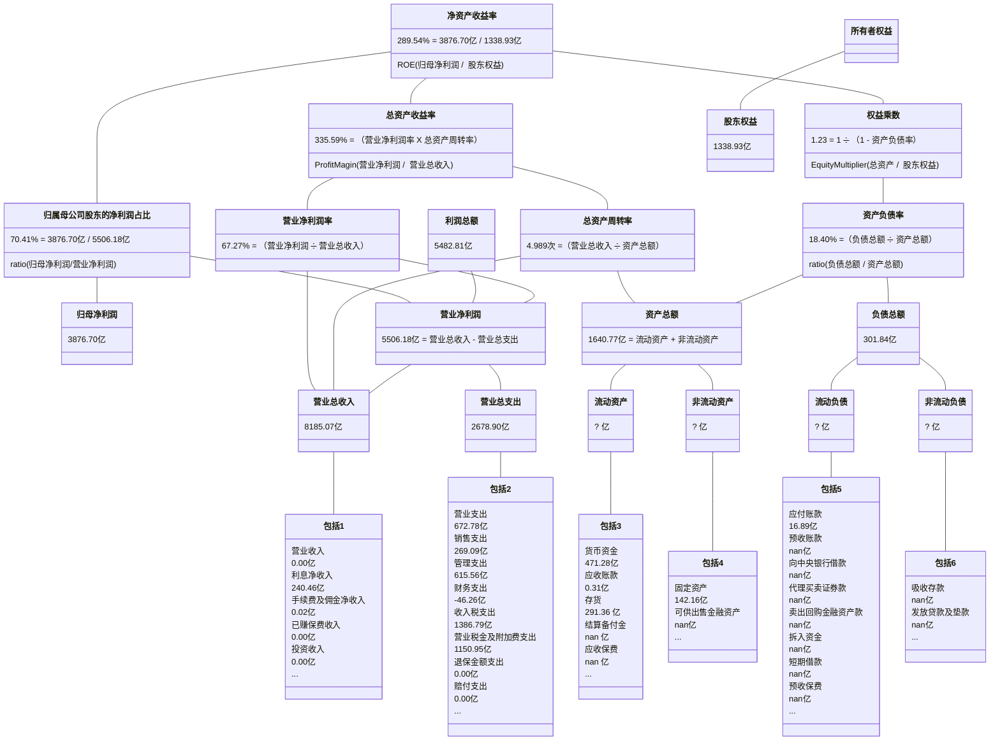

## 飞科电器

2014-2023年年报披露的部分数据：

| 年份 | 净资产收益率 | 资产负债率 | 归母净利润 | 股东权益合计 |
| :-: | :--------: | :-------: | :------: | :--------: |
| 2013 | 53.990% | 34.897% | 2.906亿 | 6.835亿 |
| 2014 | 53.350% | 42.270% | 3.707亿 | 8.222亿 |
| 2015 | 55.230% | 34.660% | 5.017亿 | 11.044亿 |
| 2016 | 34.300% | 27.794% | 6.132亿 | 20.104亿 |
| 2017 | 38.420% | 25.970% | 8.353亿 | 24.102亿 |
| 2018 | 34.460% | 29.581% | 8.449亿 | 26.035亿 |
| 2019 | 27.380% | 28.808% | 6.858亿 | 26.299亿 |
| 2020 | 23.690% | 27.159% | 6.383亿 | 28.329亿 |
| 2021 | 22.090% | 27.026% | 6.407亿 | 30.411亿 |
| 2022 | 25.730% | 21.129% | 8.230亿 | 34.281亿 |
| 2023 | 29.730% | 19.799% | 10.196亿 | 35.763亿 |

2013-2023年计算的部分数据：
                
| 年份 | 净资产收益率 | 资产负债率 | 归母净利润 | 股东权益合计 |
| :-: | :--------: | :-------: | :------: | :--------: |
| 2014 | 49.242% | 39.141% | 3.707亿 | 7.529亿 |
| 2015 | 52.083% | 38.140% | 5.017亿 | 9.633亿 |
| 2016 | 39.375% | 30.388% | 6.132亿 | 15.574亿 |
| 2017 | 37.793% | 26.811% | 8.353亿 | 22.103亿 |
| 2018 | 33.704% | 27.890% | 8.449亿 | 25.068亿 |
| 2019 | 26.210% | 29.195% | 6.858亿 | 26.167亿 |
| 2020 | 23.368% | 27.963% | 6.383亿 | 27.314亿 |
| 2021 | 21.815% | 27.090% | 6.407亿 | 29.370亿 |
| 2022 | 25.443% | 24.016% | 8.230亿 | 32.346亿 |
| 2023 | 29.114% | 20.455% | 10.196亿 | 35.022亿 |
| 2014-2023 | 327.396% | 22.676% | 69.733亿 | 21.299亿 |

## 养元饮品

2014-2023年年报披露的部分数据：

| 年份 | 净资产收益率 | 资产负债率 | 归母净利润 | 股东权益合计 |
| :-: | :--------: | :-------: | :------: | :--------: |
| 2013 | 101.740% | 55.908% | 15.821亿 | 23.019亿 |
| 2014 | 62.510% | 51.594% | 18.305亿 | 36.375亿 |
| 2015 | 57.770% | 39.874% | 26.200亿 | 56.387亿 |
| 2016 | 46.730% | 38.798% | 27.407亿 | 59.737亿 |
| 2017 | 38.770% | 34.434% | 23.099亿 | 73.369亿 |
| 2018 | 27.000% | 21.724% | 28.370亿 | 119.701亿 |
| 2019 | 22.850% | 17.847% | 26.953亿 | 124.135亿 |
| 2020 | 13.130% | 21.427% | 15.779亿 | 118.383亿 |
| 2021 | 17.560% | 21.528% | 21.108亿 | 124.648亿 |
| 2022 | 12.510% | 23.542% | 14.742亿 | 115.177亿 |
| 2023 | 13.220% | 31.421% | 14.674亿 | 110.559亿 |

2013-2023年计算的部分数据：
                
| 年份 | 净资产收益率 | 资产负债率 | 归母净利润 | 股东权益合计 |
| :-: | :--------: | :-------: | :------: | :--------: |
| 2014 | 61.641% | 53.362% | 18.305亿 | 29.697亿 |
| 2015 | 56.488% | 45.087% | 26.200亿 | 46.381亿 |
| 2016 | 47.203% | 39.325% | 27.407亿 | 58.062亿 |
| 2017 | 34.707% | 36.467% | 23.099亿 | 66.553亿 |
| 2018 | 29.388% | 27.094% | 28.370亿 | 96.535亿 |
| 2019 | 22.108% | 19.797% | 26.953亿 | 121.918亿 |
| 2020 | 13.012% | 19.635% | 15.779亿 | 121.259亿 |
| 2021 | 17.371% | 21.479% | 21.108亿 | 121.516亿 |
| 2022 | 12.294% | 22.509% | 14.742亿 | 119.912亿 |
| 2023 | 13.001% | 27.615% | 14.674亿 | 112.868亿 |
| 2014-2023 | 324.361% | 37.411% | 216.637亿 | 66.789亿 |

## 苏泊尔

2014-2023年年报披露的部分数据：

| 年份 | 净资产收益率 | 资产负债率 | 归母净利润 | 股东权益合计 |
| :-: | :--------: | :-------: | :------: | :--------: |
| 2013 | 18.540% | 34.938% | 5.885亿 | 37.329亿 |
| 2014 | 19.630% | 35.498% | 6.899亿 | 42.788亿 |
| 2015 | 21.900% | 32.265% | 8.890亿 | 50.097亿 |
| 2016 | 23.410% | 41.949% | 10.773亿 | 45.616亿 |
| 2017 | 26.150% | 42.847% | 13.262亿 | 54.079亿 |
| 2018 | 28.840% | 44.447% | 16.699亿 | 59.071亿 |
| 2019 | 30.540% | 42.230% | 19.199亿 | 68.446亿 |
| 2020 | 26.970% | 41.128% | 18.462亿 | 72.367亿 |
| 2021 | 26.810% | 44.902% | 19.439亿 | 76.583亿 |
| 2022 | 27.890% | 45.396% | 20.677亿 | 70.727亿 |
| 2023 | 34.620% | 51.309% | 21.798亿 | 63.818亿 |

2013-2023年计算的部分数据：
                
| 年份 | 净资产收益率 | 资产负债率 | 归母净利润 | 股东权益合计 |
| :-: | :--------: | :-------: | :------: | :--------: |
| 2014 | 17.222% | 35.238% | 6.899亿 | 40.059亿 |
| 2015 | 19.142% | 33.794% | 8.890亿 | 46.443亿 |
| 2016 | 22.512% | 37.253% | 10.773亿 | 47.856亿 |
| 2017 | 26.605% | 42.440% | 13.262亿 | 49.847亿 |
| 2018 | 29.516% | 43.694% | 16.699亿 | 56.575亿 |
| 2019 | 30.112% | 43.278% | 19.199亿 | 63.758亿 |
| 2020 | 26.222% | 41.669% | 18.462亿 | 70.407亿 |
| 2021 | 26.102% | 43.131% | 19.439亿 | 74.475亿 |
| 2022 | 28.072% | 45.140% | 20.677亿 | 73.655亿 |
| 2023 | 32.402% | 48.370% | 21.798亿 | 67.273亿 |
| 2014-2023 | 308.655% | 46.324% | 156.098亿 | 50.574亿 |

## 吉比特

2014-2023年年报披露的部分数据：

| 年份 | 净资产收益率 | 资产负债率 | 归母净利润 | 股东权益合计 |
| :-: | :--------: | :-------: | :------: | :--------: |
| 2013 | 101.850% | 36.574% | 1.575亿 | 2.040亿 |
| 2014 | 67.720% | 25.651% | 1.935亿 | 3.374亿 |
| 2015 | 43.740% | 20.751% | 1.750亿 | 4.912亿 |
| 2016 | 78.900% | 22.323% | 5.855亿 | 20.530亿 |
| 2017 | 29.580% | 21.865% | 6.097亿 | 24.562亿 |
| 2018 | 28.050% | 21.883% | 7.230亿 | 31.311亿 |
| 2019 | 28.140% | 21.372% | 8.092亿 | 34.351亿 |
| 2020 | 31.030% | 21.159% | 10.464亿 | 42.477亿 |
| 2021 | 35.970% | 28.771% | 14.685亿 | 50.596亿 |
| 2022 | 32.490% | 27.439% | 14.609亿 | 47.095亿 |
| 2023 | 26.040% | 20.931% | 11.251亿 | 52.476亿 |

2013-2023年计算的部分数据：
                
| 年份 | 净资产收益率 | 资产负债率 | 归母净利润 | 股东权益合计 |
| :-: | :--------: | :-------: | :------: | :--------: |
| 2014 | 71.488% | 30.181% | 1.935亿 | 2.707亿 |
| 2015 | 42.232% | 22.822% | 1.750亿 | 4.143亿 |
| 2016 | 46.023% | 22.025% | 5.855亿 | 12.721亿 |
| 2017 | 27.043% | 22.074% | 6.097亿 | 22.546亿 |
| 2018 | 25.879% | 21.875% | 7.230亿 | 27.937亿 |
| 2019 | 24.647% | 21.616% | 8.092亿 | 32.831亿 |
| 2020 | 27.240% | 21.254% | 10.464亿 | 38.414亿 |
| 2021 | 31.556% | 25.487% | 14.685亿 | 46.537亿 |
| 2022 | 29.908% | 28.135% | 14.609亿 | 48.846亿 |
| 2023 | 22.599% | 24.149% | 11.251亿 | 49.786亿 |
| 2014-2023 | 300.709% | 21.654% | 81.967亿 | 27.258亿 |

## 贵州茅台

2014-2023年年报披露的部分数据：

| 年份 | 净资产收益率 | 资产负债率 | 归母净利润 | 股东权益合计 |
| :-: | :--------: | :-------: | :------: | :--------: |
| 2013 | 39.430% | 20.422% | 151.366亿 | 441.291亿 |
| 2014 | 31.960% | 16.033% | 153.498亿 | 553.116亿 |
| 2015 | 26.230% | 23.253% | 155.031亿 | 662.342亿 |
| 2016 | 24.440% | 32.794% | 167.184亿 | 758.985亿 |
| 2017 | 32.950% | 28.668% | 270.794亿 | 960.196亿 |
| 2018 | 34.460% | 26.549% | 352.036亿 | 1174.085亿 |
| 2019 | 33.090% | 22.490% | 412.065亿 | 1418.764亿 |
| 2020 | 31.410% | 21.404% | 466.973亿 | 1677.207亿 |
| 2021 | 29.890% | 22.813% | 524.601亿 | 1969.575亿 |
| 2022 | 30.260% | 19.474% | 627.175亿 | 2049.381亿 |
| 2023 | 34.190% | 17.984% | 747.341亿 | 2236.565亿 |

2013-2023年计算的部分数据：
                
| 年份 | 净资产收益率 | 资产负债率 | 归母净利润 | 股东权益合计 |
| :-: | :--------: | :-------: | :------: | :--------: |
| 2014 | 30.872% | 18.039% | 153.498亿 | 497.203亿 |
| 2015 | 25.510% | 20.127% | 155.031亿 | 607.729亿 |
| 2016 | 23.525% | 28.661% | 167.184亿 | 710.664亿 |
| 2017 | 31.503% | 30.551% | 270.794亿 | 859.591亿 |
| 2018 | 32.989% | 27.518% | 352.036亿 | 1067.141亿 |
| 2019 | 31.785% | 24.382% | 412.065亿 | 1296.424亿 |
| 2020 | 30.166% | 21.905% | 466.973亿 | 1547.985亿 |
| 2021 | 28.771% | 22.171% | 524.601亿 | 1823.391亿 |
| 2022 | 31.211% | 21.146% | 627.175亿 | 2009.478亿 |
| 2023 | 34.874% | 18.704% | 747.341亿 | 2142.973亿 |
| 2014-2023 | 289.537% | 18.396% | 3876.697亿 | 1338.928亿 |

## 百川能源

2014-2023年年报披露的部分数据：

| 年份 | 净资产收益率 | 资产负债率 | 归母净利润 | 股东权益合计 |
| :-: | :--------: | :-------: | :------: | :--------: |
| 2013 | -26.680% | 84.944% | -0.057亿 | 0.250亿 |
| 2014 | 44.510% | 84.696% | 0.021亿 | 0.281亿 |
| 2015 | 53.580% | 52.537% | 4.078亿 | 8.648亿 |
| 2016 | 32.940% | 37.495% | 5.512亿 | 21.411亿 |
| 2017 | 32.130% | 44.479% | 8.580亿 | 39.158亿 |
| 2018 | 24.160% | 48.248% | 10.064亿 | 46.034亿 |
| 2019 | 16.490% | 48.995% | 7.283亿 | 46.656亿 |
| 2020 | 11.750% | 45.290% | 5.075亿 | 43.844亿 |
| 2021 | 13.380% | 50.133% | 5.374亿 | 40.650亿 |
| 2022 | 10.300% | 51.079% | 3.912亿 | 38.283亿 |
| 2023 | 9.990% | 51.718% | 3.684亿 | 38.004亿 |

2013-2023年计算的部分数据：
                
| 年份 | 净资产收益率 | 资产负债率 | 归母净利润 | 股东权益合计 |
| :-: | :--------: | :-------: | :------: | :--------: |
| 2014 | 7.899% | 84.813% | 0.021亿 | 0.265亿 |
| 2015 | 91.353% | 55.481% | 4.078亿 | 4.464亿 |
| 2016 | 36.673% | 42.718% | 5.512亿 | 15.030亿 |
| 2017 | 28.333% | 42.196% | 8.580亿 | 30.285亿 |
| 2018 | 23.627% | 46.581% | 10.064亿 | 42.596亿 |
| 2019 | 15.714% | 48.627% | 7.283亿 | 46.345亿 |
| 2020 | 11.215% | 47.265% | 5.075亿 | 45.250亿 |
| 2021 | 12.720% | 47.732% | 5.374亿 | 42.247亿 |
| 2022 | 9.912% | 50.597% | 3.912亿 | 39.467亿 |
| 2023 | 9.659% | 51.400% | 3.684亿 | 38.144亿 |
| 2014-2023 | 280.147% | 52.404% | 53.583亿 | 19.127亿 |

## 双汇发展

2014-2023年年报披露的部分数据：

| 年份 | 净资产收益率 | 资产负债率 | 归母净利润 | 股东权益合计 |
| :-: | :--------: | :-------: | :------: | :--------: |
| 2013 | 30.440% | 24.019% | 38.582亿 | 150.034亿 |
| 2014 | 28.600% | 25.573% | 40.399亿 | 163.608亿 |
| 2015 | 27.240% | 22.714% | 42.555亿 | 176.866亿 |
| 2016 | 28.330% | 29.427% | 44.051亿 | 150.687亿 |
| 2017 | 35.620% | 33.010% | 43.193亿 | 154.673亿 |
| 2018 | 38.840% | 40.059% | 49.119亿 | 137.052亿 |
| 2019 | 37.370% | 40.226% | 54.376亿 | 171.154亿 |
| 2020 | 32.930% | 30.461% | 62.555亿 | 241.327亿 |
| 2021 | 21.800% | 31.867% | 48.659亿 | 231.497亿 |
| 2022 | 25.430% | 39.079% | 56.209亿 | 221.825亿 |
| 2023 | 23.830% | 42.342% | 50.527亿 | 211.463亿 |

2013-2023年计算的部分数据：
                
| 年份 | 净资产收益率 | 资产负债率 | 归母净利润 | 股东权益合计 |
| :-: | :--------: | :-------: | :------: | :--------: |
| 2014 | 25.761% | 24.838% | 40.399亿 | 156.821亿 |
| 2015 | 24.998% | 24.115% | 42.555亿 | 170.237亿 |
| 2016 | 26.897% | 25.954% | 44.051亿 | 163.777亿 |
| 2017 | 28.290% | 31.288% | 43.193亿 | 152.680亿 |
| 2018 | 33.675% | 36.517% | 49.119亿 | 145.863亿 |
| 2019 | 35.286% | 40.152% | 54.376亿 | 154.103亿 |
| 2020 | 30.331% | 34.875% | 62.555亿 | 206.241亿 |
| 2021 | 20.582% | 31.157% | 48.659亿 | 236.412亿 |
| 2022 | 24.799% | 35.598% | 56.209亿 | 226.661亿 |
| 2023 | 23.323% | 40.716% | 50.527亿 | 216.644亿 |
| 2014-2023 | 272.005% | 35.929% | 491.643亿 | 180.748亿 |

## 同花顺

2014-2023年年报披露的部分数据：

| 年份 | 净资产收益率 | 资产负债率 | 归母净利润 | 股东权益合计 |
| :-: | :--------: | :-------: | :------: | :--------: |
| 2013 | 1.940% | 13.621% | 0.219亿 | 11.391亿 |
| 2014 | 5.190% | 24.638% | 0.605亿 | 11.915亿 |
| 2015 | 57.810% | 40.217% | 9.572亿 | 21.272亿 |
| 2016 | 49.610% | 27.603% | 12.116亿 | 29.532亿 |
| 2017 | 24.680% | 24.744% | 7.257亿 | 31.692亿 |
| 2018 | 20.230% | 19.145% | 6.339亿 | 33.399亿 |
| 2019 | 24.930% | 23.795% | 8.977亿 | 39.901亿 |
| 2020 | 38.370% | 26.992% | 17.240亿 | 52.242亿 |
| 2021 | 33.590% | 23.814% | 19.112亿 | 64.767亿 |
| 2022 | 25.550% | 19.745% | 16.911亿 | 72.451亿 |
| 2023 | 20.190% | 25.653% | 14.025亿 | 73.193亿 |

2013-2023年计算的部分数据：
                
| 年份 | 净资产收益率 | 资产负债率 | 归母净利润 | 股东权益合计 |
| :-: | :--------: | :-------: | :------: | :--------: |
| 2014 | 5.188% | 19.628% | 0.605亿 | 11.653亿 |
| 2015 | 57.687% | 35.425% | 9.572亿 | 16.593亿 |
| 2016 | 47.697% | 33.480% | 12.116亿 | 25.402亿 |
| 2017 | 23.705% | 26.151% | 7.257亿 | 30.612亿 |
| 2018 | 19.479% | 21.972% | 6.339亿 | 32.545亿 |
| 2019 | 24.493% | 21.745% | 8.977亿 | 36.650亿 |
| 2020 | 37.420% | 25.641% | 17.240亿 | 46.071亿 |
| 2021 | 32.668% | 25.267% | 19.112亿 | 58.505亿 |
| 2022 | 24.648% | 21.718% | 16.911亿 | 68.609亿 |
| 2023 | 19.259% | 22.827% | 14.025亿 | 72.822亿 |
| 2014-2023 | 265.184% | 24.232% | 112.152亿 | 42.292亿 |

## 三七互娱

2014-2023年年报披露的部分数据：

| 年份 | 净资产收益率 | 资产负债率 | 归母净利润 | 股东权益合计 |
| :-: | :--------: | :-------: | :------: | :--------: |
| 2013 | 0.490% | 7.935% | 0.037亿 | 7.375亿 |
| 2014 | 4.210% | 16.813% | 0.382亿 | 28.411亿 |
| 2015 | 17.580% | 19.734% | 5.060亿 | 37.109亿 |
| 2016 | 26.560% | 25.947% | 10.702亿 | 47.292亿 |
| 2017 | 28.120% | 20.453% | 16.206亿 | 72.867亿 |
| 2018 | 16.590% | 27.181% | 10.085亿 | 61.137亿 |
| 2019 | 32.660% | 28.107% | 21.148亿 | 72.937亿 |
| 2020 | 34.840% | 42.586% | 27.610亿 | 60.655亿 |
| 2021 | 30.240% | 24.796% | 28.756亿 | 108.573亿 |
| 2022 | 25.410% | 27.976% | 29.544亿 | 123.126亿 |
| 2023 | 20.830% | 33.041% | 26.586亿 | 128.124亿 |

2013-2023年计算的部分数据：
                
| 年份 | 净资产收益率 | 资产负债率 | 归母净利润 | 股东权益合计 |
| :-: | :--------: | :-------: | :------: | :--------: |
| 2014 | 2.136% | 15.126% | 0.382亿 | 17.893亿 |
| 2015 | 15.446% | 18.493% | 5.060亿 | 32.760亿 |
| 2016 | 25.359% | 23.338% | 10.702亿 | 42.200亿 |
| 2017 | 26.974% | 22.710% | 16.206亿 | 60.079亿 |
| 2018 | 15.052% | 23.670% | 10.085亿 | 67.002亿 |
| 2019 | 31.546% | 27.688% | 21.148亿 | 67.037亿 |
| 2020 | 41.334% | 35.493% | 27.610亿 | 66.796亿 |
| 2021 | 33.985% | 32.313% | 28.756亿 | 84.614亿 |
| 2022 | 25.502% | 26.520% | 29.544亿 | 115.850亿 |
| 2023 | 21.163% | 30.651% | 26.586亿 | 125.625亿 |
| 2014-2023 | 259.894% | 32.032% | 176.077亿 | 67.750亿 |

## 浙江美大

2014-2023年年报披露的部分数据：

| 年份 | 净资产收益率 | 资产负债率 | 归母净利润 | 股东权益合计 |
| :-: | :--------: | :-------: | :------: | :--------: |
| 2013 | 12.200% | 14.255% | 1.077亿 | 9.201亿 |
| 2014 | 14.620% | 12.672% | 1.377亿 | 9.878亿 |
| 2015 | 15.320% | 13.897% | 1.556亿 | 10.435亿 |
| 2016 | 18.500% | 17.642% | 2.027亿 | 11.511亿 |
| 2017 | 25.730% | 21.918% | 3.052亿 | 13.084亿 |
| 2018 | 29.280% | 23.335% | 3.775亿 | 13.651亿 |
| 2019 | 33.050% | 23.533% | 4.600亿 | 15.192亿 |
| 2020 | 34.350% | 21.795% | 5.436亿 | 17.037亿 |
| 2021 | 37.040% | 17.208% | 6.647亿 | 19.502亿 |
| 2022 | 23.510% | 13.803% | 4.522亿 | 19.665亿 |
| 2023 | 23.640% | 13.038% | 4.643亿 | 20.286亿 |

2013-2023年计算的部分数据：
                
| 年份 | 净资产收益率 | 资产负债率 | 归母净利润 | 股东权益合计 |
| :-: | :--------: | :-------: | :------: | :--------: |
| 2014 | 14.438% | 13.442% | 1.377亿 | 9.540亿 |
| 2015 | 15.324% | 13.306% | 1.556亿 | 10.157亿 |
| 2016 | 18.469% | 15.903% | 2.027亿 | 10.973亿 |
| 2017 | 24.818% | 19.973% | 3.052亿 | 12.297亿 |
| 2018 | 28.242% | 22.648% | 3.775亿 | 13.367亿 |
| 2019 | 31.897% | 23.440% | 4.600亿 | 14.422亿 |
| 2020 | 33.731% | 22.624% | 5.436亿 | 16.115亿 |
| 2021 | 36.382% | 19.412% | 6.647亿 | 18.270亿 |
| 2022 | 23.088% | 15.533% | 4.522亿 | 19.584亿 |
| 2023 | 23.243% | 13.416% | 4.643亿 | 19.975亿 |
| 2014-2023 | 255.266% | 13.421% | 37.634亿 | 14.743亿 |

