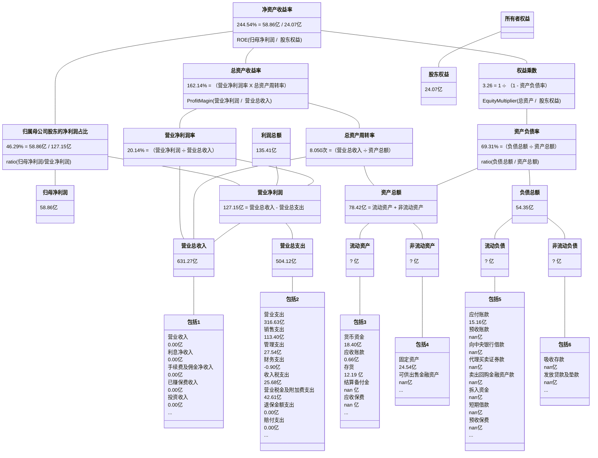
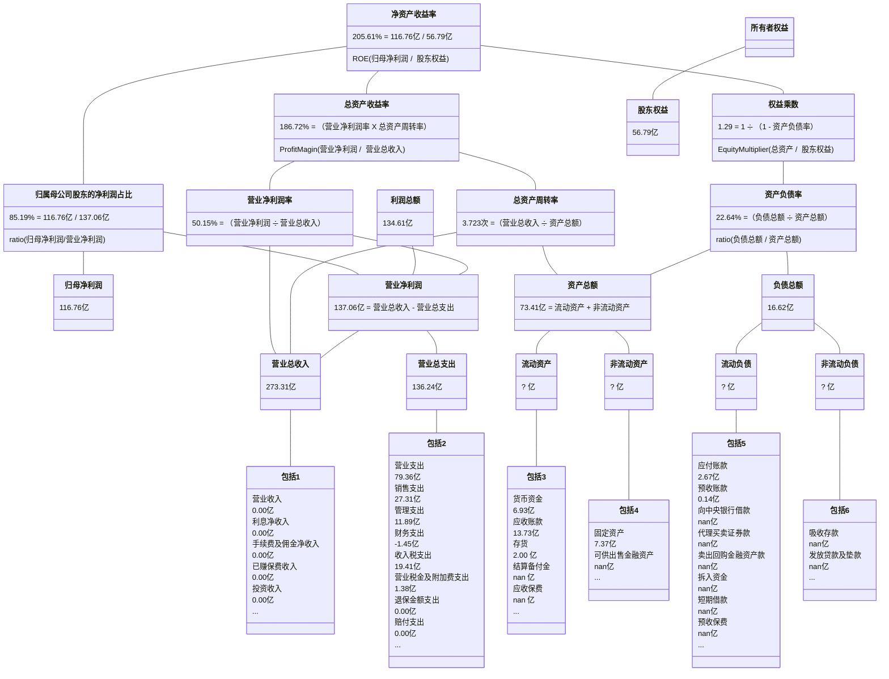
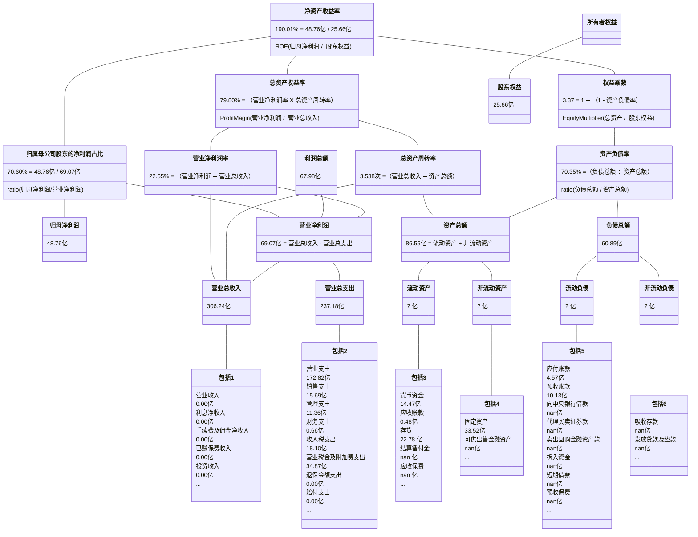
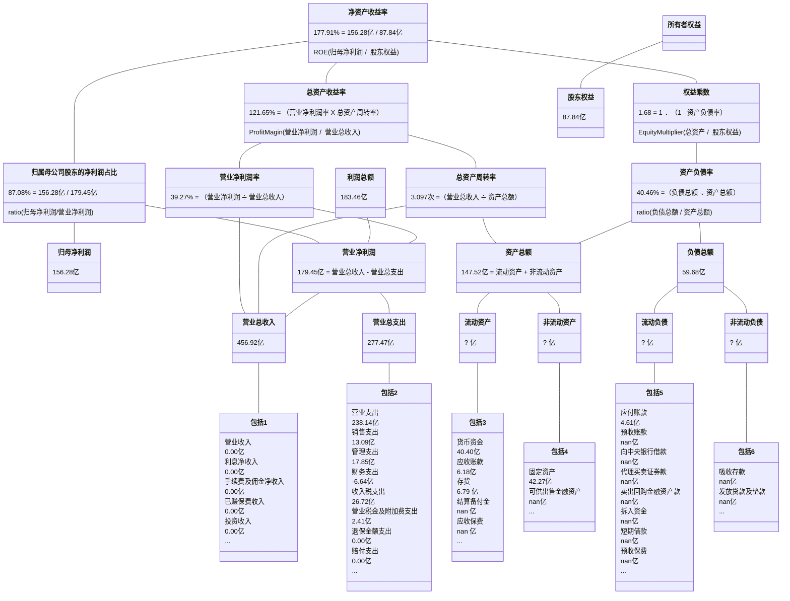
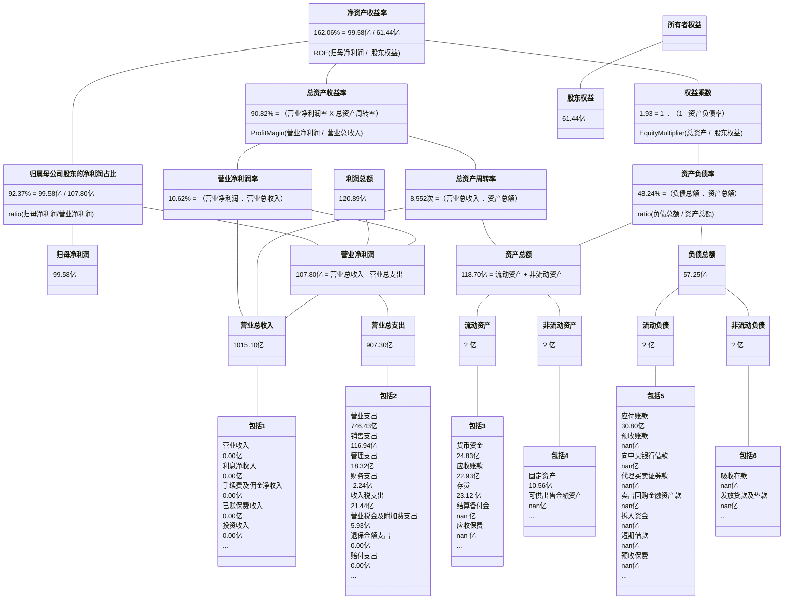
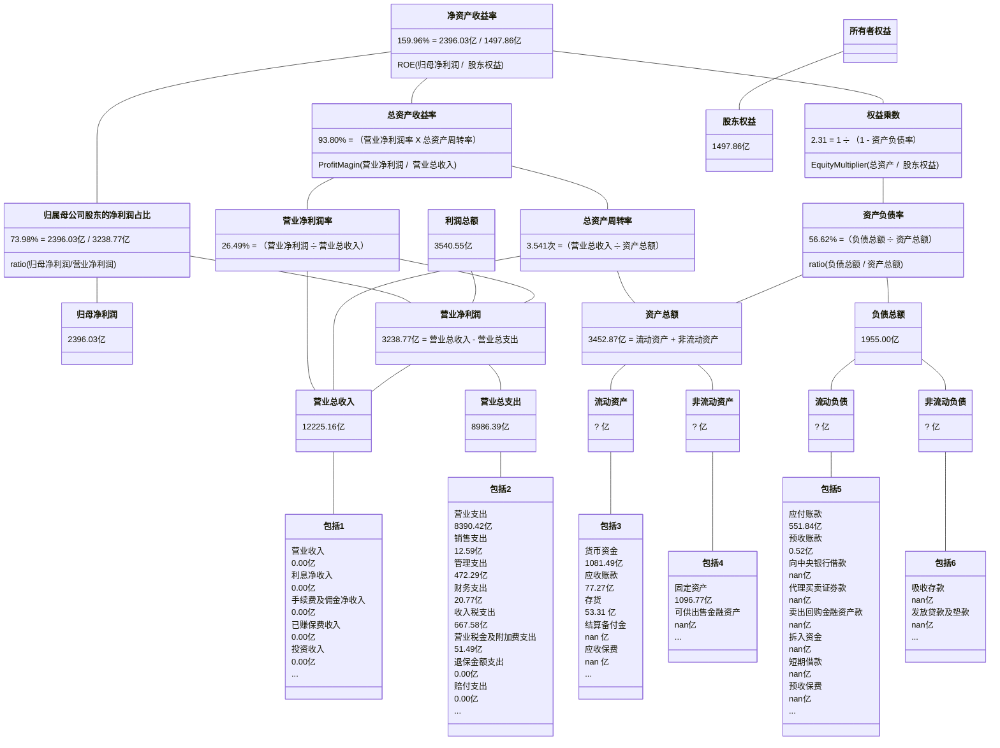
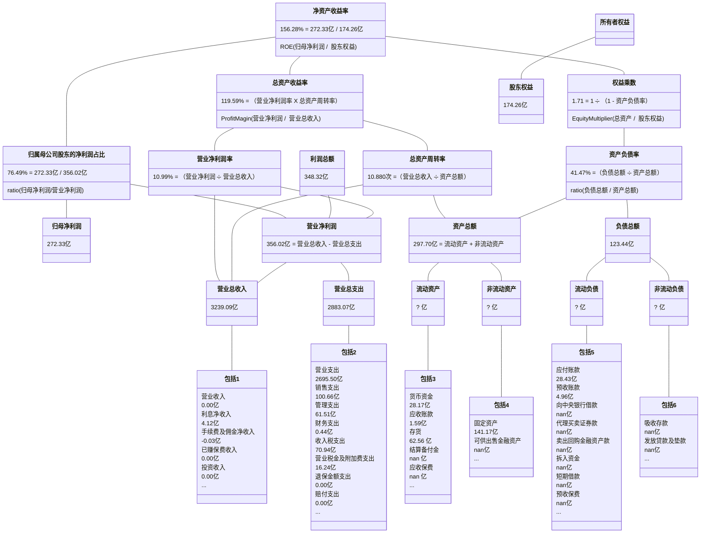

## 重庆啤酒

2019-2023年年报披露的部分数据：

| 年份 | 净资产收益率 | 资产负债率 | 归母净利润 | 股东权益合计 |
| :-: | :--------: | :-------: | :------: | :--------: |
| 2018 | 28.580% | 64.766% | 4.040亿 | 11.619亿 |
| 2019 | 43.660% | 66.870% | 10.429亿 | 35.738亿 |
| 2020 | 45.550% | 83.650% | 10.768亿 | 15.688亿 |
| 2021 | 99.690% | 72.875% | 11.662亿 | 31.283亿 |
| 2022 | 69.250% | 71.010% | 12.636亿 | 36.231亿 |
| 2023 | 67.050% | 70.516% | 13.366亿 | 36.521亿 |

2018-2023年计算的部分数据：
                
| 年份 | 净资产收益率 | 资产负债率 | 归母净利润 | 股东权益合计 |
| :-: | :--------: | :-------: | :------: | :--------: |
| 2019 | 44.044% | 66.377% | 10.429亿 | 23.678亿 |
| 2020 | 41.879% | 74.769% | 10.768亿 | 25.713亿 |
| 2021 | 49.658% | 77.768% | 11.662亿 | 23.486亿 |
| 2022 | 37.433% | 71.905% | 12.636亿 | 33.757亿 |
| 2023 | 36.744% | 70.764% | 13.366亿 | 36.376亿 |

## 达安基因

2019-2023年年报披露的部分数据：

| 年份 | 净资产收益率 | 资产负债率 | 归母净利润 | 股东权益合计 |
| :-: | :--------: | :-------: | :------: | :--------: |
| 2018 | 5.770% | 39.930% | 1.016亿 | 22.005亿 |
| 2019 | 5.100% | 41.389% | 0.922亿 | 20.875亿 |
| 2020 | 80.210% | 32.617% | 24.491亿 | 45.147亿 |
| 2021 | 62.520% | 25.894% | 36.182亿 | 76.600亿 |
| 2022 | 58.960% | 21.286% | 54.123亿 | 116.159亿 |
| 2023 | 1.080% | 16.889% | 1.047亿 | 91.571亿 |

2018-2023年计算的部分数据：
                
| 年份 | 净资产收益率 | 资产负债率 | 归母净利润 | 股东权益合计 |
| :-: | :--------: | :-------: | :------: | :--------: |
| 2019 | 4.299% | 40.649% | 0.922亿 | 21.440亿 |
| 2020 | 74.191% | 35.662% | 24.491亿 | 33.011亿 |
| 2021 | 59.438% | 28.538% | 36.182亿 | 60.873亿 |
| 2022 | 56.157% | 23.184% | 54.123亿 | 96.379亿 |
| 2023 | 1.008% | 19.406% | 1.047亿 | 103.865亿 |

## 京基智农

2019-2023年年报披露的部分数据：

| 年份 | 净资产收益率 | 资产负债率 | 归母净利润 | 股东权益合计 |
| :-: | :--------: | :-------: | :------: | :--------: |
| 2018 | 54.950% | 76.355% | 4.374亿 | 12.254亿 |
| 2019 | 70.350% | 63.261% | 11.008亿 | 23.777亿 |
| 2020 | 35.460% | 71.917% | 8.666亿 | 27.812亿 |
| 2021 | 15.000% | 82.746% | 3.893亿 | 25.591亿 |
| 2022 | 31.350% | 84.817% | 7.731亿 | 26.624亿 |
| 2023 | 55.470% | 67.785% | 17.463亿 | 39.071亿 |

2018-2023年计算的部分数据：
                
| 年份 | 净资产收益率 | 资产负债率 | 归母净利润 | 股东权益合计 |
| :-: | :--------: | :-------: | :------: | :--------: |
| 2019 | 61.104% | 69.084% | 11.008亿 | 18.016亿 |
| 2020 | 33.594% | 68.496% | 8.666亿 | 25.795亿 |
| 2021 | 14.581% | 78.411% | 3.893亿 | 26.702亿 |
| 2022 | 29.611% | 83.868% | 7.731亿 | 26.108亿 |
| 2023 | 53.164% | 77.854% | 17.463亿 | 32.847亿 |

## 英科医疗

2019-2023年年报披露的部分数据：

| 年份 | 净资产收益率 | 资产负债率 | 归母净利润 | 股东权益合计 |
| :-: | :--------: | :-------: | :------: | :--------: |
| 2018 | 15.300% | 47.493% | 1.793亿 | 12.731亿 |
| 2019 | 13.080% | 49.807% | 1.783亿 | 15.018亿 |
| 2020 | 132.220% | 26.997% | 70.070亿 | 94.428亿 |
| 2021 | 59.610% | 21.824% | 74.301亿 | 161.234亿 |
| 2022 | 3.940% | 25.278% | 6.291亿 | 160.493亿 |
| 2023 | 2.400% | 39.827% | 3.830亿 | 162.946亿 |

2018-2023年计算的部分数据：
                
| 年份 | 净资产收益率 | 资产负债率 | 归母净利润 | 股东权益合计 |
| :-: | :--------: | :-------: | :------: | :--------: |
| 2019 | 12.852% | 48.771% | 1.783亿 | 13.874亿 |
| 2020 | 128.047% | 31.282% | 70.070亿 | 54.723亿 |
| 2021 | 58.124% | 23.818% | 74.301亿 | 127.831亿 |
| 2022 | 3.911% | 23.586% | 6.291亿 | 160.864亿 |
| 2023 | 2.368% | 33.392% | 3.830亿 | 161.719亿 |

## 智飞生物

2019-2023年年报披露的部分数据：

| 年份 | 净资产收益率 | 资产负债率 | 归母净利润 | 股东权益合计 |
| :-: | :--------: | :-------: | :------: | :--------: |
| 2018 | 40.780% | 38.608% | 14.514亿 | 41.809亿 |
| 2019 | 47.670% | 47.477% | 23.664亿 | 57.473亿 |
| 2020 | 46.290% | 45.787% | 33.013亿 | 82.487亿 |
| 2021 | 78.010% | 41.235% | 102.085亿 | 176.572亿 |
| 2022 | 36.130% | 36.227% | 75.390亿 | 242.362亿 |
| 2023 | 29.090% | 37.279% | 80.699亿 | 315.061亿 |

2018-2023年计算的部分数据：
                
| 年份 | 净资产收益率 | 资产负债率 | 归母净利润 | 股东权益合计 |
| :-: | :--------: | :-------: | :------: | :--------: |
| 2019 | 47.671% | 44.074% | 23.664亿 | 49.641亿 |
| 2020 | 47.175% | 46.494% | 33.013亿 | 69.980亿 |
| 2021 | 78.813% | 42.765% | 102.085亿 | 129.529亿 |
| 2022 | 35.991% | 38.438% | 75.390亿 | 209.467亿 |
| 2023 | 28.954% | 36.826% | 80.699亿 | 278.711亿 |

## 东鹏饮料

2019-2023年年报披露的部分数据：

| 年份 | 净资产收益率 | 资产负债率 | 归母净利润 | 股东权益合计 |
| :-: | :--------: | :-------: | :------: | :--------: |
| 2018 | 22.050% | 48.426% | 2.158亿 | 10.869亿 |
| 2019 | 43.140% | 51.053% | 5.706亿 | 16.352亿 |
| 2020 | 45.820% | 56.131% | 8.121亿 | 19.133亿 |
| 2021 | 36.480% | 45.599% | 11.930亿 | 42.381亿 |
| 2022 | 31.650% | 57.333% | 14.405亿 | 50.646亿 |
| 2023 | 35.820% | 57.011% | 20.398亿 | 63.238亿 |

2018-2023年计算的部分数据：
                
| 年份 | 净资产收益率 | 资产负债率 | 归母净利润 | 股东权益合计 |
| :-: | :--------: | :-------: | :------: | :--------: |
| 2019 | 41.921% | 50.036% | 5.706亿 | 13.611亿 |
| 2020 | 45.770% | 53.928% | 8.121亿 | 17.742亿 |
| 2021 | 38.787% | 49.379% | 11.930亿 | 30.757亿 |
| 2022 | 30.970% | 52.683% | 14.405亿 | 46.514亿 |
| 2023 | 35.822% | 57.154% | 20.398亿 | 56.942亿 |

## 贵州茅台

2019-2023年年报披露的部分数据：

| 年份 | 净资产收益率 | 资产负债率 | 归母净利润 | 股东权益合计 |
| :-: | :--------: | :-------: | :------: | :--------: |
| 2018 | 34.460% | 26.549% | 352.036亿 | 1174.085亿 |
| 2019 | 33.090% | 22.490% | 412.065亿 | 1418.764亿 |
| 2020 | 31.410% | 21.404% | 466.973亿 | 1677.207亿 |
| 2021 | 29.890% | 22.813% | 524.601亿 | 1969.575亿 |
| 2022 | 30.260% | 19.474% | 627.175亿 | 2049.381亿 |
| 2023 | 34.190% | 17.984% | 747.341亿 | 2236.565亿 |

2018-2023年计算的部分数据：
                
| 年份 | 净资产收益率 | 资产负债率 | 归母净利润 | 股东权益合计 |
| :-: | :--------: | :-------: | :------: | :--------: |
| 2019 | 31.785% | 24.382% | 412.065亿 | 1296.424亿 |
| 2020 | 30.166% | 21.905% | 466.973亿 | 1547.985亿 |
| 2021 | 28.771% | 22.171% | 524.601亿 | 1823.391亿 |
| 2022 | 31.211% | 21.146% | 627.175亿 | 2009.478亿 |
| 2023 | 34.874% | 18.704% | 747.341亿 | 2142.973亿 |

## 苏泊尔

2019-2023年年报披露的部分数据：

| 年份 | 净资产收益率 | 资产负债率 | 归母净利润 | 股东权益合计 |
| :-: | :--------: | :-------: | :------: | :--------: |
| 2018 | 28.840% | 44.447% | 16.699亿 | 59.071亿 |
| 2019 | 30.540% | 42.230% | 19.199亿 | 68.446亿 |
| 2020 | 26.970% | 41.128% | 18.462亿 | 72.367亿 |
| 2021 | 26.810% | 44.902% | 19.439亿 | 76.583亿 |
| 2022 | 27.890% | 45.396% | 20.677亿 | 70.727亿 |
| 2023 | 34.620% | 51.309% | 21.798亿 | 63.818亿 |

2018-2023年计算的部分数据：
                
| 年份 | 净资产收益率 | 资产负债率 | 归母净利润 | 股东权益合计 |
| :-: | :--------: | :-------: | :------: | :--------: |
| 2019 | 30.112% | 43.278% | 19.199亿 | 63.758亿 |
| 2020 | 26.222% | 41.669% | 18.462亿 | 70.407亿 |
| 2021 | 26.102% | 43.131% | 19.439亿 | 74.475亿 |
| 2022 | 28.072% | 45.140% | 20.677亿 | 73.655亿 |
| 2023 | 32.402% | 48.370% | 21.798亿 | 67.273亿 |

## 中远海控

2019-2023年年报披露的部分数据：

| 年份 | 净资产收益率 | 资产负债率 | 归母净利润 | 股东权益合计 |
| :-: | :--------: | :-------: | :------: | :--------: |
| 2018 | 5.520% | 75.299% | 12.300亿 | 563.529亿 |
| 2019 | 21.570% | 73.639% | 67.641亿 | 691.252亿 |
| 2020 | 25.160% | 71.059% | 99.271亿 | 786.971亿 |
| 2021 | 100.570% | 56.681% | 893.489亿 | 1794.600亿 |
| 2022 | 59.840% | 50.424% | 1097.030亿 | 2537.931亿 |
| 2023 | 11.800% | 47.404% | 238.603亿 | 2432.195亿 |

2018-2023年计算的部分数据：
                
| 年份 | 净资产收益率 | 资产负债率 | 归母净利润 | 股东权益合计 |
| :-: | :--------: | :-------: | :------: | :--------: |
| 2019 | 10.781% | 74.411% | 67.641亿 | 627.391亿 |
| 2020 | 13.431% | 72.326% | 99.271亿 | 739.111亿 |
| 2021 | 69.221% | 62.379% | 893.489亿 | 1290.786亿 |
| 2022 | 50.642% | 53.223% | 1097.030亿 | 2166.266亿 |
| 2023 | 9.601% | 48.991% | 238.603亿 | 2485.063亿 |

## 双汇发展

2019-2023年年报披露的部分数据：

| 年份 | 净资产收益率 | 资产负债率 | 归母净利润 | 股东权益合计 |
| :-: | :--------: | :-------: | :------: | :--------: |
| 2018 | 38.840% | 40.059% | 49.119亿 | 137.052亿 |
| 2019 | 37.370% | 40.226% | 54.376亿 | 171.154亿 |
| 2020 | 32.930% | 30.461% | 62.555亿 | 241.327亿 |
| 2021 | 21.800% | 31.867% | 48.659亿 | 231.497亿 |
| 2022 | 25.430% | 39.079% | 56.209亿 | 221.825亿 |
| 2023 | 23.830% | 42.342% | 50.527亿 | 211.463亿 |

2018-2023年计算的部分数据：
                
| 年份 | 净资产收益率 | 资产负债率 | 归母净利润 | 股东权益合计 |
| :-: | :--------: | :-------: | :------: | :--------: |
| 2019 | 35.286% | 40.152% | 54.376亿 | 154.103亿 |
| 2020 | 30.331% | 34.875% | 62.555亿 | 206.241亿 |
| 2021 | 20.582% | 31.157% | 48.659亿 | 236.412亿 |
| 2022 | 24.799% | 35.598% | 56.209亿 | 226.661亿 |
| 2023 | 23.323% | 40.716% | 50.527亿 | 216.644亿 |

