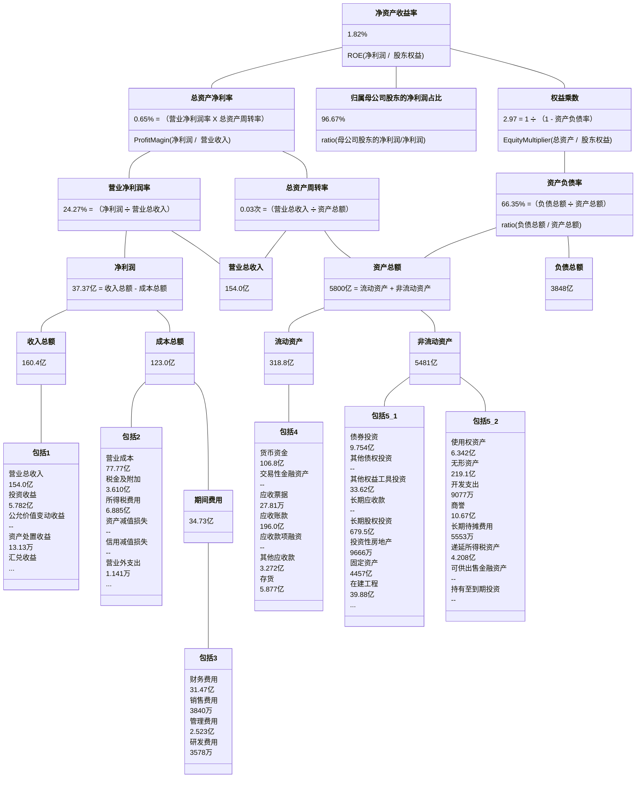

## 计算净资产收益率(ROE)

Updated 1943 GMT+8 Apr 9, 2024


2023/7/22


**说明：**

需要独立完成，在canvas对应作业中，

1）提交10～30分钟的present（在canvas上，利用studio完成，录制时候，需要自己头像出现）（4分）

2）present提交之后，请把作业报告（4分）、源程序代码py、jupyter等（4分），上传到右侧的“作业评论”区。在报告中请自评当次作业分数（满分是12分）及理由。

作业报告包括：实验设置（目标、数据、参数、评价指标等）、原理和实现、实验结果与分析、总结和自评分、感谢和收获。

录制pre时候，左侧代码，右侧文档（如果是.jpynb文档，开一个窗口可以），自己头像可以放在右下角位置。


**作业评分标准**

| 标准                        | 等级                                            | 得分         |
| --------------------------- | ----------------------------------------------- | ------------ |
| 按时提交10～30分钟的present | 4 得分6+分钟，2 得分请假，0 得分未提交          | 4 分         |
| 源程序代码                  | 4 得分规范可读性好，2 得分有缺失，0 得分无源码  | 4 分         |
| 作业报告                    | 4 得分要求几部分完整，2得分有缺失，0 得分无报告 | 4 分         |
| 总得分：                    |                                                 | 12 ，满分 12 |


### 财务报表

财务报表在金融领域中扮演着至关重要的角色，它向股东、投资者、分析师、债权人和其他利益相关者提供了有关企业财务状况和业绩的信息。这种信息透明度和可比性有助于市场参与者做出更明智的投资和决策。投资者可以通过财务报表来评估一个企业的盈利能力、成长潜力和风险状况；企业管理者使用财务报表来评估公司的业绩，了解盈利状况和成本结构，从而制定战略和经营决策。

财务报表主要包括以下三个部分：

1. **资产负债表**： 资产负债表是用于展示企业在特定日期的资产、负债和所有者权益的财务状况。它反映了企业拥有的资源（资产）、对外欠债的义务（负债）以及资产归属于所有者的部分（所有者权益），满足资产 = 负债 + 所有者权益。通过这张表，人们可以了解企业在某个时间点的财务健康状况。
2. **利润表**： 利润表用于总结企业在一段时间内的收入和费用情况，以计算净利润或净亏损。它显示了企业在特定会计期间内的营业收入、营业成本、毛利润、营业费用、税前利润、税后利润等，反映了企业经营活动的盈亏情况，提供了企业的盈利能力和经营绩效信息。
3. **现金流量表**： 现金流量表记录了企业在一定期间内现金流动的情况。它分为三个主要部分：经营活动现金流量、投资活动现金流量和融资活动现金流量。现金流量表帮助人们了解企业现金流动状况，评估企业的偿债能力和资金运作状况。


### 杜邦分析

杜邦分析是一种财务分析方法，旨在深入了解企业盈利能力的来源。该分析方法将企业的净资产收益率（Return on Equity，ROE），分解为营业净利润率、总资产周转率和权益乘数三个财务指标相乘，以此揭示ROE的变化是由哪些因素引起的，从而帮助投资者和管理者更好地理解企业的盈利能力。

**营业净利润率**：营业净利润率是指归母净利润与营业收入之间的比率。它用于衡量企业在每销售一单位产品或提供一项服务后，实际获得的净利润占营业收入的比例。较高的净利润率通常表示企业在销售中能有效地控制成本和费用，有较高的盈利水平。

净利润率 = ( 归母净利润 / 营业收入) × 100%

其中，净利润是企业在一定期间内的总收入扣除所有费用和税后所得的利润，归母净利润表示归属于母公司的净利润，营业收入是企业在一定期间内的总销售收入

**总资产周转率**：总资产周转率衡量企业利用其总资产的效率。它用于评估企业销售产生的收入与企业总资产之间的关系。较高的总资产周转率意味着企业在运营中能更好地利用其资产，更高效地产生收入。

总资产周转率 = 营业收入 / 平均总资产

其中， 营业收入是企业在一定期间内的总销售收入，平均总资产是该期间开始和结束时的总资产数值的平均值。

**权益乘数**：权益乘数反映了公司利⽤财务杠杆进⾏经营活动的程度。资产负债率⾼，权益乘数就⼤，这说明公司负债程度⾼，公司会有较多的杠杆利益，但⻛险也⾼；反之，资产负债率低，权益乘数就⼩，这说明公司负债程度低，公司会有较少的杠杆利益，但相应所承担的⻛险也低。

权益乘数 = 1 / (1 - 资产负债率) 

资产负债率 =  (平均总负债 / 平均总资产) × 100%

其中， 总资产、总负债分别是企业在特定时间点的全部资产总额与全部负债总额，平均总资产、平均总负债是企业在期初期末总资产、总负债的均值。

**净资产收益率**：净资产收益率表示企业在股东权益上实现的收益率，即股东对其投资获得的回报率。

ROE = ( 归母净利润 / 净资产) × 100%

其中，净资产即为所有者权益，也就是资产减去负债的差值。


### 作业

1. 推导杜邦分析公式：ROE = 净利润率 x 总资产周转率 x 权益乘数，并简要分析宏观经济放缓对于ROE的影响。
2. 因为假的东西难以长久，看财报最好多看几年。1）利用akshare库获取上市公司的财务报表数据（代码参考附录1），计算每只股票在2021年至2023年期间的ROE（由于akshare没有给出归母净利润，这里假设净利润 = 归母净利润）。2）希望对同一板块的公司进行ROE的横向比较。
3. 在2的基础上，针对于ROE最高的公司，根据其某一年，如2023年的年度报表，进行杜邦分析。（markdown画图可参考附录2）


### 附录1

资产负债表：https://akshare.akfamily.xyz/data/stock/stock.html#id146

```python
import akshare as ak

#stock_zcfz_em_df = ak.stock_zcfz_em(date="20220331")
stock_zcfz_em_df = ak.stock_em_zcfz(date="20220331")
print(stock_zcfz_em_df)

"""
2024/4/1 23:12 运行，输出如下：

100%|██████████| 10/10 [00:07<00:00,  1.41it/s]
        序号    股票代码  股票简称  ...      资产负债率        股东权益合计                 公告日期
0        1  301206  三元生物  ...   9.085495  4.654908e+09  2024-02-05 00:00:00
1        2  002570   贝因美  ...  54.908798  1.854212e+09  2024-01-31 00:00:00
2        3  688260  昀冢科技  ...  49.795861  5.022345e+08  2024-01-18 00:00:00
3        4  300008  天海防务  ...  40.179661  1.680142e+09  2024-01-17 00:00:00
4        5  603718  海利生物  ...  45.402404  9.930657e+08  2023-10-28 00:00:00
   ...     ...   ...  ...        ...           ...                  ...
4977  4978  000921  海信家电  ...  71.695759  1.556595e+10  2022-04-12 00:00:00
4978  4979  000838  财信发展  ...  86.070793  1.907452e+09  2022-04-12 00:00:00
4979  4980  600313  农发种业  ...  32.933914  2.269956e+09  2022-04-08 00:00:00
4980  4981  600731  湖南海利  ...  45.418289  1.893839e+09  2022-04-07 00:00:00
4981  4982  300692  中环环保  ...  58.367935  2.275923e+09  2022-04-02 00:00:00

[4982 rows x 15 columns]
"""
```


利润表：https://akshare.akfamily.xyz/data/stock/stock.html#id147

```python
import akshare as ak

stock_lrb_em_df = ak.stock_em_lrb(date="20220331")
print(stock_lrb_em_df)

"""
2024/4/1 23:24 运行，输出如下：

100%|██████████| 11/11 [00:07<00:00,  1.56it/s]        序号    股票代码   股票简称  ...          营业利润          利润总额                 公告日期
0        1  002843   泰嘉股份  ...  1.848005e+07  1.861018e+07  2024-03-30 00:00:00
1        2  600301   华锡有色  ...  1.842857e+08  1.841354e+08  2024-03-23 00:00:00
2        3  600811   东方集团  ...  1.722434e+05 -1.825507e+07  2024-02-29 00:00:00
3        4  300091    金通灵  ... -3.194166e+07 -3.166900e+07  2024-02-08 00:00:00
4        5  002570    贝因美  ...  2.136745e+07  2.143714e+07  2024-01-31 00:00:00
   ...     ...    ...  ...           ...           ...                  ...
5333  5334  600139  *ST西源  ... -6.526324e+06 -3.670503e+07  2022-04-30 00:00:00
5334  5335  002499    科林退  ... -2.656952e+07 -2.770873e+07  2022-04-30 00:00:00
5335  5336  000587  *ST金洲  ... -3.641627e+07 -3.641459e+07  2022-04-30 00:00:00
5336  5337  000038    大通退  ...  3.082769e+07  3.082019e+07  2022-04-30 00:00:00
5337  5338  002013   中航机电  ...  3.184523e+08  3.203787e+08  2022-04-26 00:00:00

[5338 rows x 15 columns]
"""
```


现金流量表：https://akshare.akfamily.xyz/data/stock/stock.html#id148

```python
import akshare as ak

stock_lrb_em_df = ak.stock_em_xjll(date="20220331")
print(stock_lrb_em_df)

"""
2024/4/1 23:28 运行，输出如下：

100%|██████████| 11/11 [00:06<00:00,  1.74it/s]        序号    股票代码   股票简称  ...  融资性现金流-现金流量净额  融资性现金流-净现金流占比                 公告日期
0        1  002843   泰嘉股份  ...   4.041043e+07     683.320932  2024-03-30 00:00:00
1        2  600301   华锡有色  ...  -1.101793e+08    -412.718777  2024-03-23 00:00:00
2        3  600811   东方集团  ...  -7.467134e+08    -171.089110  2024-02-29 00:00:00
3        4  300091    金通灵  ...   3.299438e+08     566.298810  2024-02-08 00:00:00
4        5  002570    贝因美  ...  -3.131949e+07     -91.524080  2024-01-31 00:00:00
   ...     ...    ...  ...            ...            ...                  ...
5333  5334  600139  *ST西源  ...   2.279757e+06    1528.433989  2022-04-30 00:00:00
5334  5335  002499    科林退  ...  -1.802991e+06     -18.437314  2022-04-30 00:00:00
5335  5336  000587  *ST金洲  ...            NaN            NaN  2022-04-30 00:00:00
5336  5337  000038    大通退  ...   2.259812e+06       0.648319  2022-04-30 00:00:00
5337  5338  002013   中航机电  ...   2.023768e+06       0.108344  2022-04-26 00:00:00

[5338 rows x 12 columns]

"""
```


### 附录2




